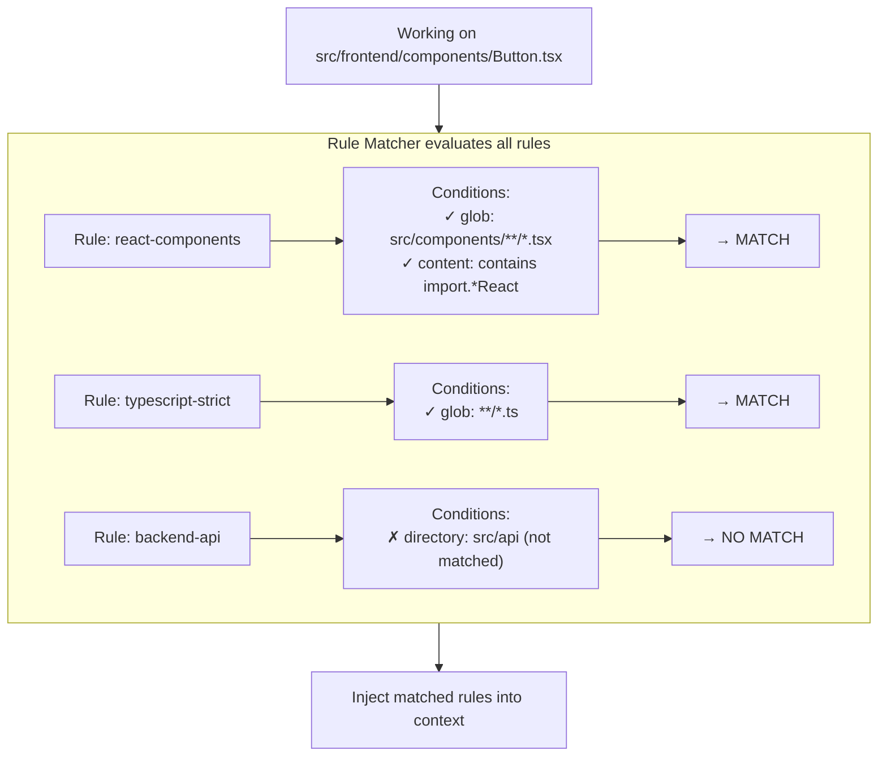

# Conditional Rules Design

Conditional Rules inject context-sensitive guidance based on the **current working context** - which files are being accessed, which agent is running, what category of task is being performed.

## Overview



---

## Rule Sources

Two complementary sources for rules:

**1. Directory-level AGENTS.md files (Amp-style)**
```
project/
├── AGENTS.md                 # Project-wide rules
├── src/
│   ├── AGENTS.md            # Source code rules
│   ├── frontend/
│   │   └── AGENTS.md        # Frontend-specific
│   └── backend/
│       └── AGENTS.md        # Backend-specific
└── tests/
    └── AGENTS.md            # Test file rules
```

**2. Configuration-driven rules**
```json
{
  "conditional_rules": {
    "conditional_rules": [
      {
        "id": "typescript-strict",
        "conditions": [{ "type": "glob", "pattern": "**/*.ts" }],
        "content": "Use strict TypeScript. No 'any' types."
      }
    ]
  }
}
```

---

## AGENTS.md Format

AGENTS.md files support conditional includes using HTML comments:

```markdown
# Project Guidelines

These rules apply everywhere in this directory and subdirectories.

## General Principles
- Follow existing patterns in the codebase
- Add tests for new functionality

<!-- include: **/*.tsx -->
## React Components

These rules only apply to .tsx files:

- Use functional components with hooks
- Props interfaces must be exported
- Use React.memo for expensive renders
<!-- /include -->

<!-- include: **/*.test.ts -->
## Test Files

These rules only apply to test files:

- Use describe/it structure
- Mock external dependencies
- One assertion per test when possible
<!-- /include -->

<!-- include: src/api/** -->
## API Routes

These rules apply to API route files:

- Validate all inputs with Zod
- Return consistent error format
- Add OpenAPI annotations
<!-- /include -->
```

## AGENTS.md Parsing

```typescript
interface ParsedAgentsMd {
  /** Global rules (no conditions) */
  globalRules: string

  /** Conditional blocks */
  conditionalBlocks: ConditionalBlock[]

  /** Source file path */
  sourcePath: string

  /** Directory depth (for priority) */
  depth: number
}

interface ConditionalBlock {
  /** Glob pattern from include directive */
  pattern: string

  /** Rule content */
  content: string

  /** Line range in source file */
  lineStart: number
  lineEnd: number
}
```

---

## Rule Schema

```typescript
interface ConditionalRule {
  /** Unique identifier */
  id: string

  /** Human-readable name */
  name: string

  /** Rule source */
  source: RuleSource

  /** Match conditions (ALL must match) */
  conditions: RuleCondition[]

  /** Rule content to inject */
  content: string

  /** Priority (higher = injected first) */
  priority: number

  /** Whether rule is enabled */
  enabled: boolean
}

type RuleSource =
  | { type: "agents-md"; path: string; depth: number }
  | { type: "config"; section: string }
  | { type: "inline" }
```

## Condition Types

```typescript
type RuleCondition =
  | GlobCondition
  | DirectoryCondition
  | ContentCondition
  | ContextCondition

/** Match files by glob pattern */
interface GlobCondition {
  type: "glob"

  /** Glob pattern (e.g., "**/*.tsx", "src/api/**") */
  pattern: string

  /** Match any file (true) or all files (false) */
  matchAny?: boolean  // default: true
}

/** Match by directory path */
interface DirectoryCondition {
  type: "directory"

  /** Directory path relative to project root */
  path: string

  /** Include subdirectories */
  recursive?: boolean  // default: true
}

/** Match by file content */
interface ContentCondition {
  type: "content"

  /** Regex pattern to match in file content */
  pattern: string

  /** Only check files in current context */
  relevantFilesOnly?: boolean  // default: true
}

/** Match by execution context */
interface ContextCondition {
  type: "context"

  /** Context matcher */
  match: ContextMatcher
}

type ContextMatcher =
  | { agent: string }                                    // Specific agent
  | { category: string }                                 // Delegation category
  | { task: "planning" | "implementation" | "review" }   // Task phase
  | { skill: string }                                    // Active skill
```

---

## Matching Engine

```typescript
class RuleMatcher {
  private rules: ConditionalRule[]
  private globCache: Map<string, RegExp>

  constructor(rules: ConditionalRule[]) {
    // Sort by priority (descending)
    this.rules = [...rules].sort((a, b) => b.priority - a.priority)
    this.globCache = new Map()
  }

  /**
   * Find all rules matching the current context
   */
  match(context: RuleMatchContext): MatchedRule[] {
    const results: MatchedRule[] = []

    for (const rule of this.rules) {
      if (!rule.enabled) continue

      const match = this.matchRule(rule, context)
      if (match) {
        results.push(match)
      }
    }

    return results
  }

  private matchRule(
    rule: ConditionalRule,
    context: RuleMatchContext
  ): MatchedRule | null {
    // ALL conditions must match (AND logic)
    const matchedConditions: RuleCondition[] = []
    const matchedFiles = new Set<string>()

    for (const condition of rule.conditions) {
      const result = this.matchCondition(condition, context)

      if (!result.matched) {
        return null  // Early exit on first non-match
      }

      matchedConditions.push(condition)
      result.files?.forEach(f => matchedFiles.add(f))
    }

    return {
      rule,
      matchedConditions,
      matchedFiles: Array.from(matchedFiles)
    }
  }
}

interface RuleMatchContext {
  /** Files currently being worked on */
  files: string[]

  /** Current working directory */
  cwd: string

  /** Current agent (if any) */
  agent?: string

  /** Current delegation category (if any) */
  category?: string

  /** Current task phase */
  taskPhase?: "planning" | "implementation" | "review"

  /** Active skill (if any) */
  skill?: string
}
```

---

## Discovery and Loading

```typescript
/**
 * Load all conditional rules from:
 * 1. AGENTS.md files in project tree
 * 2. Configuration file
 */
async function loadAllRules(
  projectRoot: string,
  config: ConditionalRulesConfig
): Promise<ConditionalRule[]> {
  const rules: ConditionalRule[] = []

  // 1. Discover AGENTS.md files
  if (config.agents_md.enabled) {
    const agentsMdFiles = await discoverAgentsMdFiles(
      projectRoot,
      config.agents_md.ignore
    )

    for (const parsed of agentsMdFiles) {
      // Global rules from this AGENTS.md
      if (parsed.globalRules.trim()) {
        rules.push({
          id: `agents-md:${parsed.sourcePath}:global`,
          name: `Global rules from ${basename(dirname(parsed.sourcePath))}`,
          source: { type: "agents-md", path: parsed.sourcePath, depth: parsed.depth },
          conditions: [{
            type: "directory",
            path: dirname(relative(projectRoot, parsed.sourcePath)),
            recursive: true
          }],
          content: parsed.globalRules,
          priority: 100 - parsed.depth,  // Deeper = lower priority
          enabled: true
        })
      }

      // Conditional blocks from this AGENTS.md
      for (const block of parsed.conditionalBlocks) {
        rules.push({
          id: `agents-md:${parsed.sourcePath}:${block.lineStart}`,
          name: `Conditional rules for ${block.pattern}`,
          source: { type: "agents-md", path: parsed.sourcePath, depth: parsed.depth },
          conditions: [
            {
              type: "directory",
              path: dirname(relative(projectRoot, parsed.sourcePath)),
              recursive: true
            },
            {
              type: "glob",
              pattern: block.pattern
            }
          ],
          content: block.content,
          priority: 100 - parsed.depth,
          enabled: true
        })
      }
    }
  }

  // 2. Load config-defined rules
  if (config.conditional_rules) {
    for (const ruleConfig of config.conditional_rules) {
      rules.push({
        ...ruleConfig,
        source: { type: "config", section: "conditional_rules" },
        enabled: ruleConfig.enabled ?? true,
        priority: ruleConfig.priority ?? 0
      })
    }
  }

  return rules
}
```

---

## Hook Integration

```typescript
export function createConditionalRulesHook(config: ConditionalRulesConfig) {
  let matcher: RuleMatcher | null = null
  let lastLoadTime = 0

  // Reload rules periodically (config may change)
  async function getMatcher(projectRoot: string): Promise<RuleMatcher> {
    const now = Date.now()
    if (!matcher || now - lastLoadTime > 30_000) {
      const rules = await loadAllRules(projectRoot, config)
      matcher = new RuleMatcher(rules)
      lastLoadTime = now
    }
    return matcher
  }

  return {
    name: "conditional-rules",

    // Inject rules before file operations
    "tool.execute.before": async (params) => {
      const { tool, args, sessionId, context } = params

      // Only process file-related tools
      if (!["Read", "Edit", "Write"].includes(tool)) return

      const filePath = args.file_path || args.path
      if (!filePath) return

      const m = await getMatcher(context.cwd)
      const matchContext: RuleMatchContext = {
        files: [relative(context.cwd, filePath)],
        cwd: context.cwd,
        agent: context.agent,
        category: context.category,
        taskPhase: context.taskPhase
      }

      const matched = m.match(matchContext)
      if (matched.length === 0) return

      // Inject matched rules
      const injection = formatRulesForInjection(matched)
      injectHookMessage(sessionId, injection, {
        agent: context.agent || "general",
        priority: "normal"
      })
    },

    // Inject rules into delegated tasks
    "tool.execute.before:delegate_task": async (params) => {
      const { args, sessionId, context } = params
      const { category, prompt } = args

      const m = await getMatcher(context.cwd)

      // Extract file mentions from prompt
      const mentionedFiles = extractFileMentions(prompt)

      const matchContext: RuleMatchContext = {
        files: mentionedFiles,
        cwd: context.cwd,
        category,
        taskPhase: "implementation"
      }

      const matched = m.match(matchContext)
      if (matched.length === 0) return

      // Append rules to delegate prompt
      const rulesContent = formatRulesForDelegation(matched)
      return {
        args: {
          ...args,
          prompt: `${args.prompt}\n\n---\n\n## Applicable Rules\n\n${rulesContent}`
        }
      }
    }
  }
}
```

---

## Injection Format

When multiple rules match, the injection includes conflict resolution hints:

```markdown
## Applicable Rules

The following rules apply to your current task:

*Multiple rules matched. Conflict resolution guidance:*
*Specificity hint: "React Components" is from a deeper directory and may be more specific to current context.*
*Priority hint: "TypeScript Strict" has highest priority (20). When rules conflict, prefer higher-priority rules.*

### React Components (from src/components/AGENTS.md) [priority: 15]
*Applies to: src/components/Button.tsx*

- Use functional components with hooks
- Props interfaces must be exported
- Use React.memo for expensive renders
- Follow naming: ComponentName.tsx for components

### TypeScript Strict (from config) [priority: 20]
*Applies to: all .ts/.tsx files*

- No 'any' types allowed
- Explicit return types on exported functions
- Use 'unknown' with type guards instead of 'any'

---
```

---

## Conflict Resolution

When multiple rules match the same context, the system provides guidance:

1. **Priority-based precedence**: Rules are sorted by priority (higher first). When rules conflict, higher-priority rules should be preferred.

2. **Specificity hints**: For AGENTS.md rules, deeper directory rules are considered more specific. A rule from `src/components/AGENTS.md` is more specific than one from `src/AGENTS.md`.

3. **Conflict hints format**:
   - When multiple rules match, a "Conflict resolution guidance" section is added
   - Shows which rule is from a deeper (more specific) directory
   - Shows priority values to help the LLM decide precedence

This allows the LLM to make informed decisions when rules provide conflicting guidance.

---

## Configuration

```typescript
interface ConditionalRulesConfig {
  /** AGENTS.md discovery settings */
  agents_md: {
    /** Enable AGENTS.md file discovery */
    enabled: boolean  // default: true

    /** Directories to ignore */
    ignore: string[]  // default: ["node_modules", ".git", "dist", "coverage"]
  }

  /** Config-defined rules */
  conditional_rules?: ConfigRule[]
}

interface ConfigRule {
  /** Unique rule ID */
  id: string

  /** Human-readable name */
  name: string

  /** Match conditions */
  conditions: RuleCondition[]

  /** Rule content (string or file reference) */
  content: string | { file: string }

  /** Priority (default: 0) */
  priority?: number

  /** Enabled (default: true) */
  enabled?: boolean
}
```

---

## Example Configuration

```jsonc
{
  "conditional_rules": {
    "agents_md": {
      "enabled": true,
      "ignore": ["node_modules", ".git", "dist", "coverage", "vendor"]
    },

    "conditional_rules": [
      {
        "id": "typescript-strict",
        "name": "TypeScript Strict Mode",
        "conditions": [
          { "type": "glob", "pattern": "**/*.{ts,tsx}" }
        ],
        "content": "- Use strict TypeScript\n- No 'any' types\n- Explicit return types on exports",
        "priority": 10
      },
      {
        "id": "react-hooks",
        "name": "React Hooks Guidelines",
        "conditions": [
          { "type": "glob", "pattern": "src/**/*.tsx" },
          { "type": "content", "pattern": "use[A-Z]\\w+\\(" }
        ],
        "content": { "file": ".opencode/rules/react-hooks.md" },
        "priority": 20
      },
      {
        "id": "api-validation",
        "name": "API Input Validation",
        "conditions": [
          { "type": "directory", "path": "src/api" },
          { "type": "context", "match": { "category": "backend" } }
        ],
        "content": "- Validate ALL inputs with Zod\n- Return RFC 7807 error format\n- Log validation failures",
        "priority": 25
      },
      {
        "id": "test-patterns",
        "name": "Test File Standards",
        "conditions": [
          { "type": "glob", "pattern": "**/*.{test,spec}.{ts,tsx}" }
        ],
        "content": "- Use describe/it structure\n- One assertion per test\n- Mock external dependencies\n- Test edge cases explicitly",
        "priority": 15
      }
    ]
  }
}
```

---

## Known Limitations

| Limitation | Impact | Mitigation |
|------------|--------|------------|
| Content matching cost | Reading files is slow | Cache, only check relevant files |
| Rule conflicts | Multiple rules may contradict | Priority ordering, last-wins |
| AGENTS.md discovery | May miss deeply nested files | Configurable depth limit |
| Glob performance | Complex patterns are slow | Cache compiled regexes |
