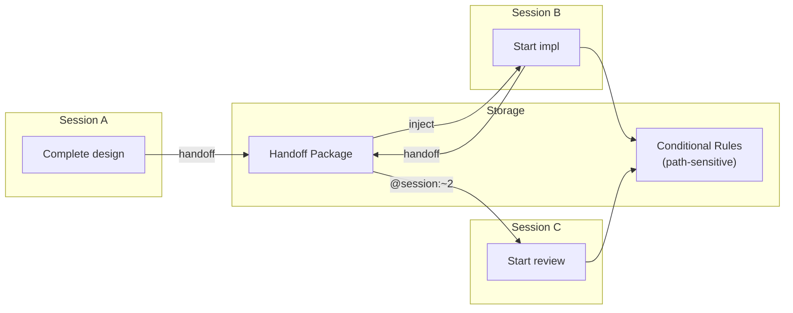
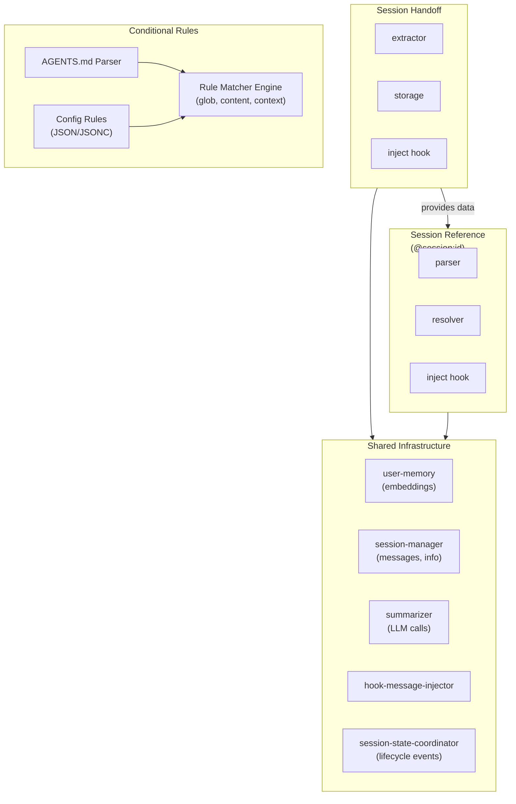
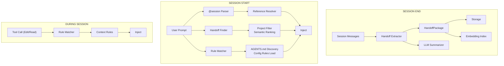

# Cross-Session Continuity: Overview & Integration

## Overview

This document describes three interconnected features for cross-session knowledge continuity:

1. **[Session Handoff](./session-handoff-design.md)** - Structured knowledge extraction and transfer between sessions
2. **[Session Reference](./session-reference-design.md)** - Declarative syntax for referencing historical session context
3. **[Conditional Rules](./conditional-rules-design.md)** - Path-sensitive rule injection based on working context

These features transform Oh-My-OpenCode from a single-session tool into a **continuously learning, context-aware** coding assistant.



### Motivation

**Problem**: Each new session starts with zero context about previous work. This leads to:

- Re-explaining architecture decisions already made
- Re-discovering failed approaches
- Inconsistent coding patterns across sessions
- Manual context rebuilding via copy-paste

**Solution**: Structured knowledge transfer that preserves:

- **Decisions** - What was chosen and why
- **Artifacts** - What was created or modified
- **Anti-patterns** - What failed and should be avoided
- **Domain knowledge** - Insights about the codebase

### Design Philosophy

| Principle | Implementation |
|-----------|----------------|
| **Structured over free-form** | Handoff packages have defined schemas, not prose dumps |
| **Compaction-aligned** | Handoff extraction mirrors `compaction-context-injector` structure |
| **Embedding-ready** | All content indexable for semantic retrieval |
| **Lazy extraction** | Handoffs created on-demand or at session idle, not continuously |
| **Declarative reference** | `@session:id` syntax is explicit and parseable |

---

## Feature Documents

| Feature | Document | Description |
|---------|----------|-------------|
| Session Handoff | [session-handoff-design.md](./session-handoff-design.md) | Extraction, storage, and injection of session knowledge |
| Session Reference | [session-reference-design.md](./session-reference-design.md) | `@session:id` syntax and resolution |
| Conditional Rules | [conditional-rules-design.md](./conditional-rules-design.md) | AGENTS.md and config-driven rule injection |

---

## Integration Architecture

### Module Dependencies



### Data Flow



### Hook Execution Order

```
user.prompt.submit (first message)
    │
    ├─1─▶ user-memory hook (baseline injection)
    │
    └─2─▶ session-handoff hook (auto-inject + resolve @session references)

tool.execute.before (Edit/Read/Write)
    │
    └─1─▶ conditional-rules hook (file-specific rules)

tool.execute.before:delegate_task
    │
    └─1─▶ conditional-rules hook (append rules to delegation prompt)

session.idle (primary)
    │
    └─1─▶ session-handoff hook (extract and store handoff)

session.deleted (fallback)
    │
    └─1─▶ session-handoff hook (extract if needed, cleanup)
```

---

## Configuration Summary

### Complete Configuration Example

```jsonc
// .opencode/oh-my-opencode.json
{
  // ═══════════════════════════════════════════════════════════════════
  // Session Handoff Configuration
  // ═══════════════════════════════════════════════════════════════════
  "session_handoff": {
    "enabled": true,
    "auto_extract": true,
    "auto_inject": true,
    "min_messages_for_extract": 5,
    "max_inject_count": 3,
    "expiry_days": 7,
    "extractor": {
      "model": "haiku",
      "max_decisions": 10,
      "max_artifacts": 20,
      "generate_embeddings": true
    },
    "reference": {
      "enabled": true,
      "strip_from_prompt": false,
      "resolve_options": {
        "prefer_handoff": true,
        "allow_session_fallback": true,
        "create_handoff_if_missing": false,
        "max_results": 5,
        "min_relevance": 0.3
      }
    }
  },

  // ═══════════════════════════════════════════════════════════════════
  // Conditional Rules Configuration
  // ═══════════════════════════════════════════════════════════════════
  "conditional_rules": {
    "agents_md": {
      "enabled": true,
      "ignore": ["node_modules", ".git", "dist", "coverage"]
    },

    "conditional_rules": [
      {
        "id": "typescript-strict",
        "name": "TypeScript Strict Mode",
        "conditions": [
          { "type": "glob", "pattern": "**/*.{ts,tsx}" }
        ],
        "content": "- Use strict TypeScript, no 'any' types\n- Explicit return types on exported functions",
        "priority": 10
      },
      {
        "id": "react-components",
        "name": "React Component Standards",
        "conditions": [
          { "type": "glob", "pattern": "src/components/**/*.tsx" }
        ],
        "content": { "file": ".opencode/rules/react.md" },
        "priority": 20
      }
    ]
  }
}
```

### Default Values

| Setting | Default | Description |
|---------|---------|-------------|
| `session_handoff.enabled` | `true` | Enable handoff feature |
| `session_handoff.auto_extract` | `true` | Extract on session idle |
| `session_handoff.auto_inject` | `true` | Inject on session start |
| `session_handoff.min_messages_for_extract` | `5` | Min messages to trigger |
| `session_handoff.max_inject_count` | `3` | Max handoffs to inject |
| `session_handoff.expiry_days` | `7` | Days until expiration |
| `session_handoff.extractor.model` | `"haiku"` | Extraction model |
| `session_handoff.reference.enabled` | `true` | Enable @session syntax |
| `session_handoff.reference.strip_from_prompt` | `false` | Remove refs after resolution |
| `session_handoff.reference.resolve_options.max_results` | `5` | Semantic search limit |
| `conditional_rules.agents_md.enabled` | `true` | Discover AGENTS.md files |

---

## Implementation Priority

| Phase | Feature | Rationale | Dependencies |
|-------|---------|-----------|--------------|
| **P0** | Conditional Rules | Most independent, immediate value | config schema |
| **P1** | Session Handoff | Foundation for references | user-memory embeddings |
| **P2** | Session Reference | Requires handoff data | handoff + session-manager |

### P0: Conditional Rules (1-2 weeks)

1. ✅ AGENTS.md parser with conditional includes
2. ✅ Config schema for rules
3. ✅ Rule matcher engine
4. ✅ Hook for file operations
5. ✅ Hook for delegate_task

### P1: Session Handoff (2-3 weeks)

1. ✅ HandoffPackage types and schemas
2. ✅ Extraction prompt and LLM integration (with circuit breaker)
3. ✅ Storage layer (index + packages)
4. ✅ Session end hook for extraction
5. ✅ Session start hook for injection
6. ✅ CLI commands (as /handoff builtin skill)

### P2: Session Reference (1-2 weeks)

1. ✅ Reference syntax parser (in session-handoff/hook.ts)
2. ✅ Identifier resolver (in session-handoff/injector.ts)
3. ✅ Semantic search integration (embedding-based; falls back when embeddings unavailable)
4. ✅ Hook for prompt processing (in user.prompt.submit)
5. ❌ Tool interface (future work - not yet implemented)

---

## File Structure

```
src/features/
├── session-handoff/
│   ├── index.ts              # Public exports
│   ├── types.ts              # HandoffPackage, Decision, SessionReference types
│   ├── extractor.ts          # Extraction logic + prompts + zod schemas
│   ├── storage.ts            # Load/save/index
│   ├── embeddings.ts         # Embedding index build + similarity
│   ├── injector.ts           # Injection content generation + @session resolver
│   ├── hook.ts               # Session lifecycle hooks + @session parsing
│   └── summarizer.ts         # LLM integration with circuit breaker
│
│   # Note: Session Reference functionality is integrated into session-handoff
│   # rather than being a separate module. The @session:id syntax parsing
│   # and resolution is handled in hook.ts and injector.ts.
│   # CLI commands are implemented as a builtin skill (/handoff).
│
└── conditional-rules/
    ├── index.ts              # Public exports
    ├── types.ts              # ConditionalRule, RuleCondition
    ├── agents-md-parser.ts   # AGENTS.md parsing
    ├── matcher.ts            # Rule matching engine
    ├── loader.ts             # Discovery and loading
    └── hook.ts               # Injection hooks
```

### Implementation Notes

**Session Reference Integration:**
- Originally planned as a separate `session-reference/` module
- Merged into `session-handoff/` for simplicity since they share data structures
- `@session:id` syntax parsing in `hook.ts:parseSessionReferences()`
- Resolution logic in `injector.ts:resolveSessionReference()`
- Auto-parsing enabled in `user.prompt.submit` hook

**CLI Commands:**
- Implemented as builtin skill `/handoff` rather than separate commands.ts
- Located in `src/features/builtin-skills/skills.ts`

**Future: session_reference Tool:**
- Tool interface for programmatic session reference not yet implemented
- Can be added to allow agents to explicitly query session history

---

## Testing Strategy

### Unit Tests

```bash
# Session Handoff
bun test src/features/session-handoff/

# Session Reference
bun test src/features/session-reference/

# Conditional Rules
bun test src/features/conditional-rules/
```

### Key Test Scenarios

**Session Handoff:**
- Extraction from various session types
- Fallback when LLM unavailable
- Storage persistence and retrieval
- Expiration and cleanup
- Embedding generation

**Session Reference:**
- Syntax parsing (all identifier types)
- Resolution priority (handoff vs session)
- Semantic search relevance
- Multiple references in one prompt
- Invalid reference handling

**Conditional Rules:**
- AGENTS.md parsing with conditionals
- Config rule loading
- Glob matching edge cases
- Content matching with regex
- Context condition matching
- Priority ordering

---

## Future Considerations

### Team Sharing (Future)

```typescript
// Potential future extension
interface SharedHandoff extends HandoffPackage {
  visibility: "private" | "team" | "public"
  sharedBy: string
  sharedAt: number
}
```

### Cross-Project References (Future)

```
@session:project:other-repo:~1
```

### Rule Inheritance (Future)

```markdown
<!-- extends: ../AGENTS.md -->
## Additional rules for this directory
```

---

## Changelog

| Version | Date | Changes |
|---------|------|---------|
| 0.1.0 | TBD | Initial design document |
| 0.2.0 | TBD | Split into separate feature documents |
