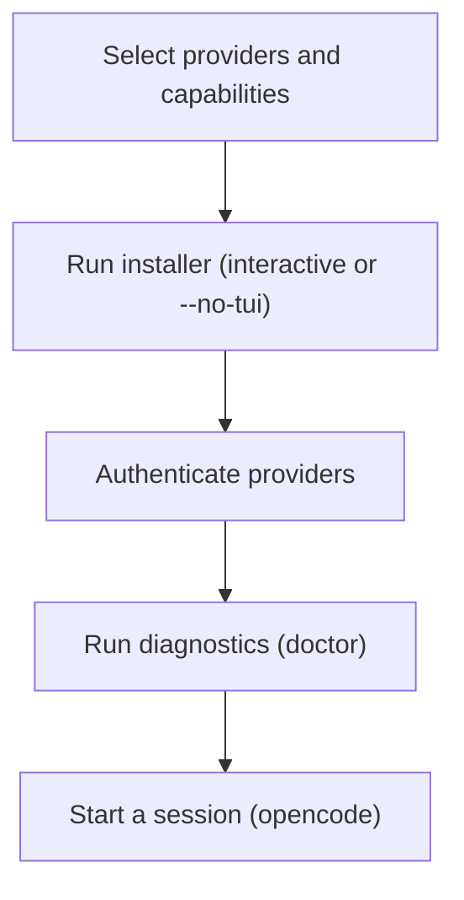

# Installation

This guide explains how to install the Oh-My-OpenCode plugin for OpenCode and validate that the environment is correctly configured.

## Prerequisites

- OpenCode version: **>= 1.0.150** (required by the CLI health checks and some hook integrations)
- Runtime for the installer:
  - Recommended: Bun (`bunx`)
  - Alternative: Node.js (`npx`)
- Optional provider access:
  - Anthropic (Claude)
  - OpenAI (ChatGPT)
  - Google (Gemini, typically via Antigravity OAuth)
  - GitHub Copilot

## Installation Flow



## Install the Plugin

### Interactive installer (recommended)

```bash
bunx oh-my-opencode install
```

### Non-interactive installer (CI / scripting)

```bash
bunx oh-my-opencode install --no-tui \
  --claude=<yes|no|max20> \
  --openai=<yes|no> \
  --gemini=<yes|no> \
  --copilot=<yes|no> \
  [--opencode-zen=<yes|no>] \
  [--zai-coding-plan=<yes|no>]
```

Examples:

```bash
# Claude + OpenAI
bunx oh-my-opencode install --no-tui --claude=yes --openai=yes --gemini=no --copilot=no

# Copilot only
bunx oh-my-opencode install --no-tui --claude=no --openai=no --gemini=no --copilot=yes
```

## Authenticate Providers

### OpenCode providers (Anthropic / OpenAI / Copilot)

Use OpenCode’s auth flow:

```bash
opencode auth login
```

### Google Gemini (Antigravity OAuth)

If you use Gemini via Antigravity OAuth, use the CLI auth helper:

```bash
bunx oh-my-opencode auth login
```

## Verify the Setup

Run the doctor checks:

```bash
bunx oh-my-opencode doctor
```

Common validations include:

- OpenCode version check
- Plugin registration in OpenCode config
- Configuration file validity (JSON/JSONC)
- Provider authentication presence

## Next Steps

- Overview: `docs/guide/overview.md`
- Orchestration system: `docs/guide/understanding-orchestration-system.md`
- CLI reference: `docs/guide/cli.md`
- Documentation index: `docs/index.md`
