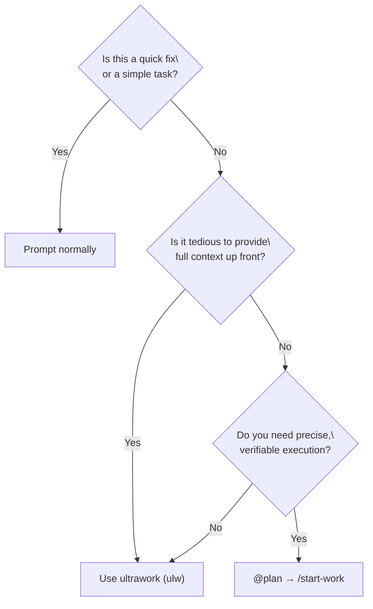
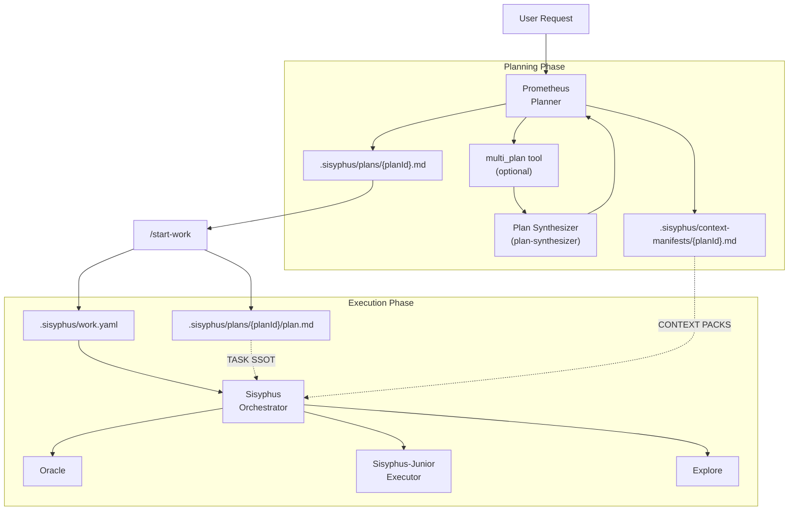

# Orchestration Guide

## TL;DR - When to Use What

| Complexity | Approach | When to Use |
|------------|----------|-------------|
| **Simple** | Just prompt | Simple tasks, quick fixes, single-file changes |
| **Complex + Lazy** | Just type `ulw` or `ultrawork` | Complex tasks where explaining context is tedious. Agent figures it out. |
| **Complex + Precise** | `@plan` → `/start-work` | Precise, multi-step work requiring true orchestration. Prometheus plans, Sisyphus executes. |
| **Complex + Parallel (Isolated)** | `@plan` → `/start-work` (Swarm-first) | Large work where you want parallel execution with git worktree isolation and a recoverable task pool. |

**Decision Flow:**



---

This document provides a comprehensive guide to the orchestration system that implements Oh-My-OpenCode's core philosophy: **"Separation of Planning and Execution"**.

## 1. Overview

Traditional AI agents often mix planning and execution, leading to context pollution, goal drift, and low-quality output.

Oh-My-OpenCode solves this by clearly separating two roles:

1. **Prometheus**: A pure strategist who never writes code. Establishes perfect plans through interviews and analysis.
2. **Sisyphus (Executor)**: An orchestrator who executes plans. Delegates work to specialized agents and never stops until completion.

---

## 2. Overall Architecture



### Single Source of Truth Architecture

The system uses two complementary sources of truth:

| SSOT | File | Purpose |
|------|------|---------|
| **STATE** | `.sisyphus/work.yaml` | Session metadata, protocol state (2-action, 3-strike), decision history |
| **TASKS** | `.sisyphus/plans/*/plan.md` | Actual tasks with checkboxes, human-readable progress |

- **work.yaml** is machine-optimized: structured YAML for programmatic session management
- **plans/*.md** is human-optimized: markdown for agent reasoning and human review
- **Path convention**: `work.yaml.execution_plan_path` is stored as a **workspace-relative** path when possible (e.g., `.sisyphus/plans/<planId>/plan.md`)

**Performance Note (Optional Cache):**

To avoid re-parsing the plan file on every progress check, `work.yaml` may include an optional cached snapshot:

```yaml
task_snapshot:
  total: 10
  completed: 3
  plan_mtime: 1737964800000
  last_sync: "2026-01-27T08:00:00Z"
```

- This snapshot is **derived from** the plan file and is **never** the source of truth for tasks.
- It is automatically refreshed when the plan file changes.

---

## 3. Key Components

### Prometheus (Planner)
- **Model**: `anthropic/claude-opus-4-6`
- **Role**: Strategic planning, requirements interviews, work plan creation
- **Constraint**: **READ-ONLY**. Can only create/modify markdown files within `.sisyphus/` directory.
- **Characteristic**: Never writes code directly, focuses solely on "how to do it".

### Multi-Model Planning (Optional)
- **Tool**: `multi_plan`
- **Role**: Parallel plan generation + synthesis for complex/high-stakes planning
- **Mechanism**: Multiple models generate plans → Plan Synthesizer compares/conflict-resolves → unified final plan

### Sisyphus (Orchestrator)
- **Model**: `anthropic/claude-opus-4-6` (Extended Thinking 32k)
- **Role**: Execution and delegation
- **Characteristic**: Doesn't do everything directly, actively delegates to specialized agents (Oracle, Librarian, Explore, etc.) and uses Categories + Skills for domain routing (e.g., `visual-engineering` + `frontend-ui-ux` for UI work).

---

## 4. Workflow

### Phase 1: Interview and Planning (Interview Mode)
Prometheus starts in **interview mode** by default. Instead of immediately creating a plan, it collects sufficient context.

1. **Intent Identification**: Classifies whether the user's request is Refactoring or New Feature.
2. **Context Collection**: Investigates codebase and external documentation through `explore` and `librarian` agents.
3. **Draft Creation**: Continuously records discussion content in `.sisyphus/drafts/`.

### Phase 2: Plan Generation
When the user requests "Make it a plan", plan generation begins.

1. **Optional multi_plan**: For complex work, Prometheus may call `multi_plan` to generate a stronger plan.
2. **Plan Creation**: Writes a plan draft to `.sisyphus/plans/{planId}.md` and a context manifest to `.sisyphus/context-manifests/{planId}.md`.
3. **Handoff**: Once plan creation is complete, guides user to use `/start-work` command.

### Phase 3: Execution
When the user enters `/start-work`, the execution phase begins.

1. **State Management**: Creates/updates `work.yaml` to track active plan, session IDs, and protocol state.
2. **Task Execution**: Sisyphus reads the plan file and processes tasks one by one.
3. **Delegation**: UI work is delegated via category + skills (e.g., `visual-engineering` + `frontend-ui-ux`, executed by Sisyphus-Junior); complex logic to Oracle.
4. **Continuity**: Even if the session is interrupted, work continues in the next session through `work.yaml`.
5. **Protocol Enforcement**: 2-action rule (research tracking) and 3-strike protocol (error recording) are managed via work.yaml.

#### Swarm-first Execution (Parallel Worktrees)

If Swarm-first is enabled, `/start-work` becomes a bootstrap point for a **recoverable parallel execution** model:

- A Swarm team is created (or recovered) for the active plan.
- The plan’s pending TODO blocks are synced into a task pool under `.sisyphus/tasks/<team>/`.
- Worker processes can be spawned in tmux windows, optionally one git worktree per worker.
- The coordinator auto-assigns tasks; completion is tracked in the task pool (not by editing the plan file in parallel).

This is the closest “Trellis-style” binding between **task structure**, **workspace isolation**, and **recovery**.

---

## 5. Commands and Usage

### `@plan [request]`
Invokes Prometheus to start a planning session.
- Example: `@plan "I want to refactor the authentication system to NextAuth"`

### `/start-work`
Executes the generated plan.
- Function: Finds plan in `.sisyphus/plans/` and enters execution mode.
- If there's interrupted work, automatically resumes from where it left off.

---

## 6. Configuration Guide

You can control related features in `oh-my-opencode.json`.

```jsonc
{
  "sisyphus_agent": {
    "disabled": false,           // Disable Sisyphus orchestration when true (default: false)
    "planner_enabled": true,     // Enable Prometheus (default: true)
    "replace_plan": true         // Replace default plan agent with Prometheus (default: true)
  },
  
  // Hook settings (add to disable)
  "disabled_hooks": [
    // "start-work",             // Disable execution trigger
    // "prometheus-md-only"      // Remove Prometheus write restrictions (not recommended)
    // "context-manifest-injector" // Disable Context Packs auto-injection
    // "swarm-from-plan"         // Disable Swarm-first bootstrap from /start-work
  ]
}
```

### Swarm-first (Recommended for parallel + isolation)

Swarm-first requires both Sisyphus Tasks (task pool) and Swarm to be enabled.

> **Schema reference**: `src/config/schema.ts` — `SisyphusConfigSchema`, `TmuxParallelAgentsConfigSchema`

```jsonc
{
  "sisyphus": {
    "tasks": { "enabled": true },       // default: false
    "swarm": {
      "enabled": true,                  // default: false
      "swarm_first": true,              // default: false
      "worker_count": 3                 // default: 3
    }
  },
  "tmux_parallel_agents": {
    "enabled": true,                    // default: false (requires tmux)
    "worktree": { "enabled": true }     // default: false
  }
}
```

### Parallel Runtime (Global Concurrency Control)

The parallel runtime is **enabled by default** (`mode: "shadow"`, `global_slots: 6`). It controls admission for Background and Swarm subsystems. Manual worktrees (Option A in `docs/journeys/parallel-agents.md`) are intentionally outside this system.

> **Schema reference**: `src/config/schema.ts` — `ParallelRuntimeConfigSchema`

To tune the defaults:

```jsonc
{
  "parallel_runtime": {
    "enabled": true,            // default: true
    "mode": "shadow",           // default: "shadow" — "shadow" observes, "enforce" caps
    "global_slots": 6,          // default: 6
    "lease_ttl_ms": 120000,     // default: 120000 (2 min)
    "heartbeat_ms": 10000,      // default: 10000 (10 sec)
    "acquire_timeout_ms": 15000,// default: 15000 (enforce-mode only)
    "lock_timeout_ms": 2000     // default: 2000
  }
}
```

Rollout recommendation:
1. Start with `mode="shadow"` (the default) and monitor slot pressure via `/swarm status`.
2. Switch to `mode="enforce"` after validating throughput and timeout behavior.

Note: in `enforce` mode, Background admissions may wait up to `acquire_timeout_ms`, while Swarm admissions are non-blocking (the coordinator stops assigning when at capacity).

## 7. Best Practices

1. **Don't Rush**: Invest sufficient time in the interview with Prometheus. The more perfect the plan, the faster the execution.
2. **Single Plan Principle**: No matter how large the task, contain all TODOs in one plan file (`.md`). This prevents context fragmentation.
3. **Active Delegation**: During execution, delegate to specialized agents via `delegate_task` rather than modifying code directly.

---

## 8. Context Manifests / Context Packs

Goal: turn “what context should be loaded” from ad-hoc runtime guesswork into a **versioned, auditable, reusable** artifact.

Deep dive (recommended): `docs/journeys/context-packs-and-manifests.md`

### 8.1 Artifacts and Responsibilities

- **Plan (Task SSOT)**: `.sisyphus/plans/{planId}/plan.md`
- **Context Manifest (Delegation Context)**: `.sisyphus/context-manifests/{planId}.md`
  - Organized as *Context Packs* (3–8 stable pack IDs)
  - Each pack lists the relevant specs / key files / index entrypoints, plus **why** (what the executor should extract)

### 8.2 Deterministic Injection (v2)

When Sisyphus Execution Mode calls `delegate_task(...)`, if the prompt contains:

```text
Context Packs: global, tooling
```

or the bullet-list form:

```text
Context Packs:
- global
- tooling
```

the system injects the selected packs at the tool boundary by appending a stable markdown snippet to the prompt (via the `context-manifest-injector` hook).

### 8.2.1 Manifest File Format (Required)

The context manifest file must be machine-parseable. It is Markdown with an embedded JSON payload between markers:

```text
[CONTEXT_MANIFEST]
{ ...json... }
[/CONTEXT_MANIFEST]
```

If the marker block is missing or invalid JSON, injection will **fail-open** (no injection).

Benefits:
- **Deterministic**: the same task consistently gets the same context, without relying on “remember to read X”
- **Low-noise**: only inject explicitly requested packs; avoid full dumps that pollute the context window
- **Extensible**: packs can later incorporate repo overview / cartography / org memory references as first-class items

### 8.3 Recommended Conventions

- When Prometheus generates the plan:
  - Also generate `.sisyphus/context-manifests/{planId}.md`
  - Every TODO block must include a `Context Packs:` selector line (used by the injector)
- When Sisyphus Execution Mode delegates:
  - Copy the TODO’s `Context Packs:` line verbatim into the `delegate_task` prompt (keep it a single line)

### 8.4 Troubleshooting (Quick)

If “it didn’t inject anything”, check:
- You ran `/start-work` (so `.sisyphus/work.yaml` exists and `plan_id` is set)
- `.sisyphus/context-manifests/{plan_id}.md` exists
- The manifest contains a valid `[CONTEXT_MANIFEST]...[/CONTEXT_MANIFEST]` JSON block
- Your `delegate_task` prompt includes `Context Packs: ...`
- The hook is enabled (not listed in `disabled_hooks`)
