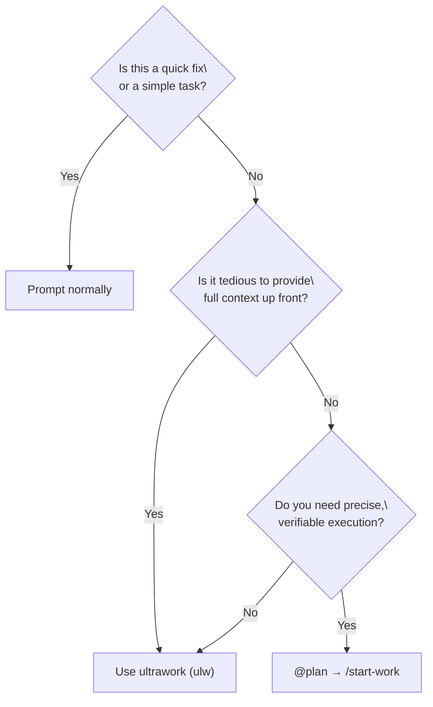

# Orchestration Guide

## TL;DR - When to Use What

| Complexity | Approach | When to Use |
|------------|----------|-------------|
| **Simple** | Just prompt | Simple tasks, quick fixes, single-file changes |
| **Complex + Lazy** | Just type `ulw` or `ultrawork` | Complex tasks where explaining context is tedious. Agent figures it out. |
| **Complex + Precise** | `@plan` → `/start-work` | Precise, multi-step work requiring true orchestration. Prometheus plans, Sisyphus executes. |

**Decision Flow:**



---

This document provides a comprehensive guide to the orchestration system that implements Oh-My-OpenCode's core philosophy: **"Separation of Planning and Execution"**.

## 1. Overview

Traditional AI agents often mix planning and execution, leading to context pollution, goal drift, and low-quality output.

Oh-My-OpenCode solves this by clearly separating two roles:

1. **Prometheus**: A pure strategist who never writes code. Establishes perfect plans through interviews and analysis.
2. **Sisyphus (Executor)**: An orchestrator who executes plans. Delegates work to specialized agents and never stops until completion.

---

## 2. Overall Architecture

```mermaid
flowchart TD
    User[User Request] --> Prometheus

    subgraph Planning Phase
        Prometheus[Prometheus<br>Planner] --> MultiPlan[multi_plan tool<br>(optional)]
        MultiPlan --> Synth[Plan Synthesizer<br>(plan-synthesizer)]
        Synth --> Prometheus
        Prometheus --> PlanFile["/.sisyphus/plans/{name}.md"]
    end

    PlanFile --> StartWork["/start-work"]
    StartWork --> WorkState[work.yaml]

    subgraph Execution Phase
        WorkState --> Sisyphus[Sisyphus<br>Orchestrator]
        PlanFile -.-> |"TASK SSOT"| Sisyphus
        Sisyphus --> Oracle[Oracle]
        Sisyphus --> Frontend[Frontend<br>Engineer]
        Sisyphus --> Explore[Explore]
    end
```

### Single Source of Truth Architecture

The system uses two complementary sources of truth:

| SSOT | File | Purpose |
|------|------|---------|
| **STATE** | `.sisyphus/work.yaml` | Session metadata, protocol state (2-action, 3-strike), decision history |
| **TASKS** | `.sisyphus/plans/*.md` | Actual tasks with checkboxes, human-readable progress |

- **work.yaml** is machine-optimized: structured YAML for programmatic session management
- **plans/*.md** is human-optimized: markdown for agent reasoning and human review
- **Path convention**: `work.yaml.active_plan` is stored as a **workspace-relative** path when possible (e.g., `.sisyphus/plans/x.md`)

**Performance Note (Optional Cache):**

To avoid re-parsing the plan file on every progress check, `work.yaml` may include an optional cached snapshot:

```yaml
task_snapshot:
  total: 10
  completed: 3
  plan_mtime: 1737964800000
  last_sync: "2026-01-27T08:00:00Z"
```

- This snapshot is **derived from** the plan file and is **never** the source of truth for tasks.
- It is automatically refreshed when the plan file changes.

---

## 3. Key Components

### Prometheus (Planner)
- **Model**: `anthropic/claude-opus-4-5`
- **Role**: Strategic planning, requirements interviews, work plan creation
- **Constraint**: **READ-ONLY**. Can only create/modify markdown files within `.sisyphus/` directory.
- **Characteristic**: Never writes code directly, focuses solely on "how to do it".

### Multi-Model Planning (Optional)
- **Tool**: `multi_plan`
- **Role**: Parallel plan generation + synthesis for complex/high-stakes planning
- **Mechanism**: Multiple models generate plans → Plan Synthesizer compares/conflict-resolves → unified final plan

### Sisyphus (Orchestrator)
- **Model**: `anthropic/claude-opus-4-5` (Extended Thinking 32k)
- **Role**: Execution and delegation
- **Characteristic**: Doesn't do everything directly, actively delegates to specialized agents (Frontend, Librarian, etc.).

---

## 4. Workflow

### Phase 1: Interview and Planning (Interview Mode)
Prometheus starts in **interview mode** by default. Instead of immediately creating a plan, it collects sufficient context.

1. **Intent Identification**: Classifies whether the user's request is Refactoring or New Feature.
2. **Context Collection**: Investigates codebase and external documentation through `explore` and `librarian` agents.
3. **Draft Creation**: Continuously records discussion content in `.sisyphus/drafts/`.

### Phase 2: Plan Generation
When the user requests "Make it a plan", plan generation begins.

1. **Optional multi_plan**: For complex work, Prometheus may call `multi_plan` to generate a stronger plan.
2. **Plan Creation**: Writes a single plan in `.sisyphus/plans/{name}.md` file.
3. **Handoff**: Once plan creation is complete, guides user to use `/start-work` command.

### Phase 3: Execution
When the user enters `/start-work`, the execution phase begins.

1. **State Management**: Creates/updates `work.yaml` to track active plan, session IDs, and protocol state.
2. **Task Execution**: Sisyphus reads the plan file and processes tasks one by one.
3. **Delegation**: UI work is delegated to Frontend agent, complex logic to Oracle.
4. **Continuity**: Even if the session is interrupted, work continues in the next session through `work.yaml`.
5. **Protocol Enforcement**: 2-action rule (research tracking) and 3-strike protocol (error recording) are managed via work.yaml.

---

## 5. Commands and Usage

### `@plan [request]`
Invokes Prometheus to start a planning session.
- Example: `@plan "I want to refactor the authentication system to NextAuth"`

### `/start-work`
Executes the generated plan.
- Function: Finds plan in `.sisyphus/plans/` and enters execution mode.
- If there's interrupted work, automatically resumes from where it left off.

---

## 6. Configuration Guide

You can control related features in `oh-my-opencode.json`.

```jsonc
{
  "sisyphus_agent": {
    "disabled": false,           // Enable Sisyphus orchestration (default: false)
    "planner_enabled": true,     // Enable Prometheus (default: true)
    "replace_plan": true         // Replace default plan agent with Prometheus (default: true)
  },
  
  // Hook settings (add to disable)
  "disabled_hooks": [
    // "start-work",             // Disable execution trigger
    // "prometheus-md-only"      // Remove Prometheus write restrictions (not recommended)
  ]
}
```

## 7. Best Practices

1. **Don't Rush**: Invest sufficient time in the interview with Prometheus. The more perfect the plan, the faster the execution.
2. **Single Plan Principle**: No matter how large the task, contain all TODOs in one plan file (`.md`). This prevents context fragmentation.
3. **Active Delegation**: During execution, delegate to specialized agents via `delegate_task` rather than modifying code directly.
