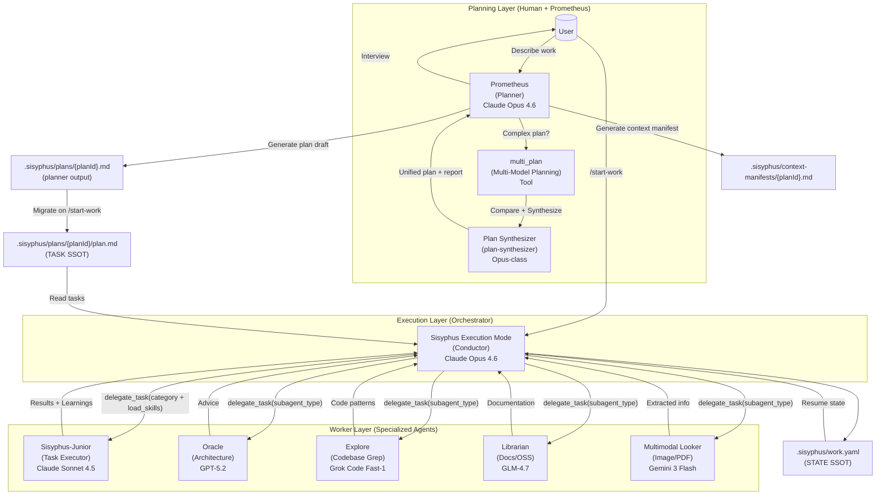
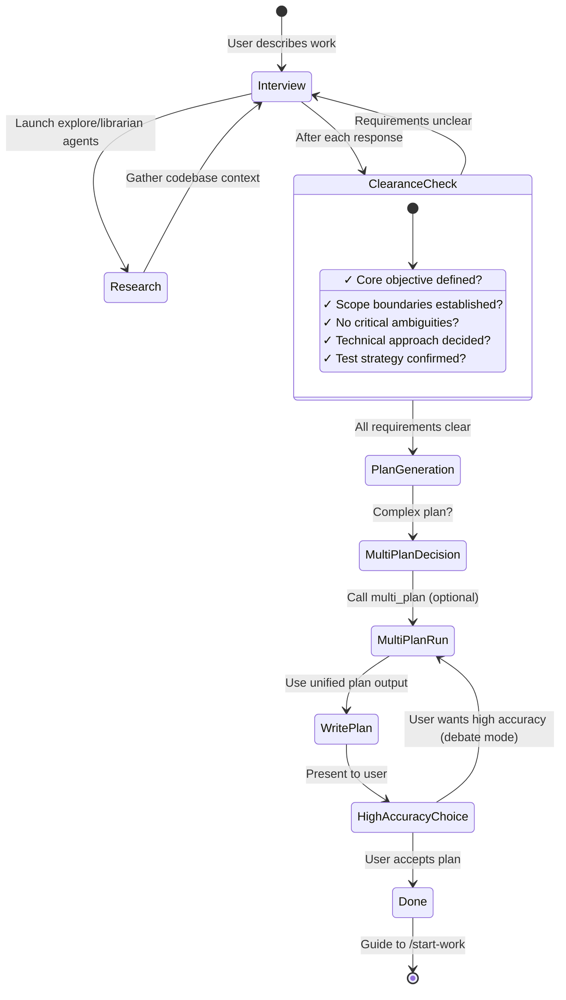
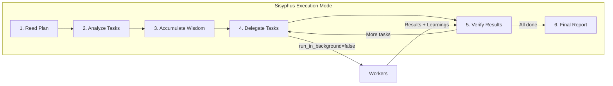
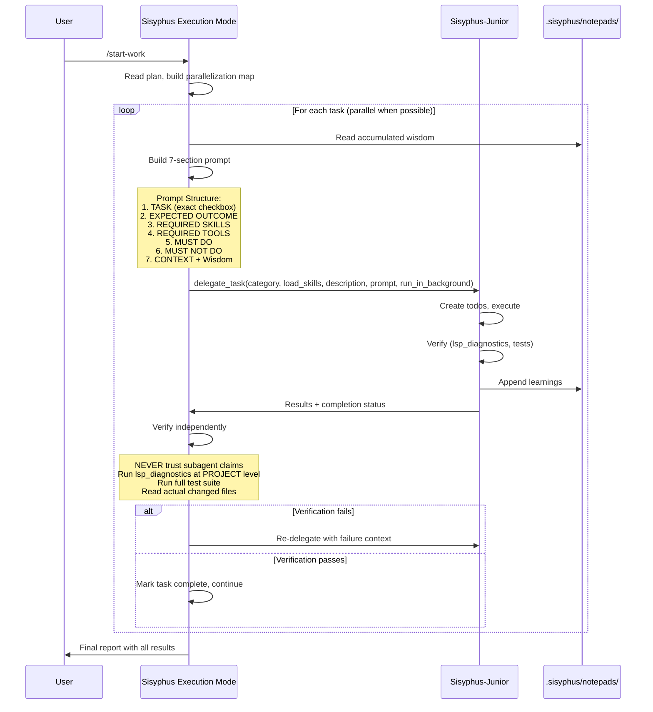

# Understanding the Orchestration System

Oh My OpenCode's orchestration system transforms a simple AI agent into a coordinated development team. This document explains how the Prometheus → Sisyphus Execution Mode → Junior workflow creates high-quality, reliable code output.

---

## The Core Philosophy

Traditional AI coding tools follow a simple pattern: user asks → AI responds. This works for small tasks but fails for complex work because:

1. **Context overload**: Large tasks exceed context windows
2. **Cognitive drift**: AI loses track of requirements mid-task
3. **Verification gaps**: No systematic way to ensure completeness
4. **Human = Bottleneck**: Requires constant user intervention

The orchestration system solves these problems through **specialization and delegation**.

---

## The Three-Layer Architecture



---

## Layer 1: Planning (Prometheus + Multi-Model Planning)

### Prometheus: Your Strategic Consultant

Prometheus is **not just a planner** - it's an intelligent interviewer that helps you think through what you actually need.

**The Interview Process:**



**Intent-Specific Strategies:**

Prometheus adapts its interview style based on what you're doing:

| Intent | Prometheus Focus | Example Questions |
|--------|------------------|-------------------|
| **Refactoring** | Safety - behavior preservation | "What tests verify current behavior?" "Rollback strategy?" |
| **Build from Scratch** | Discovery - patterns first | "Found pattern X in codebase. Follow it or deviate?" |
| **Mid-sized Task** | Guardrails - exact boundaries | "What must NOT be included? Hard constraints?" |
| **Architecture** | Strategic - long-term impact | "Expected lifespan? Scale requirements?" |

### Multi-Model Planning: Deep Verification and Synthesis

For complex or high-accuracy planning, Prometheus can call `multi_plan` to:

- Generate multiple independent plans in parallel
- Compare and score them (clarity/verification/context/big picture)
- Run optional deep verification (file reference audit, execution simulation)
- Resolve conflicts and synthesize one unified final plan
- Optionally run a debate round (rebuttals) for maximum scrutiny

---

## Layer 2: Execution (Sisyphus Execution Mode)

### The Conductor Mindset

The Orchestrator is like an orchestra conductor: **it doesn't play instruments, it ensures perfect harmony**.



**What Orchestrator CAN do:**
- Read files to understand context
- Run commands to verify results
- Use `lsp_diagnostics` to check for errors
- Search patterns with `grep` / `glob` / `ast_grep_*`
- Create git commits **after verification** (atomic, scoped)

**What Orchestrator SHOULD delegate (for isolation + throughput):**
- Medium/large code changes (implementation, refactors)
- Test creation and multi-file migrations
- Specialized work that benefits from a focused context window (UI/UX, deep reasoning, research)

### Wisdom Accumulation

The power of orchestration is **cumulative learning**. After each task:

1. Extract learnings from subagent's response
2. Categorize into: Conventions, Successes, Failures, Gotchas, Commands
3. Pass forward to ALL subsequent subagents

This prevents repeating mistakes and ensures consistent patterns.

**Notepad System:**

```
.sisyphus/notepads/{plan-name}/
├── learnings.md      # Patterns, conventions, successful approaches
├── decisions.md      # Architectural choices and rationales
├── issues.md         # Problems, blockers, gotchas encountered
├── verification.md   # Test results, validation outcomes
└── problems.md       # Unresolved issues, technical debt
```

### Parallel Execution

Independent tasks run in parallel:

```typescript
// Orchestrator identifies parallelizable groups from plan
// Group A: Tasks 2, 3, 4 (no file conflicts)
delegate_task({
  category: "ultrabrain",
  load_skills: [],
  description: "task 2",
  prompt: "Task 2...",
  run_in_background: true,
})
delegate_task({
  category: "visual-engineering",
  load_skills: ["frontend-ui-ux"],
  description: "task 3",
  prompt: "Task 3...",
  run_in_background: true,
})
delegate_task({
  category: "unspecified-low",
  load_skills: [],
  description: "task 4",
  prompt: "Task 4...",
  run_in_background: true,
})
// All run simultaneously
```

---

## Layer 3: Workers (Specialized Agents)

### Sisyphus-Junior: The Task Executor

Junior is the **workhorse** that actually writes code. Key characteristics:

- **Focused**: No implementation delegation. `delegate_task` is **research-scoped only** (explore/librarian, no categories, `load_skills=[]`).
- **Disciplined**: Obsessive todo tracking
- **Verified**: Prompt requires `lsp_diagnostics` clean (and tests when applicable) before claiming completion; Orchestrator still verifies independently.
- **Constrained**: `task` tool is denied. Plan/ledger artifacts under `.sisyphus/` are treated as read-only by convention (SSOT is owned by the orchestrator workflow).

**Why Sonnet is Sufficient:**

Junior doesn't need to be the smartest - it needs to be reliable. With:
1. Detailed prompts from Orchestrator (50-200 lines)
2. Accumulated wisdom passed forward
3. Clear MUST DO / MUST NOT DO constraints
4. Verification requirements

Even a mid-tier model executes precisely. The intelligence is in the **system**, not individual agents.

### System Reminder Mechanism

The hook system ensures Junior never stops halfway:

```
[SYSTEM REMINDER - TODO CONTINUATION]

You have incomplete todos! Complete ALL before responding:
- [ ] Implement user service ← IN PROGRESS
- [ ] Add validation
- [ ] Write tests

DO NOT respond until all todos are marked completed.
```

This "work continuation" mechanism (the Sisyphus “boulder pushing” metaphor) is why the system is named after Sisyphus.

---

## The delegate_task Tool: Category + Skill System

### Why Categories are Revolutionary

**The Problem with Model Names:**

```typescript
// Avoid routing by raw model strings ("use gpt-5.2", "use opus") as the *contract*.
// Prefer either:
// - semantic categories (intent presets), or
// - explicit specialists via subagent_type.

delegate_task({
  subagent_type: "oracle",
  load_skills: [],
  description: "architecture review",
  prompt: "...",
  run_in_background: false,
})
```

**The Solution: Semantic Categories:**

```typescript
// NEW: Category describes INTENT, not implementation
delegate_task({
  category: "ultrabrain",
  load_skills: [],
  description: "deep reasoning task",
  prompt: "...",
  run_in_background: false,
})
delegate_task({
  category: "visual-engineering",
  load_skills: ["frontend-ui-ux"],
  description: "visual task",
  prompt: "...",
  run_in_background: false,
})
delegate_task({
  category: "quick",
  load_skills: [],
  description: "quick fix",
  prompt: "...",
  run_in_background: false,
})
```

### Built-in Categories

| Category | Model | When to Use |
|----------|-------|-------------|
| `visual-engineering` | Gemini 3 Pro | Frontend, UI/UX, design, styling, animation |
| `ultrabrain` | GPT-5.3 Codex (xhigh) | Deep logical reasoning, complex architecture decisions |
| `deep` | GPT-5.3 Codex (medium) | Goal-oriented autonomous problem-solving for hairy tasks |
| `artistry` | Gemini 3 Pro (high) | Highly creative/artistic tasks, novel ideas |
| `quick` | Claude Haiku 4.5 | Trivial tasks - single file changes, typo fixes |
| `unspecified-low` | Claude Sonnet 4.5 | Tasks that don't fit other categories, low effort |
| `unspecified-high` | Claude Opus 4.6 (max) | Tasks that don't fit other categories, high effort |
| `writing` | Gemini 3 Flash | Documentation, prose, technical writing |

### Custom Categories

You can define your own categories:

```json
// .opencode/oh-my-opencode.json
{
  "categories": {
    "unity-game-dev": {
      "model": "openai/gpt-5.2",
      "temperature": 0.3,
      "prompt_append": "You are a Unity game development expert..."
    }
  }
}
```

### Skills: Domain-Specific Instructions

Skills prepend specialized instructions to subagent prompts:

```typescript
// Category + Skill combination
delegate_task({
  category: "visual-engineering",
  load_skills: ["frontend-ui-ux"], // Adds UI/UX expertise
  description: "UI implementation",
  prompt: "...",
  run_in_background: false,
})

delegate_task({
  category: "deep",
  load_skills: ["playwright"], // Adds browser automation expertise
  description: "browser verification",
  prompt: "...",
  run_in_background: false,
})
```

**Example Evolution:**

| Before | After |
|--------|-------|
| Hardcoded: `frontend-ui-ux-engineer` (Gemini 3 Pro) | `category: "visual-engineering" + load_skills: ["frontend-ui-ux"]` |
| One-size-fits-all | `category: "visual-engineering" + load_skills: ["unity-master"]` |
| Model bias | Category-based: model abstraction eliminates bias |

---

## The Orchestrator → Junior Workflow



---

## Why This Architecture Works

### 1. Separation of Concerns

- **Planning** (Prometheus): High reasoning, interview, strategic thinking
- **Orchestration** (Sisyphus Execution Mode): Coordination, verification, wisdom accumulation
- **Execution** (Junior): Focused implementation, no distractions

### 2. Explicit Over Implicit

Every Junior prompt includes:
- Exact task from plan
- Clear success criteria
- Forbidden actions
- All accumulated wisdom
- Reference files with line numbers

No assumptions. No guessing.

### 3. Trust But Verify

The Orchestrator **never trusts subagent claims**:
- Runs `lsp_diagnostics` at project level
- Executes full test suite
- Reads actual file changes
- Cross-references requirements

### 4. Model Optimization

Expensive models (Opus, GPT-5.2) used only where needed:
- Planning decisions (once per project)
- Debugging consultation (rare)
- Complex architecture (rare)

Bulk work goes to cost-effective models (Sonnet, Haiku, Flash).

---

## Getting Started

1. **Enter Prometheus Mode**: Press **Tab** at the prompt
2. **Describe Your Work**: "I want to add user authentication to my app"
3. **Answer Interview Questions**: Prometheus will ask about patterns, preferences, constraints
4. **Review the Plan**: Check `.sisyphus/plans/` for generated work plan
5. **Run `/start-work`**: Orchestrator takes over
6. **Observe**: Watch tasks complete with verification
7. **Done**: All todos complete, code verified, ready to ship

---

## Further Reading

- [Overview](./overview.md) - Quick start guide
- [Ultrawork Journey](../journeys/ultrawork.md) - Philosophy behind the system
- [Installation Guide](./installation.md) - Detailed installation instructions
- [Configuration](../reference/configuration.md) - Customize the orchestration
