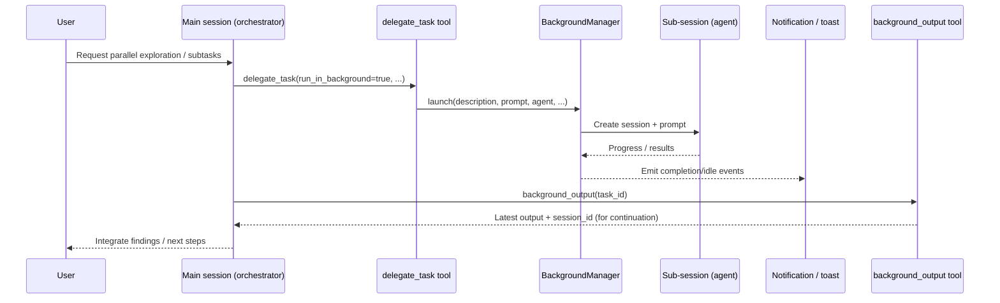

# Journey: Background Tasks & Parallelism

## User Perspective

You want to reduce wall-clock time by running independent subtasks concurrently, without losing the “single source of truth” for integration.
In Oh-My-OpenCode this is done by launching **background tasks** (sub-sessions) and consuming their outputs when ready.

## End-to-End Flow

This journey explains how Oh-My-OpenCode executes work in parallel, how results flow back to the main session, and which components to inspect when something looks “out of order”.

## Mental Model

- **Foreground**: the main session agent (often an orchestrator) drives the task and owns final integration.
- **Background tasks**: delegated work executed concurrently to reduce wall-clock time.
- **Continuation**: some background tasks produce a `session_id` that can be resumed with full context.

## Recommended Workflow

1. Use parallel exploration early (search, inventory, alternative approaches).
2. Keep integration work in the main session; merge results as they arrive.
3. Prefer “many small independent background tasks” over one huge delegated task.

## Where to Look in Code

- Background manager: `src/features/background-agent/`
- Delegation tool: `src/tools/delegate-task/`
- OMO agent runner: `src/tools/call-omo-agent/`
- Tmux integration (fork-owned): `src/hooks/tmux-parallel-agents/` and `docs/journeys/swarm-coordination.md`
  - For manual worktrees + tmux (multi-process agents): use the built-in \`parallel-agents\` skill.

## Operational Notes

- If you see tool output getting truncated unexpectedly, verify hook ordering:
  - `src/index.ts` (`tool.execute.after`)
  - `src/hooks/AGENTS.md` (documentation mirror)
