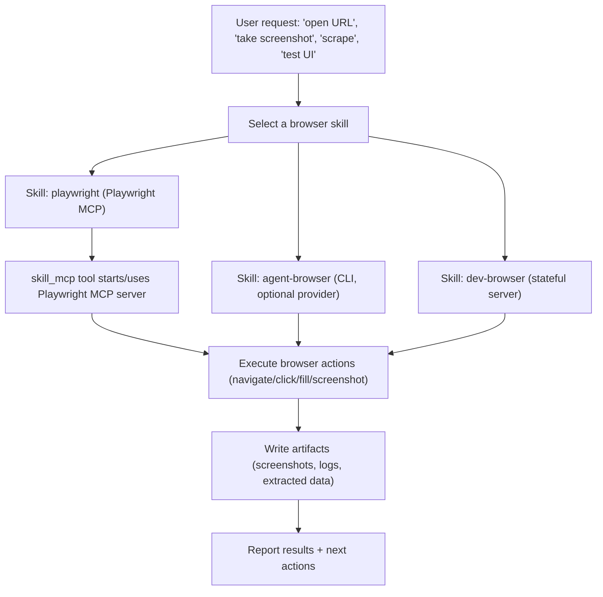

# Journey: Browser Automation

## User Perspective

You want the agent to interact with a real browser to verify UI behavior, capture screenshots, scrape data, or reproduce a bug.
The reliable approach is to drive browser actions through a dedicated **browser skill** (Playwright MCP, agent-browser CLI, or dev-browser), then persist artifacts (screenshots, extracted data) as files.

## End-to-End Flow

This journey describes how to run browser automation workflows in Oh-My-OpenCode using skills and MCP servers.

Notes:
- The default built-in browser skill is `playwright`.
- `agent-browser` is an alternate provider used by some integration points when `browserProvider="agent-browser"` is explicitly set.
- `dev-browser` requires separate setup to run the local server.

## Entry Points

- Feature overview: `docs/guide/features.md`
- Configuration: `docs/reference/configuration.md`

## Recommended Approach

1. Prefer a browser-related skill (e.g., Playwright) for any UI testing, screenshotting, scraping, or flow verification.
2. Keep automation steps deterministic:
   - Explicit navigation + waits
   - Minimal reliance on flaky selectors
3. Record artifacts (screenshots, extracted data) as files when appropriate.

## Where to Look in Code

- Skill system & discovery: `src/features/opencode-skill-loader/`
- Built-in skills: `src/features/builtin-skills/`
- MCP integration: `src/mcp/` and `docs/reference/mcps.md`
