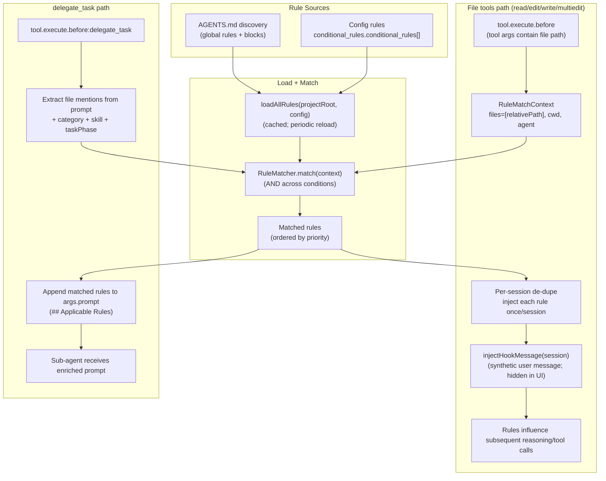

# Journey: Conditional Rules (Context-Sensitive Guidance)

## User Perspective

You want the agent to follow different engineering rules depending on what is being worked on (file path, module, task category, or skill) without dumping an entire style guide into every prompt.
Conditional Rules provide targeted, context-sensitive instruction injection so the model receives “just-in-time” constraints exactly when they become relevant.

## End-to-End Flow

## Rule Sources

### 1) AGENTS.md (directory discovery)

Rules are discovered by scanning `AGENTS.md` files in the project tree. Two tiers exist:

- **Global rules**: apply to the directory (and subdirectories).
- **Conditional blocks**: gated by `<!-- include: <glob> --> ... <!-- /include -->`.

The loader assigns higher priority to deeper (more specific) directories, so nested rules can override broader ones.

### 2) Config-defined rules

Rules can also be declared in `oh-my-opencode/*.json` under `conditional_rules.conditional_rules[]` with conditions such as:

- `glob`: match file paths
- `directory`: match directory scopes
- `content`: regex match on current-context file contents
- `context`: match agent/category/task/skill

## Operational Notes

- **De-dupe**: for file tools, each matched rule is injected at most once per session to reduce spam.
- **Reload**: rules are cached per project root and periodically reloaded (time-based).
- **Compaction safety**: per-session injection tracking resets on `session.compacted` and `session.deleted`.

## Configuration & Defaults

- `conditional_rules.agents_md`: discovery options (ignore patterns, max depth, etc.).
- `conditional_rules.conditional_rules[]`: config-defined rules (inline content or `content.file`).

## Where to Look in Code

- Hook + lifecycle wiring: `src/features/conditional-rules/hook.ts`
- Rule discovery + parsing: `src/features/conditional-rules/agents-md-parser.ts`
- Loader (AGENTS.md + config): `src/features/conditional-rules/loader.ts`
- Matcher engine (glob/content/context): `src/features/conditional-rules/matcher.ts`
- Synthetic message injection: `src/features/hook-message-injector/`

## Debug Checklist

- Confirm `conditional-rules` hook is enabled (not in `disabled_hooks`).
- Verify the tool path you expect is covered:
  - file tools: `Read/Edit/Write/MultiEdit`
  - delegation: `delegate_task`
- Check logs for `[conditional-rules]` (rule count loaded, injections, errors).
- If rules do not match, confirm:
  - file paths are relative to project root (matching uses normalized slashes),
  - glob patterns are correct,
  - `content` conditions can read the file from `cwd`.

## Further Reading

- Contract: `docs/reference/hooks.md` (hook ordering + tool interception points)
- Contract: `docs/reference/configuration.md` (config schema and defaults)
