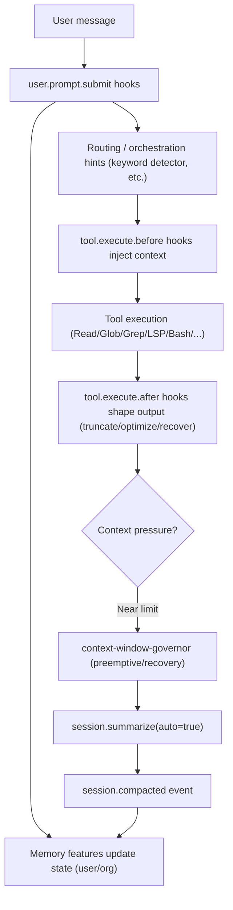

# Journey: Context & Memory

## User Perspective

You want to understand why the agent “knows what it knows”, how much context is being injected, and why behavior can change when the session grows (truncation, compaction, recovery).
This journey maps the end-to-end lifecycle across prompt submission, tool execution, and compaction.

## End-to-End Flow

This journey explains how context is managed (budgeting, truncation, compaction), how memory features inject state, and how to reason about “what the agent knows”.

## Key Docs

- Context window management: `docs/journeys/context-window-management.md`
- Deterministic delegation context: `docs/journeys/context-packs-and-manifests.md`
- User memory contract: `docs/reference/user-memory.md`
- Org memory contract: `docs/reference/org-memory.md`
- User memory deep dive (non-normative): `docs/research/user-memory-deep-dive.md`
- Cross-session continuity: `docs/journeys/cross-session-continuity.md`
- Session handoff & session reference: `docs/journeys/session-handoff-and-reference.md`
- Hook contract: `docs/reference/hooks.md`

## Where to Look in Code

- Context collection/injection: `src/features/context-injector/`
- Context budget arbiter: `src/features/context-budget/` (unified token budget across all injection channels)
- Tool output truncation: `src/hooks/tool-output-truncator.ts`
- Preemptive compaction: `src/hooks/context-window-governor/index.ts`
- Compaction-time injection helpers (wired via `experimental.session.compacting`): `src/hooks/context-window-governor/actions/` and Claude Code compat `src/hooks/claude-code-hooks/pre-compact.ts`
- Session recovery on token-limit errors: `src/hooks/context-window-governor/`
- User memory: `src/features/user-memory/`
- Org memory: `src/features/org-memory/`

## Practical Debug Checklist

- Verify runtime order in `src/hooks/runtime/pipeline-order.ts`, event node assembly in `src/hooks/runtime/assembly/*.ts`, and lifecycle dispatch entrypoints in `src/index.ts`.
- Confirm `disabled_hooks` and feature config in `oh-my-opencode/*.json`.
- If compaction seems to “forget” critical constraints, inspect compaction triggers (`context-window-governor`, `context-window-governor`) and whether your build has any compaction-time injection wired (see `docs/reference/hooks.md`).
