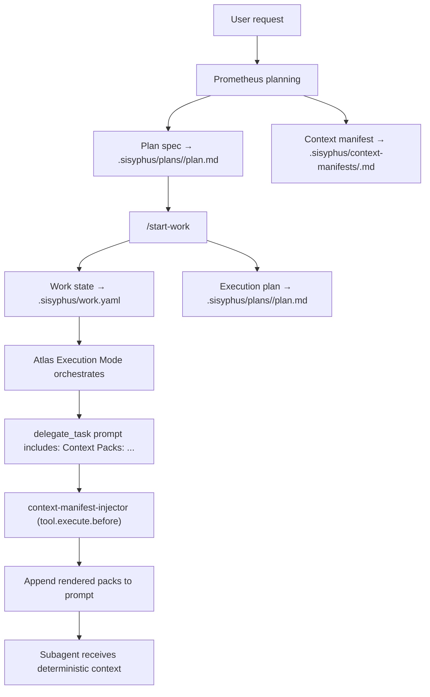

# Journey: Context Packs & Context Manifests (Deterministic Delegation Context)

## User Perspective

You want delegation to be **repeatable and reviewable**:
- The right specs / conventions / “do-not-do” guardrails should reliably reach every subagent.
- You should not have to manually paste context or hope the orchestrator “remembers to read X”.
- Context should be **versionable** (in `.sisyphus/`) and **auditable** (you can inspect what was injected and why).

Context Packs and Context Manifests turn “context selection” into a first-class planning artifact, and make prompt injection deterministic at `delegate_task` boundaries.

## End-to-End Flow



## Core Concepts

### Context Packs

A **Context Pack** is a named, stable bundle of references:
- Pack ID (e.g., `global`, `tooling`, `work-state`, `governance`)
- A short purpose/title
- A list of items: pointers to docs/code/index entrypoints, plus `why` (what the executor should extract)

Pack IDs are intentionally boring: stable, composable building blocks.

### Context Manifest

The **Context Manifest** is a per-plan artifact that defines the pack catalog:

- Path: `.sisyphus/context-manifests/{planId}.md`
- Format: Markdown + an embedded JSON payload between markers:

```text
[CONTEXT_MANIFEST]
{ ...json... }
[/CONTEXT_MANIFEST]
```

This keeps it human-readable (Markdown) and machine-parseable (JSON block).

## How to Use (Practitioner Workflow)

### Step 1: Prometheus generates both artifacts

For a plan `{planId}`, Prometheus should write:
- `.sisyphus/plans/{planId}/plan.md` (plan spec)
- `.sisyphus/context-manifests/{planId}.md`

When you run `/start-work`, execution mode binds:
- `.sisyphus/plans/{planId}/plan.md` (plan spec)
- `.sisyphus/tasks/plan/{planId}/task_*.json` (TaskGraph task SSOT)

The plan template enforces that each task includes:

```text
Context Packs: global, tooling
```

This line is the selection mechanism for deterministic injection.

### Step 2: Start work (so `work.yaml` exists)

Run `/start-work` so the system records the active plan in `.sisyphus/work.yaml`.

The injector resolves the manifest path from `work.yaml.plan_id`.

### Step 3: Delegate as usual

When Atlas Execution Mode calls `delegate_task(...)`, it copies the task’s `Context Packs:` line into the delegation prompt.

The injector hook then appends the corresponding pack content (rendered) right before the tool executes.

## Deterministic Injection (v2)

### What the hook does

Hook: `context-manifest-injector` (runs on `tool.execute.before` for `delegate_task`)

1. Parse pack IDs from the prompt (`Context Packs:`)
2. Load `.sisyphus/work.yaml` → `plan_id`
3. Read `.sisyphus/context-manifests/{plan_id}.md`
4. Parse the `[CONTEXT_MANIFEST]...[/CONTEXT_MANIFEST]` JSON
5. Render the selected packs into a stable markdown snippet
6. Append snippet to the `delegate_task` prompt

### Safety & budget defaults

The renderer is intentionally conservative:
- Max total injected chars: ~6000 (default)
- Max chars per pack: ~2500 (default)
- Max items per pack: 20 (default)
- Fail-open: if anything is missing/invalid, it simply does not inject

Idempotency:
- If the prompt already contains `## CONTEXT PACKS (auto-injected)`, the hook does nothing.

Disable:
- Add `"context-manifest-injector"` to `disabled_hooks`.

## Manifest Authoring Guidelines

### Pack design rules

- Prefer **pointers** over dumps. An item should tell the executor what to read and why.
- Keep packs stable and reusable across plans.
- Pack IDs should be safe and predictable: `[a-zA-Z0-9][a-zA-Z0-9._-]{0,63}`.
- Put “must-not-do” guardrails into packs that are likely to apply repeatedly (`global`, `governance`).

### Item types

Item kinds are intentionally limited:
- `doc`: user-facing docs/contracts
- `code`: source entrypoints / patterns to copy
- `index`: directory-level map / codemap / readme
- `command`: canonical commands to run
- `url`: external reference (official docs)

### Example manifest (minimal)

```text
[CONTEXT_MANIFEST]
{
  "schemaVersion": 2,
  "planId": "demo",
  "generatedAt": "2026-02-05T00:00:00Z",
  "packs": [
    {
      "id": "global",
      "title": "Global guardrails + repo conventions",
      "items": [
        { "kind": "doc", "ref": "docs/guide/orchestration.md", "why": "Execution workflow + SSOT expectations" },
        { "kind": "code", "ref": "src/agents/sisyphus/index.ts", "why": "Delegation prompt structure expectations" }
      ]
    }
  ]
}
[/CONTEXT_MANIFEST]
```

## Troubleshooting

### “It didn’t inject anything”

Check these first:
- You ran `/start-work` and `.sisyphus/work.yaml` exists.
- `work.yaml.plan_id` matches the manifest filename: `.sisyphus/context-manifests/{plan_id}.md`.
- Your `delegate_task` prompt includes `Context Packs: ...`.
- The manifest contains a valid JSON block and `schemaVersion: 2`.
- Pack IDs in the prompt are safe (invalid IDs are ignored).
- The hook is enabled (not in `disabled_hooks`).

### “It injected, but the pack looks truncated”

This is expected when packs exceed the default caps. Keep packs small and split them by purpose.

## Where to Look in Code

- Hook: `src/hooks/context-manifest-injector/`
- Parser/renderer: `src/features/context-manifests/`
- Prometheus plan template: `src/agents/prometheus/plan-template.ts`
- Orchestration overview: `docs/guide/orchestration.md`
