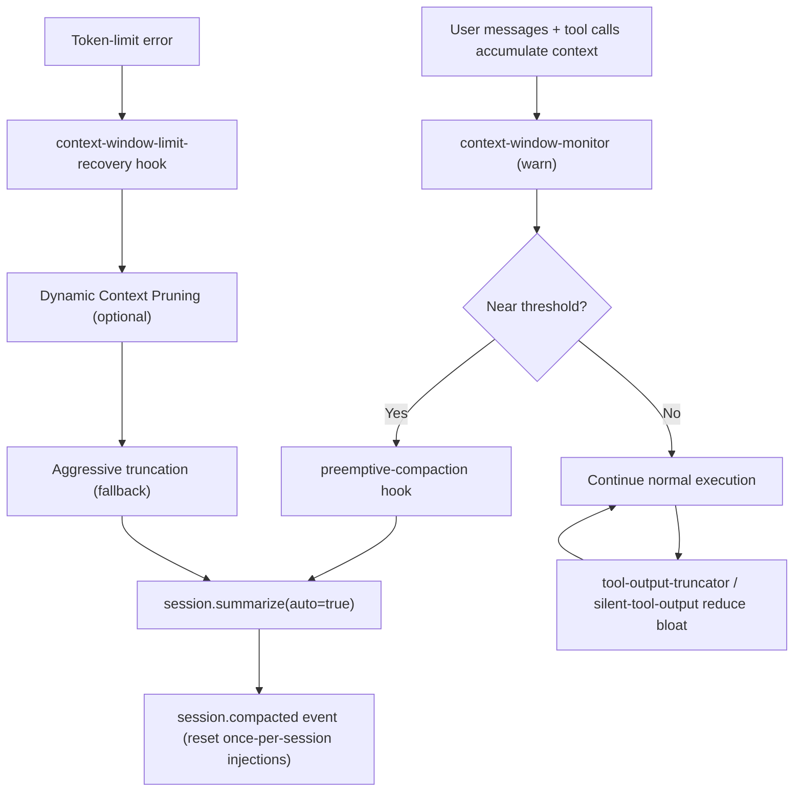
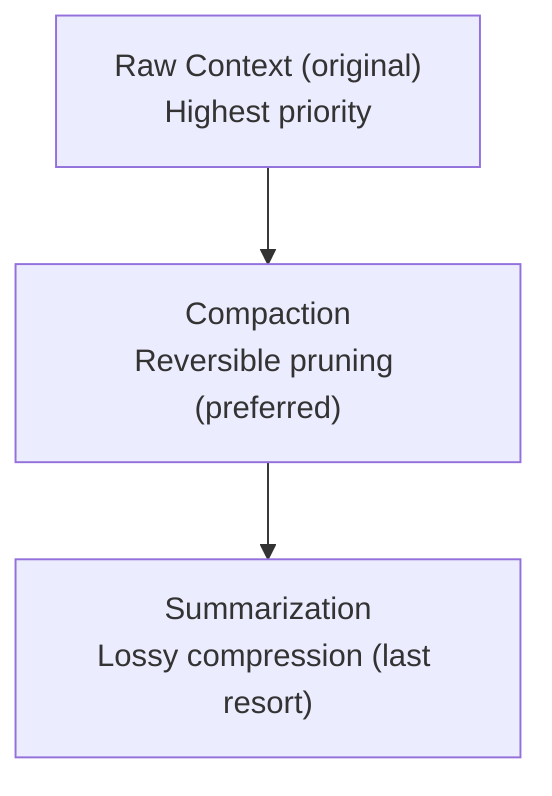
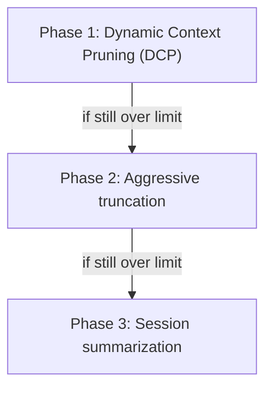

# Journey: Context Window Management

## User Perspective

You want long-running sessions to remain stable and coherent: large tool outputs should not blow up the context, token-limit errors should recover automatically, and compaction should preserve the information that matters (goals, decisions, current state, and “do not repeat” failures).
This journey explains the end-to-end chain: monitoring → proactive compaction → reactive recovery → output shaping → memory injection boundaries.

## End-to-End Flow



A comprehensive guide to context window management in oh-my-opencode. This document details how the system manages LLM context windows to maintain information integrity and system stability during extended sessions.

**Status note (wiring matters)**: This document describes runtime components that are actually wired. Canonical event order lives in `src/hooks/runtime/pipeline-order.ts`, and canonical node wiring lives in `src/index.ts`. Compaction-time injection is wired via `experimental.session.compacting`, but still depends on the OpenCode runtime emitting that experimental surface.

## Table of Contents

- [Overview](#overview)
- [Core Principles](#core-principles)
- [Architecture](#architecture)
- [Compaction Strategies](#compaction-strategies)
- [Memory Systems](#memory-systems)
- [Configuration Guide](#configuration-guide)
- [Trade-offs and Limitations](#trade-offs-and-limitations)
- [Best Practices](#best-practices)
- [Troubleshooting](#troubleshooting)
- [References](#references)

---

## Overview

### The Context Window Problem

Large Language Models operate within fixed context window limits. As conversations progress, the context gradually fills, leading to three critical challenges:

1. **Performance Degradation**: Model performance significantly deteriorates when approaching context limits, a phenomenon known as "context rot"
2. **Information Loss**: Naive truncation discards important historical information
3. **Continuity Disruption**: Poor compression can lose task context, interrupting workflow

### Design Philosophy

oh-my-opencode employs a **multi-layered context distillation** strategy, guided by the principle:

> "Treat context the way operating systems treat memory: as finite resources to be budgeted, compacted, and intelligently paged."

The system implements a hierarchical approach to context management:



**The Golden Rule**: `Raw > Compaction > Summarization`

---

## Core Principles

### 1. Proactive vs Reactive Management

| Strategy | Trigger | Advantages | Disadvantages |
|----------|---------|------------|---------------|
| **Proactive** | Threshold-based (before limits) | Smooth transitions, no interruptions | Uses less than maximum available context |
| **Reactive** | Error-based (after API failure) | Maximum context utilization | Causes workflow interruption |

oh-my-opencode supports both strategies. **Proactive mode is recommended** for production use to avoid workflow interruptions.

### 2. Preserve Momentum

During compaction, the system preserves the most recent conversation turns in their original form. This ensures the model maintains:

- Consistent formatting style
- Task execution "rhythm"
- Tool invocation patterns

**Configuration**: `turn_protection.turns` (default: 3 turns)

Research indicates that keeping recent turns raw significantly improves post-compaction coherence.

### 3. Structure Forces Preservation

The system employs structured summary templates where each section acts as a checklist, preventing silent information loss:

```markdown
## 1. User Requests (As-Is)
## 2. Final Goal
## 3. Files Modified (with details)
## 4. Key Decisions & Rationale
## 5. Current Working State
## 6. Environment & Tool Outputs Still Needed
## 7. Remaining Tasks
## 8. MUST NOT Do (Critical Constraints)
## 9. Important Context
```

This structured approach ensures that critical information categories cannot be inadvertently omitted during summarization.

### 4. Layered Recovery

The system implements a three-phase progressive recovery strategy, escalating from lightweight to heavyweight interventions:



This approach minimizes information loss by applying the least destructive method first.

### 5. Re-trigger Guardrails

To avoid repeated or noisy compaction behavior, current wiring relies on per-session state:

- `preemptive-compaction` compacts at most once per session (best-effort guard).
- `context-window-limit-recovery` tracks retry/truncation state and applies backoff (`RETRY_CONFIG`) to avoid tight recovery loops.

Note: there is no global time-based "compaction cooldown" constant in the current code; behavior is controlled via per-session guards and retry backoff.

---

## Architecture

### Component Overview

```
oh-my-opencode Context Management
├── Preemptive Compaction              # Proactive summarization (best-effort; once per session)
│   └── src/hooks/preemptive-compaction.ts
├── Error Recovery                     # Reactive recovery on token limit errors
│   └── src/hooks/context-window-limit-recovery/
│       ├── index.ts                   # Hook entry point
│       ├── executor.ts                # Three-phase orchestration
│       ├── parser.ts                  # Token error parsing
│       ├── pruning-deduplication.ts   # Remove duplicate calls
│       ├── pruning-supersede.ts       # Remove superseded writes
│       ├── pruning-purge-errors.ts    # Remove old errors
│       ├── pruning-clear-results.ts   # Clear old tool results
│       └── storage.ts                 # Tool output management
├── Context Injection                  # Context bootstrapping
│   ├── src/hooks/compaction-context-injector/   # Compaction-time injection helper (wired via experimental.session.compacting)
│   ├── src/hooks/repo-overview-injector/        # Project context injection
│   └── src/hooks/directory-agents-injector/     # Directory-level context
├── Memory Systems                     # Persistent memory
│   ├── src/features/user-memory/      # Cross-session user memory
│   │   ├── types.ts                   # Memory schema
│   │   ├── storage.ts                 # Persistence layer
│   │   └── hook.ts                    # Injection hook
│   └── src/features/org-memory/       # Project/team memory
│       ├── types.ts                   # Memory schema
│       ├── storage.ts                 # Persistence layer
│       └── hook.ts                    # Injection hook
├── Monitoring                         # Runtime monitoring
│   ├── src/hooks/context-window-monitor.ts      # Usage tracking (70% warning)
│   └── src/hooks/runtime-tracker/               # Tool performance tracking
└── Output Optimization                # Output size management
    ├── src/hooks/tool-output-truncator.ts       # Tool output truncation
    └── src/shared/dynamic-truncator.ts          # Dynamic size adjustment
```

### Data Flow

```mermaid
flowchart TD
  START["Session start"] --> BOOT["Bootstrap injection\n- User memory\n- Org memory\n- AGENTS.md context\n- Repository overview"]
  BOOT --> NORMAL["Normal operation\n- Tool invocations\n- Output shaping\n- Runtime tracking"]

  NORMAL --> WARN["Context warnings\ncontext-window-monitor (70% default)"]
  WARN --> NORMAL

  NORMAL --> PRE{"Usage ratio >= threshold?\n(preemptive-compaction; Anthropic only)\n(default threshold: 0.78)"}
  PRE -->|No| NORMAL
  PRE -->|Yes (once/session)| SUM["session.summarize(auto=true)"]
  SUM --> NORMAL

  ERR["Token limit error"] --> REC["Recovery pipeline\ncontext-window-limit-recovery\n1) DCP pruning\n2) Truncation\n3) Summarization (if needed)"]
  REC --> NORMAL
```

### Event Flow

| Event | Handler | Action |
|-------|---------|--------|
| `tool.execute.after` | preemptive-compaction | Check usage and maybe auto-summarize (Anthropic only; once per session) |
| `tool.execute.after` | context-window-monitor | Emit 70% usage warnings |
| `session.error` | context-window-limit-recovery | Parse token-limit errors and schedule recovery |
| `message.updated` | context-window-limit-recovery | Capture assistant errors (token-limit cases) |
| `session.idle` | context-window-limit-recovery | Execute recovery if `pendingCompact` is set |
| `experimental.session.compacting` | compaction-context-injector / Claude Code PreCompact | Inject extra compaction-time context (best-effort) |
| `session.compacted` | Various | Clear session-specific caches |
| `session.deleted` | Various | Clean up session state |

---

## Compaction Strategies

### 1. Dynamic Context Pruning (DCP)

DCP comprises a set of reversible pruning strategies that remove redundant information without semantic loss. These operations target content that either duplicates existing information or can be reconstructed from the environment.

#### Upstream Compatibility

DCP is designed to coexist with opencode's built-in `SessionCompaction.prune()` mechanism without conflicts. The two systems use different marking conventions but recognize each other's markers:

| System | Marker | Recognition |
|--------|--------|-------------|
| **Upstream prune** | `state.time.compacted` (timestamp) | DCP checks and skips parts with this marker |
| **DCP** | `output = "[Content pruned...]"` + sets `time.compacted` | Upstream recognizes `time.compacted` and breaks loop |

**Conflict Prevention**:
- When DCP prunes output, it also sets `time.compacted` so upstream will skip the part
- When DCP encounters a part with `time.compacted` already set, it skips processing
- This bidirectional recognition ensures no redundant processing regardless of execution order

**Execution Order** (lowest risk → highest risk):
1. Deduplication - Safe: identical calls, agent can re-fetch
2. Clear Tool Results - Safe: old results from deep history, agent can re-fetch
3. Supersede Writes - Medium risk: writes that have been re-read
4. Purge Errors - Executed last: old errors have limited ongoing value but may aid debugging

This order ensures the safest operations are applied first, maximizing token savings with minimal information loss risk.

#### 1.1 Deduplication

Removes duplicate tool invocations (same tool name + identical arguments), **keeping only the most recent occurrence**.

```typescript
// Example: Multiple reads of the same file
Read("src/index.ts")  // Pruned (older duplicate)
Read("src/index.ts")  // Pruned (older duplicate)
Read("src/utils.ts")  // Preserved (different file)
Read("src/index.ts")  // Preserved (most recent)
```

**Rationale**: The most recent result is the most relevant. Earlier identical calls provide no additional information.

**Implementation Detail**: Uses signature-based deduplication where signature = `toolName::JSON(sortedInput)`.

**Configuration**:
```json
{
  "strategies": {
    "deduplication": { "enabled": true }
  }
}
```

#### 1.2 Clear Tool Results

**The safest form of compaction**—clears tool outputs from older turns while preserving the most recent N turns.

```typescript
// Turn 1 (old) - output cleared
Read("file.ts") → output: "[Content pruned by Dynamic Context Pruning]"

// Turn 5 (recent) - output preserved
Read("file.ts") → output: "actual file content..."
```

**Rationale**: Tool results deep in conversation history are rarely referenced. If needed, the agent can re-invoke the tool to retrieve current information. The tool invocation record is preserved, only the verbose output is cleared.

**Configuration**:
```json
{
  "strategies": {
    "clear_tool_results": {
      "enabled": true,
      "keep_recent_turns": 5
    }
  }
}
```

#### 1.3 Supersede Writes

Removes write operation inputs when the file is subsequently read, as the content has been superseded by the current file state.

```typescript
// Example: Write followed by read
Write("config.json", content)  // Input pruned (superseded by read)
Edit("config.json", ...)       // Input pruned (superseded by read)
Read("config.json")            // Preserved (proves writes completed)
```

**Rationale**: Once a file has been read after modifications, the write inputs are redundant—the read output contains the current state.

**Modes**:
- `aggressive: false` (default): Prune write/edit inputs only when the SAME file is read later
- `aggressive: true`: Prune write/edit inputs when ANY subsequent read occurs (even if it reads a different file)

**Configuration**:
```json
{
  "strategies": {
    "supersede_writes": {
      "enabled": true,
      "aggressive": false
    }
  }
}
```

#### 1.4 Purge Errors

Removes errored tool invocations after N conversation turns, as error context becomes stale.

```typescript
// 5 turns ago
Bash("invalid-cmd")  // Error → Pruned after threshold
// Current turn
Bash("valid-cmd")    // Success → Preserved
```

**Rationale**: Error context degrades as the conversation progresses and the agent's focus shifts. Old errors consume space better utilized for current task information.

**Configuration**:
```json
{
  "strategies": {
    "purge_errors": {
      "enabled": true,
      "turns": 5  // Prune errors older than N turns
    }
  }
}
```

#### Turn Protection

All DCP strategies respect **turn protection**, which prevents pruning of recent tool calls regardless of other criteria.

```json
{
  "turn_protection": {
    "enabled": true,
    "turns": 3  // Never prune tools from the last 3 turns
  }
}
```

**Rationale**: Recent tool outputs are likely still relevant to ongoing work. Pruning them could disrupt the agent's current reasoning flow.

### 2. Aggressive Truncation

When DCP fails to release sufficient context space, the system applies aggressive truncation to the largest tool outputs.

**Algorithm**:
1. Identify the largest tool output in the current session
2. Truncate proportionally to reach target token count
3. Repeat up to 20 iterations if necessary

**Target**: Reduce token count to `maxTokens * 0.5`

**Configuration Constants**:
- `TRUNCATE_CONFIG.maxTruncateAttempts = 20`
- `TRUNCATE_CONFIG.targetRatio = 0.5`
- `CHARS_PER_TOKEN = 4` (estimation)

This phase preserves tool invocation records while removing verbose output content.

### 3. Session Summarization

The final fallback strategy employs the LLM to generate a structured session summary.

**Retry Configuration**:
- `RETRY_CONFIG.maxAttempts = 2`
- `RETRY_CONFIG.initialDelayMs = 2000`
- `RETRY_CONFIG.maxDelayMs = 30000`
- Exponential backoff between retries

#### Compaction Template

The system injects a structured template to guide summarization:

```markdown
## 1. User Requests (As-Is)
- Original user requests with exact wording preserved
- User intent and clarifications

## 2. Final Goal
- Ultimate objective
- Success criteria if specified

## 3. Files Modified (with details)
- Each file path with specific changes
- Line ranges for significant modifications
- Creation/modification/deletion indicators
- Example: "src/utils/helper.ts: Added validateInput function (lines 45-78)"

## 4. Key Decisions & Rationale
- Technical decisions made and WHY
- Alternatives considered and rejection reasons
- Trade-offs acknowledged
- Prevents re-exploration of rejected approaches

## 5. Current Working State
- What is currently working/passing
- Test status if tests were run
- Build status if relevant
- Partial implementations in progress

## 6. Environment & Tool Outputs Still Needed
- Tool results that may require re-fetching
- File contents that might need re-reading
- External state dependencies

## 7. Remaining Tasks
- Specific outstanding items
- Pending items from original request
- Follow-up tasks identified during work
- Blockers or dependencies

## 8. MUST NOT Do (Critical Constraints)
- Explicitly forbidden operations
- Approaches that FAILED (do not retry)
- User restrictions and preferences
- Anti-patterns identified during session
- Commands that caused errors

## 9. Important Context
- Domain-specific knowledge acquired
- Component relationships discovered
- Quirks or gotchas encountered
- User preferences learned
```

This structured approach ensures comprehensive information preservation during lossy compression.

---

## Memory Systems

### 1. Repository Overview

Provides an optional hook that can inject project context early in a session, reducing redundant exploration.

**Status**: The `repo-overview-injector` hook is wired in the runtime pipeline. Injection behavior is controlled by hook enablement and the `repo_overview` config block.

When enabled, injected content typically includes:
- Project name and description (from package.json)
- Technology stack (TypeScript, React, Python, etc.)
- Frameworks (Next.js, Express, Django, etc.)
- Package manager (npm, yarn, pnpm, bun)
- Common commands (build, dev, test, lint)
- Core file listing (package.json, tsconfig.json, etc.)
- Directory structure tree (max depth configurable)

**Caching**: Stored at `~/.opencode/cache/repo-overview/` with configurable TTL (default: 1 hour)

**Injection Timing**: Configurable via `min_tool_calls` (default: 1 = first tool use). Set to 2+ to skip injection for trivial one-shot interactions.

**Configuration** (top-level):
```json
{
  "repo_overview": {
    "enabled": true,
    "auto_generate": true,
    "max_tree_depth": 50,
    "cache_duration_ms": 3600000,
    "min_tool_calls": 1
  }
}
```

### 2. User Memory

Cross-session persistent memory stored at `~/.opencode/memory/user.json`.

**Stored Information**:

| Category | Description | Example |
|----------|-------------|---------|
| `preferences` | User preferences | `{ "style": "concise", "language": "en" }` |
| `environment` | Development environment | `{ "os": "macOS", "shell": "zsh", "editor": "vscode" }` |
| `workHistory` | Recent work sessions | Last N session summaries (configurable) |
| `customRules` | Persistent instructions | `["Always use TypeScript", "Prefer functional style"]` |
| `explicitMemories` | User-requested memories | Content from "remember that..." requests |
| `frequentPatterns` | Common commands/patterns | Auto-detected frequent operations |

**Memory Triggers**:
```
User: Remember that our API uses snake_case for all endpoints
→ Automatically saved to explicitMemories
```

The system detects patterns:
- "remember that X" - declarative statements
- "remember: X" or "remember this: X" - explicit memory markers
- "note that X" - declarative statements
- "keep in mind that X" - must have "that" to be declarative
- "I prefer/always/like/use/want X" - preference statements

**Note**: Imperative commands like "remember to run tests" are NOT captured (no "that" or colon marker).

**Configuration** (top-level):
```json
{
  "user_memory": {
    "enabled": true,
    "persist_preferences": true,
    "persist_work_history": true,
    "max_history_entries": 50,
    "auto_inject": true
  }
}
```

### 3. Org Memory (Project/Team Memory)

Project-level memory shared across all team members, stored at `.opencode/memory/org.json` in the project root.

**Stored Information**:

| Category | Description | Example |
|----------|-------------|---------|
| `conventions` | Coding conventions and style rules | `[{ "name": "api-naming", "description": "Use snake_case for API endpoints" }]` |
| `architecturalDecisions` | ADRs (Architecture Decision Records) | `[{ "title": "Use Redux", "rationale": "Team familiarity..." }]` |
| `patterns` | Common patterns used in the project | `[{ "name": "error-handling", "description": "..." }]` |
| `terminology` | Project-specific terms | `{ "PDC": "Product Data Catalog" }` |
| `protectedPaths` | Files that should never be modified | `["config/production.json", ".env.production"]` |
| `customRules` | Project-wide rules | `["Always use TypeScript strict mode"]` |

**Memory Triggers**:
```
User: Remember for this project that we use snake_case for database columns
→ Automatically saved to customRules

User: Never modify config/secrets.json
→ Automatically saved to protectedPaths
```

The system detects patterns:
- "remember for project/project-wide that..."
- "project rule: ..."
- "team/org convention: ..."
- "never modify/change/edit..."

**Key Difference from User Memory**:
- **User Memory**: Personal preferences stored in `~/.opencode/memory/user.json` (follows the user across projects)
- **Org Memory**: Project conventions stored in `.opencode/memory/org.json` (shared with team via version control)

**Configuration** (top-level):
```json
{
  "org_memory": {
    "enabled": true,
    "auto_inject": true,
    "max_conventions": 10,
    "max_decisions": 5,
    "max_patterns": 5,
    "max_terminology": 10,
    "max_custom_rules": 20
  }
}
```

### 4. AGENTS.md Injection

Automatically injects directory-level AGENTS.md files to provide localized context.

**Discovery Algorithm**:
1. Start from the directory of the current file operation
2. Traverse upward to project root
3. Inject all discovered AGENTS.md files in hierarchical order
4. Skip root-level AGENTS.md (loaded separately by system)

**Injection Timing**: On first file access in each directory

This enables project-specific and directory-specific context to be automatically provided without explicit configuration.

### 5. Runtime Tracker

Monitors tool execution times to help the agent avoid repeating slow operations.

**Status**: The `runtime-tracker` hook is wired in the runtime pipeline. Behavior is controlled by hook enablement and the `runtime_tracker` config block.

**Tracked Metrics** (per session):
- Average duration (rolling window of last N calls)
- Last duration
- Total call count
- Recent durations for trend analysis
- Last called timestamp

**Runtime Hints** (injected when threshold exceeded):
```
[Runtime: 5.2s - Tool "grep" averaged 4.8s over 3 calls.
 Consider narrower queries or caching results.]
```

**Throttling**: Hints are throttled via `hint_cooldown_ms` (default: 60 seconds per tool) to prevent spam when a tool is repeatedly slow.

**Configuration** (top-level):
```json
{
  "runtime_tracker": {
    "enabled": true,
    "threshold_ms": 3000,
    "max_recent": 10,
    "inject_hints": true,
    "hint_cooldown_ms": 60000
  }
}
```

---

## Configuration Guide

### Configuration Hierarchy

```
oh-my-opencode config
├── experimental                    # Experimental features
│   ├── preemptive_compaction      # Enable proactive compaction
│   ├── preemptive_compaction_threshold  # Trigger threshold (default: 0.78)
│   └── dynamic_context_pruning    # DCP configuration
│       ├── enabled
│       ├── notification
│       ├── turn_protection
│       ├── protected_tools
│       └── strategies
│           ├── deduplication
│           ├── supersede_writes
│           ├── purge_errors
│           └── clear_tool_results
├── repo_overview                   # Repository Overview (top-level)
├── user_memory                     # User Memory (top-level)
├── org_memory                      # Org Memory (top-level)
└── runtime_tracker                 # Runtime Tracker (top-level)
```

**Note**: DCP configuration is under `experimental.dynamic_context_pruning`, while memory systems are top-level configurations. `repo_overview` and `runtime_tracker` are top-level configs for hooks that are wired in the runtime pipeline.

### Complete Configuration Example

```json
{
  "experimental": {
    "preemptive_compaction": true,
    "preemptive_compaction_threshold": 0.80,
    "dynamic_context_pruning": {
      "enabled": true,
      "notification": "detailed",
      "turn_protection": {
        "enabled": true,
        "turns": 3
      },
      "protected_tools": [
        "task", "todowrite", "todoread",
        "lsp_rename", "lsp_code_action_resolve",
        "session_read", "session_write", "session_search"
      ],
      "strategies": {
        "deduplication": { "enabled": true },
        "supersede_writes": { "enabled": true, "aggressive": false },
        "purge_errors": { "enabled": true, "turns": 5 },
        "clear_tool_results": { "enabled": true, "keep_recent_turns": 5 }
      }
    }
  },
  "repo_overview": {
    "enabled": true,
    "auto_generate": true,
    "max_tree_depth": 50,
    "cache_duration_ms": 3600000
  },
  "user_memory": {
    "enabled": true,
    "persist_preferences": true,
    "persist_work_history": true,
    "max_history_entries": 50,
    "auto_inject": true
  },
  "org_memory": {
    "enabled": true,
    "auto_inject": true,
    "max_conventions": 10,
    "max_decisions": 5,
    "max_patterns": 5,
    "max_terminology": 10,
    "max_custom_rules": 20
  },
  "runtime_tracker": {
    "enabled": true,
    "threshold_ms": 3000,
    "max_recent": 10,
    "inject_hints": true,
    "hint_cooldown_ms": 60000
  }
}
```

### Threshold Recommendations

| Model | Context Window | Recommended Threshold | Notes |
|-------|---------------|----------------------|-------|
| Claude 3.5 Sonnet | 200K | 0.80 (160K) | Standard configuration |
| Claude 3 Opus | 200K | 0.75 (150K) | More conservative |
| Claude 3.5 Sonnet (Extended) | 1M | 0.25 (256K) | Avoid context rot zone |
| GPT-4 Turbo | 128K | 0.80 (102K) | Standard configuration |
| GPT-4o | 128K | 0.80 (102K) | Standard configuration |

**Key Insight**: For 1M context models, do not wait until 800K+ tokens. Performance degradation ("context rot") begins well before the absolute limit. Research suggests quality degrades significantly beyond 256K tokens.

### Protected Tools

Certain tools should never be pruned as they maintain critical state:

```json
{
  "protected_tools": [
    "task",                      // Subtask state - losing this breaks task coordination
    "todowrite",                 // Task list management - critical for task tracking
    "todoread",                  // Task list retrieval
    "lsp_rename",                // LSP rename operations - partial renames are dangerous
    "lsp_code_action_resolve",   // LSP code actions
    "session_read",              // Session state
    "session_write",             // Session state
    "session_search"             // Session search
  ]
}
```

### Notification Levels

| Level | Output | Use Case |
|-------|--------|----------|
| `"off"` | No notifications | Production, minimal interruption |
| `"minimal"` | `Pruned 12 tool calls (~8k tokens)` | Normal use |
| `"detailed"` | `Pruned 12 tool calls (~8k tokens). Dedup: 3, Supersede: 5, Purge: 2, ClearResults: 2` | Debugging, optimization |

---

## Trade-offs and Limitations

### Strategy Trade-offs

| Strategy | Benefits | Costs | When to Disable |
|----------|----------|-------|-----------------|
| **Deduplication** | Removes redundant reads | May lose context if file changed between reads | Never (always safe) |
| **Supersede Writes** | Significant token savings | Loses write history for debugging | When debugging write operations |
| **Purge Errors** | Cleans up failed attempts | Loses error context for pattern recognition | When debugging recurring errors |
| **Clear Tool Results** | Major token savings | Agent must re-fetch if needed | When working with slow/expensive tools |
| **Aggressive Truncation** | Forces space recovery | Loses detailed output | When output detail is critical |
| **Summarization** | Guaranteed space recovery | Lossy, may lose nuance | Cannot disable (last resort) |

### Proactive vs Reactive Trade-offs

| Aspect | Proactive (Recommended) | Reactive |
|--------|-------------------------|----------|
| **Context Utilization** | ~80% of available | ~100% of available |
| **Workflow Interruption** | Smooth, predictable | Sudden, disruptive |
| **Information Retention** | Compacted at threshold | Maximum until API error |
| **User Experience** | Better (no errors) | Risk of failures |
| **Recommended For** | Production, long sessions | Short sessions, exploration |

### Limitations

1. **Summarization Quality**: LLM-generated summaries may lose nuance or misinterpret context. The structured template mitigates but doesn't eliminate this risk.

2. **Token Estimation**: Uses 4 characters per token approximation. Actual token counts vary by model and content type (code vs prose).

3. **File Change Detection**: Deduplication assumes files don't change between reads. If external processes modify files, duplicate reads may actually return different content.

4. **Memory Persistence**: User memory is stored in plaintext JSON. Sensitive information should not be stored via "remember" commands.

5. **Cross-Session State**: While user memory persists, session-specific context (runtime stats, injection caches) is lost on session end.

6. **Preemptive Compaction Guard**: `preemptive-compaction` compacts at most once per session. In long sessions, recovery may fall back to `context-window-limit-recovery` (or manual compaction) after the first summarize.

7. **Protected Tool Scope**: Protected tools are identified by name only. Custom tools with similar functions need manual protection.

### Performance Considerations

| Operation | Latency Impact | Token Cost |
|-----------|---------------|------------|
| DCP Pruning | <100ms | None |
| Aggressive Truncation | <100ms per iteration | None |
| Summarization | 2-10s | ~1000-3000 tokens |
| Repo Overview Generation (when wired) | 100-500ms | ~500-2000 tokens |
| User Memory Injection | <50ms | ~200-1000 tokens |

### Security Considerations

1. **User Memory**: Stored at `~/.opencode/memory/user.json` with standard file permissions. Do not store secrets.

2. **Org Memory**: Stored at `.opencode/memory/org.json` in project root. May be committed to version control—do not store secrets or sensitive credentials.

3. **Repo Overview Cache (when wired)**: Stored at `~/.opencode/cache/repo-overview/`. May expose project structure. Clear cache if switching between sensitive projects.

4. **Tool Output Pruning**: Pruned content is replaced with placeholder text, not deleted from disk immediately. Sensitive output in tool results is retained until session termination or explicit cleanup.

---

## Best Practices

### 1. Threshold Configuration

```
Recommended: 0.75 - 0.85
Avoid: > 0.90 (too late, risk errors)
Avoid: < 0.60 (too aggressive, waste context)
```

Setting the threshold too high risks API errors; setting it too low wastes available context.

### 2. Protect Critical Tools

Always protect tools that maintain important state:
- Task management tools (task, todo*)
- LSP tools (rename, refactor, code actions)
- Session management tools (session_*)
- Any custom tools that maintain state

### 3. Enable Structured Summarization

Always ensure summarization uses a structured template to preserve critical information:
- Original user requests (exact wording)
- File modification records (with line numbers)
- Decision rationale (prevents re-exploration)
- Remaining tasks (maintains continuity)
- Failure constraints (prevents retry of failed approaches)

Implementation note: compaction-time injection is wired via `experimental.session.compacting` when `compaction-context-injector` (and Claude Code `PreCompact` compatibility) are enabled. Structured templates are still primarily enforced by the summarization prompts in `preemptive-compaction` and `context-window-limit-recovery`.

### 4. Monitor Context Usage

Enable context-window-monitor for early warnings at 70%:

```
[Context Status: 72% used, 28% remaining]
[SYSTEM REMINDER: You have plenty of context remaining - do NOT rush tasks]
```

### 5. Leverage Runtime Tracking

Enable runtime tracking to identify and optimize slow operations:

```
[Runtime: 5.2s - Tool "grep" averaged 4.8s over 3 calls]
[Consider narrower queries or caching results]
```

### 6. Use Repository Overview

Enable repository overview injection to eliminate redundant project exploration at session start. The cached overview provides immediate context about:
- Project structure
- Technology stack
- Build commands
- Entry points

### 7. Configure Turn Protection

Set `turn_protection.turns` based on your typical task complexity:
- Simple tasks: 2-3 turns
- Complex tasks: 4-5 turns
- Deep debugging: 5-7 turns

### 8. Use Appropriate DCP Strategy Combinations

| Use Case | Recommended Strategies |
|----------|----------------------|
| Code refactoring | dedup + supersede + clear_results |
| Debugging | dedup + clear_results (disable purge_errors) |
| Long sessions | All strategies enabled |
| Short tasks | dedup only |

---

## Troubleshooting

### Issue: Information Loss After Compaction

**Symptoms**: Agent forgets previous decisions or file modifications after compaction

**Causes**:
- Summarization template not being used
- Turn protection too low
- Critical tools not protected

**Solutions**:
1. Verify compaction-time injection is enabled in your build (hooks: `compaction-context-injector` and/or Claude Code `PreCompact`). These run on `experimental.session.compacting` events.
2. Increase `turn_protection.turns` value (try 5)
3. Add critical tools to `protected_tools`
4. Review if `aggressive: true` for supersede_writes is appropriate
5. Check compaction logs for what was pruned

### Issue: Excessive Compaction Frequency

**Symptoms**: Frequent compaction notifications disrupting workflow

**Causes**:
- Threshold too low
- Large tool outputs accumulating
- Verbose tool usage patterns

**Solutions**:
1. Increase `preemptive_compaction_threshold` (default: 0.78; try 0.85)
2. Enable `clear_tool_results` strategy to reduce tool output accumulation
3. Enable `tool-output-truncator` hook for proactive output management
4. Use more concise tool invocations (narrower searches, specific files)

### Issue: Token Limit Exceeded Errors

**Symptoms**: API returns token limit exceeded errors despite compaction

**Causes**:
- Recovery hook not enabled
- DCP not releasing enough tokens
- Cooldown preventing timely compaction

**Solutions**:
1. Verify `context-window-limit-recovery` hook is enabled
2. Enable `experimental.dynamic_context_pruning.enabled: true` to allow DCP to run before truncation/summarization
3. Lower `preemptive_compaction_threshold`
4. Check for unusually large tool outputs
5. Review if all DCP strategies are enabled

### Issue: Oversized Tool Outputs

**Symptoms**: Single tool invocations consuming excessive tokens

**Causes**:
- Unbounded search results
- Full file reads of large files
- Verbose command outputs

**Solutions**:
1. Enable `tool-output-truncator` hook
2. Configure `experimental.truncate_all_tool_outputs: true`
3. Use more precise queries (narrower grep patterns, specific file paths)
4. Enable runtime tracking to identify problematic tools
5. Use line limits when reading large files

### Issue: Slow Tool Operations

**Symptoms**: Long wait times for tool execution

**Causes**:
- Broad search patterns
- Large directory traversals
- Network-dependent operations

**Solutions**:
1. Enable `runtime_tracker` to identify slow tools
2. Use more targeted queries
3. Consider caching frequently accessed information
4. Break large operations into smaller, focused invocations

### Issue: Memory Not Being Injected

**Symptoms**: Agent doesn't remember cross-session context

**Causes**:
- User memory disabled
- Memory file corrupted
- Auto-inject disabled

**Solutions**:
1. Verify `user_memory.enabled: true`
2. Verify `user_memory.auto_inject: true`
3. Check `~/.opencode/memory/user.json` exists and is valid JSON
4. Try `clearUserMemory()` and re-add memories

---

## References

### Industry Research

- [Factory.ai - The Context Window Problem: Scaling Agents Beyond Token Limits](https://factory.ai/news/context-window-problem)
- [Anthropic - Effective Context Engineering for AI Agents](https://www.anthropic.com/engineering/effective-context-engineering-for-ai-agents)
- [Google ADK - Context Compaction](https://google.github.io/adk-docs/context/compaction/)
- [JetBrains Research - Cutting Through the Noise: Smarter Context Management](https://blog.jetbrains.com/research/2025/12/efficient-context-management/)
- [Jason Liu - Two Experiments on Context Compaction](https://jxnl.co/writing/2025/08/30/context-engineering-compaction/)
- [Phil Schmid - Context Engineering for AI Agents](https://www.philschmid.de/context-engineering-part-2)

### Related Documentation

- [oh-my-opencode Configuration Schema](../../src/config/schema.ts)
- [DCP Implementation](../../src/hooks/context-window-limit-recovery/)
- [Preemptive Compaction](../../src/hooks/preemptive-compaction.ts)
- [Compaction-Time Injection (Claude Code compat PreCompact)](../../src/hooks/claude-code-hooks/pre-compact.ts)
- [Compaction Context Injector (wired via experimental.session.compacting)](../../src/hooks/compaction-context-injector/)

---

## Appendix: Glossary

| Term | Definition |
|------|------------|
| **Context Window** | The maximum number of tokens an LLM can process in a single request |
| **Context Rot** | Performance degradation as context approaches capacity limits |
| **Compaction** | Reversible removal of redundant information from context |
| **Summarization** | Lossy compression using LLM to generate condensed representation |
| **DCP** | Dynamic Context Pruning - a set of reversible pruning strategies |
| **Turn** | A single request-response cycle in the conversation |
| **Protected Tools** | Tools exempt from pruning due to critical state maintenance |
| **Bootstrap Injection** | Initial context provided at session start |
| **Turn Protection** | Mechanism to prevent pruning of recent tool calls |
| **Cooldown** | Minimum time interval between repeated operations (e.g., runtime hints); not currently used as a global compaction gate in this repo |

---

## Appendix: Default Constants

| Constant | Value | Location |
|----------|-------|----------|
| `DEFAULT_THRESHOLD` | 0.78 | src/hooks/preemptive-compaction.ts |
| `CONTEXT_WARNING_THRESHOLD` | 0.70 | src/hooks/context-window-monitor.ts |
| `CHARS_PER_TOKEN` | 4 | src/hooks/context-window-limit-recovery/pruning-types.ts |
| `RETRY_CONFIG.maxAttempts` | 2 | src/hooks/context-window-limit-recovery/types.ts |
| `RETRY_CONFIG.initialDelayMs` | 2,000 | src/hooks/context-window-limit-recovery/types.ts |
| `TRUNCATE_CONFIG.maxTruncateAttempts` | 20 | src/hooks/context-window-limit-recovery/types.ts |
| `TRUNCATE_CONFIG.targetTokenRatio` | 0.5 | src/hooks/context-window-limit-recovery/types.ts |

---

## Changelog

| Version | Date | Changes |
|---------|------|---------|
| 3.1.1 | 2026-01 | Added bidirectional compatibility between DCP and upstream `SessionCompaction.prune()` to prevent conflicts |
| 3.1.0 | 2026-01 | Added Org Memory (project/team-level memory), optimized DCP strategy execution order, added hint throttling to Runtime Tracker |
| 3.0.0 | 2026-01 | Added clear_tool_results strategy, enhanced compaction template, added User Memory, added Repository Overview injector, added Runtime Tracker module |
| 2.9.0 | TBD | Initial DCP implementation with deduplication, supersede_writes, purge_errors |
| 2.8.0 | TBD | Preemptive compaction hook |
| 2.7.0 | TBD | Context window monitoring |
