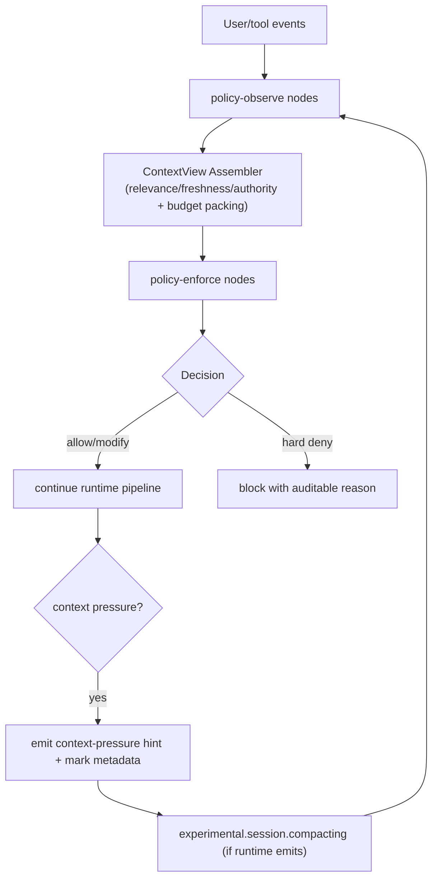

# Journey: Context Window Management (Hook-First Policy)

## User Perspective

As sessions grow, three questions matter:
1. Why these context segments were injected.
2. Why some content was trimmed from the model-visible view.
3. Whether compaction/recovery decisions are replayable and auditable.

The current implementation no longer uses a legacy governor. It uses `ContextView Assembler + Policy Runtime`.

## End-to-End Flow

## Runtime Contract

- Source of truth:
  - `src/hooks/runtime/pipeline-order.ts`
  - `src/hooks/runtime/assembly/*.ts`
  - `src/index.ts`
- Policy layers:
  - `src/features/policy-runtime/`
  - `src/contracts/`
- Context packing:
  - `src/features/context-view/`
- Compaction bridge:
  - `src/hooks/claude-code-hooks/pre-compact.ts` (best effort)

## Config Surface (Current)

Context governance configuration now follows the hook-first policy surface:

- `architecture_version: 2`
- `contracts`
- `budget_profiles`
- `model_policy`
- `evaluator`
- `cache_strategy.ledger/compiler/provider_policy`

Notes:
- `context_window_governor` has been removed.
- `tool_output_truncator` has been removed.

## Debug Checklist

1. Validate ordering anchors: `src/hooks/runtime/pipeline-policy-order.test.ts`.
2. Validate `chat.params` order: `src/hooks/chat-params-policy-order.test.ts`.
3. Validate replay parity: `src/features/policy-runtime/parity-replay.test.ts`.
4. Verify three-ledger writes:
   - context ledger: `src/features/context-ledger/`
   - policy ledger (observed events only): `src/features/policy-runtime/policy-ledger.ts`
   - governance ledger: `src/features/governance/ledger.ts`
   - policy decisions/outcomes must be present in governance ledger (`policy-decision` / `policy-outcome`), not policy ledger.
   - when governance blocks after a policy decision was already applied, runtime MUST append a follow-up `policy-outcome` with `outcome="superseded"` for the same `decisionId`.

## Practical Notes

- Trimming happens only at `ContextView` generation time; source events stay intact.
- Policy observed-event logs are short-retention and size-rolled (`policy-ledger`), while audit decisions remain in governance ledger.
- `tool.execute.before` enforces `max_tool_calls` + `wall_clock_ms`; `tool.execute.after` evaluates context pressure against `context_tokens_hard_limit`.
- `hard` decisions must map to enforceable hook points; non-enforceable points downgrade to `soft/audit`.
- The evaluator is async by default and stays out of hot path execution.
- Clauses that depend on guard payload shape (`payload.guards.*`) require `guardsVersion=1`; incompatible/missing versions fail fast to avoid silent policy drift.
- Pointer-only document injection is enabled for:
  - `directory-agents-injector`
  - `directory-readme-injector`
  - `rules-injector`
  Instead of injecting full document bodies, these hooks inject pointer cards (`Path`, `Why`, `Next: Read ...`) to reduce token pressure and preserve retrievability.
- Source budgets are explicitly tightened for pointer-card injectors via ContextView `source_limits`, preventing passive doc dumps from crowding out active execution context.
- If full pointer cards are budget-rejected, injectors fall back to minimal pointers (`Path` + `Next: Read ...`) so traceability is preserved.
