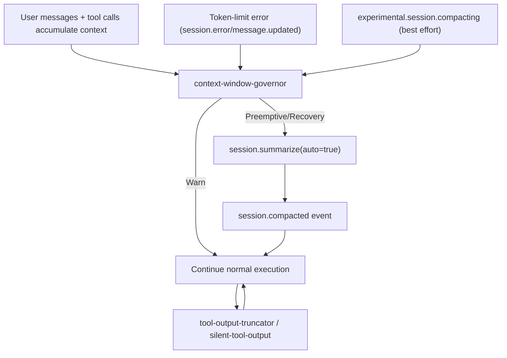

# Journey: Context Window Management (Unified Governor)

## User Perspective

You want long-running sessions to remain stable and coherent:

- Tool outputs should not blow up the context window.
- Near-limit sessions should warn early and compact proactively.
- Token-limit errors should recover automatically without compaction races.
- Compaction should preserve the information that matters (goals, decisions, current state, and "do not repeat" failures).

This document explains the current, wired chain: unified monitoring + preemptive compaction + hard-limit recovery + compaction-time context injection.

## End-to-End Flow



**Wiring matters**: Canonical event order lives in `src/hooks/runtime/pipeline-order.ts`, and canonical hook registration lives in `src/hooks/runtime/registry.ts` + `src/index.ts`.

## Core Invariants (What This Repo Guarantees)

1. **Single owner**: all context-window decisions are centralized in `context-window-governor`.
2. **Single snapshot per tool call**: at most one `session.messages()` snapshot per `tool.execute.after` invocation (deduped by `sessionID + callID`).
3. **Single compaction in-flight**: per-session lease prevents concurrent compactions (`preemptive` vs `recovery`).
4. **Edge-triggered thresholds**: warnings and preemptive compaction fire only on threshold crossings and re-arm only after reset ratios.
5. **Bounded recovery**: recovery retries are capped and backoff is exponential; exhaustion enters `failed` until reset thresholds re-arm.

## Architecture

### Component Map

```
src/hooks/context-window-governor/
  index.ts                 # Hook entry + orchestration (events, retries, lease)
  types.ts                 # Shared types
  policy.ts                # Defaults + override merge
  state-machine.ts         # Phase transitions (edge-triggered, sticky failed/cooldown)
  lease-manager.ts         # Per-session compaction lease
  limit-resolver.ts        # Context limit resolution (best-effort)
  probe.ts                 # session.messages() sampling + per-callID dedupe cache
  actions/
    warn.ts                # Tool-output reminder injection
    preemptive.ts          # session.summarize(auto=true)
    recovery.ts            # session.summarize(auto=true) + token-limit parsing
    compaction-context.ts  # compaction-time context injection prompt
```

### Event Flow (Wired)

| Event | Handler | Purpose |
|------|---------|---------|
| `tool.execute.after` | `context-window-governor` | Sample usage ratio and warn / preemptively compact / schedule recovery |
| `session.error` | `context-window-governor` | Parse token-limit errors and schedule recovery |
| `message.updated` | `context-window-governor` | Capture assistant-side token-limit errors and schedule recovery |
| `session.idle` | `context-window-governor` | Execute recovery if pending |
| `experimental.session.compacting` | `context-window-governor` + Claude Code `PreCompact` | Inject extra compaction-time context (best effort) |
| `session.compacted` | `context-window-governor` | Clear session snapshot caches and recovery state |
| `session.deleted` | `context-window-governor` | Cleanup per-session state (state machine, lease, caches) |

## How The Governor Works

### 1. Sampling (Probe)

`probe.getSnapshot({ sessionID, callID })` calls `client.session.messages({id: sessionID})` and derives:

- `providerID`, `modelID` from the last assistant message
- token usage from `info.tokens` (input + cache.read)
- `usageRatio = usedInputCacheTokens / limitTokens`

Snapshots are cached per `(sessionID, callID)` to guarantee at most one sampling per `tool.execute.after`.

### 2. Limit Resolution (Best Effort)

The governor resolves a `limitTokens` value using:

1. model cache limit (if available via `modelCacheState`)
2. provider-specific fallback (Anthropic: 200K vs 1M via env flags)
3. generic fallback (non-Anthropic defaults)

### 3. State Machine (Edge-Triggered + Sticky Failure)

The state machine is session-scoped and emits a `ContextWindowSignal` for each usage sample:

- `shouldWarn` only when crossing into `[warning_ratio, preemptive_ratio)`
- `shouldPreemptiveCompact` only when crossing into `>= preemptive_ratio`
- `shouldRecover` when crossing into `>= limit_ratio`

Reset ratios re-arm actions:

- warning re-arms below `warning_reset_ratio`
- preemptive re-arms below `preemptive_reset_ratio`

When recovery is exhausted, the session enters `failed` and **suppresses further actions** until reset ratios re-arm.

### 4. Mutual Exclusion (Lease)

All compaction paths must acquire the per-session lease:

- `preemptive` owner for proactive compaction
- `recovery` owner for hard-limit recovery

Only one owner can hold a session lease at a time, preventing concurrent `session.summarize()` calls.

### 5. Recovery Retry Policy

Recovery uses bounded retries with exponential backoff:

- `max_attempts`
- `initial_delay_ms`
- `max_delay_ms`

To avoid UI spam, recovery toasts are throttled by `toast_cooldown_ms`.

## Configuration

Configure the governor via the top-level `context_window_governor` block:

```jsonc
{
  "context_window_governor": {
    "warning_ratio": 0.7,
    "preemptive_ratio": 0.78,
    "limit_ratio": 1.0,
    "warning_reset_ratio": 0.65,
    "preemptive_reset_ratio": 0.73,
    "recovery": {
      "max_attempts": 2,
      "initial_delay_ms": 2000,
      "max_delay_ms": 30000,
      "toast_cooldown_ms": 30000
    }
  }
}
```

Notes:

- Ratios are computed from input + cache-read tokens vs the resolved context limit.
- `warning_ratio < preemptive_ratio <= limit_ratio` is strongly recommended.
- Reset ratios should be below their corresponding trigger ratios to avoid flapping.

## Compaction-Time Context Injection (Best Effort)

When the OpenCode runtime emits `experimental.session.compacting`, the governor injects a structured continuity prompt into `output.context`.

The injected prompt requires the compaction summary to include:

1. User Requests (As-Is)
2. Final Goal
3. Files Modified (with details)
4. Key Decisions & Rationale
5. Current Working State
6. Environment & Tool Outputs Still Needed
7. Remaining Tasks
8. MUST NOT Do (Critical Constraints)
9. Important Context
10. Agent Verification State

This improves continuity after compaction by making omissions visible.

## Trade-offs and Limitations

1. **Metadata dependence**: usage sampling relies on the last assistant message having `providerID` and token fields.
2. **Limit resolution is best-effort**: when provider/model metadata is missing, the governor falls back to provider defaults.
3. **Experimental compaction surface**: compaction-time injection depends on `experimental.session.compacting` being emitted by the runtime.
4. **Summarization is lossy**: compaction is performed via `session.summarize(auto=true)`, so summary quality matters.

## Troubleshooting

### Compaction not triggering

Check:

1. `context-window-governor` is not present in `disabled_hooks`.
2. Your provider/model is emitting token metadata in `session.messages()`.
3. The resolved limit is what you expect (Anthropic 200K vs 1M depends on env flags).

### Recovery keeps retrying

Tune:

- `context_window_governor.recovery.max_attempts`
- `context_window_governor.recovery.initial_delay_ms` / `max_delay_ms`
- `context_window_governor.recovery.toast_cooldown_ms`

If recovery becomes exhausted, the governor enters `failed` and will not attempt again until usage falls below reset ratios.

### Recovery skipped due to missing provider/model

This means the governor could not resolve `providerID` / `modelID` for `session.summarize()` (either from the error event payload or from `session.messages()`).

In this state the governor will retry a bounded number of times and then enter `failed` until reset thresholds re-arm.

## References

- Governor entry + orchestration: `src/hooks/context-window-governor/index.ts`
- State machine: `src/hooks/context-window-governor/state-machine.ts`
- Probe + snapshot caching: `src/hooks/context-window-governor/probe.ts`
- Lease manager: `src/hooks/context-window-governor/lease-manager.ts`
- Config schema: `src/config/schema.ts`
- Runtime wiring: `src/hooks/runtime/registry.ts`, `src/hooks/runtime/pipeline-order.ts`

