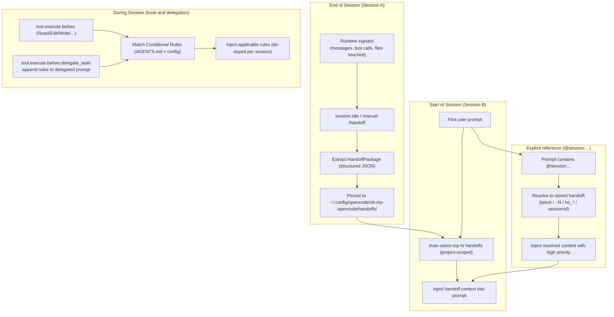
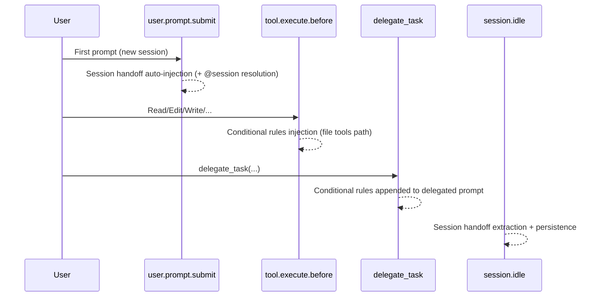

# Journey: Cross-Session Continuity

## User Perspective

You want long-running work to feel continuous across sessions: decisions should carry over, past failures should not be repeated, and project-specific rules should apply automatically when you touch relevant files. This journey describes the end-to-end chain that connects **Session Handoff**, **Session Reference** (`@session:...`), and **Conditional Rules** into a coherent cross-session workflow.

## End-to-End Flow

## What This Journey Covers

### 1) Session Handoff (structured extraction + auto-injection)

Session handoff turns the tail of a session into a structured, reusable artifact:

- What was decided and why
- What changed (files + intent)
- What failed and should not be repeated
- Optional embeddings for semantic retrieval

Deep dive: `docs/journeys/session-handoff-and-reference.md`.

### 2) Session Reference (`@session:...`)

Session reference provides deterministic “bring context from that session” semantics. References are resolved against **stored handoffs** and injected with higher priority than auto-selected handoffs.

Deep dive: `docs/journeys/session-handoff-and-reference.md`.

### 3) Conditional Rules (context-sensitive instruction injection)

Conditional rules inject targeted constraints only when they are relevant to the current working context (e.g., file path, module, task category, skill). This avoids pushing a large policy blob into every prompt while keeping the system “ruleful” where it matters.

Deep dive: `docs/journeys/conditional-rules.md`.

## Hook Surfaces (Where the Magic Happens)

This workflow relies on these hook surfaces:

For the authoritative ordering and wiring, see `docs/reference/hooks.md`, `src/hooks/runtime/pipeline-order.ts`, and `src/index.ts`.

## Configuration Summary

- Session handoff and references: `session_handoff.*` (and `session_handoff.reference.*`)
- Conditional rules: `conditional_rules.*`

For schema, defaults, and precedence, see `docs/reference/configuration.md`.
