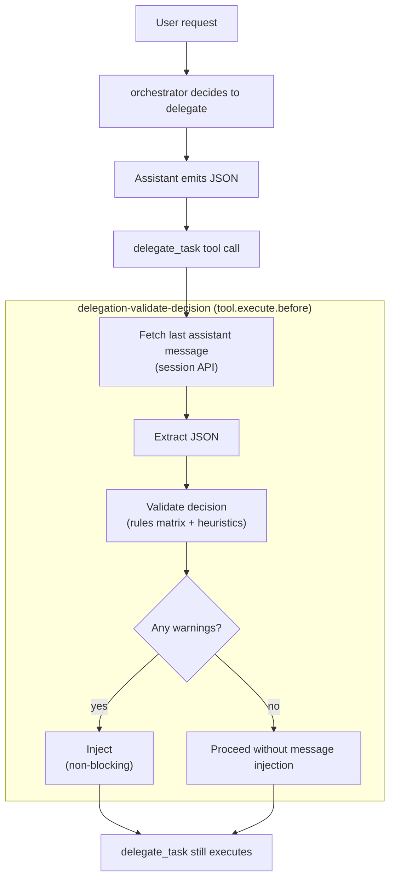

# Journey: Delegation Safety (delegation-validate-decision)

## User Perspective

You want delegation to be explainable and debuggable, especially when orchestrator delegates work to other agents in parallel.
The `delegation-validate-decision` hook adds lightweight guardrails: it requires a structured delegation decision before each `delegate_task` call and injects warnings when the choice looks suspicious—without blocking execution.

## End-to-End Flow



## Delegation Decision Format (Per `delegate_task` Call)

Before calling `delegate_task`, orchestrator SHOULD emit a decision block in the immediately preceding assistant message:

```xml
<delegation-decision>
{
  "agent": "navigator",
  "taskType": "debugging",
  "complexity": "moderate",
  "domain": "backend",
  "reason": "After multiple failed attempts, use advisor to analyze root cause and propose a minimal fix.",
  "signals": ["2+ failed attempts", "stack trace present", "multi-module impact"]
}
</delegation-decision>
```

Fields (source of truth: `src/delegation/types.ts`):

- `agent`: a built-in agent name (e.g. `navigator`, `librarian`, `advisor`).
- `taskType`: one of `exploration|implementation|debugging|refactoring|documentation|architecture|research`.
- `complexity`: one of `trivial|simple|moderate|complex`.
- `domain`: one of `frontend|backend|external|general`.
- `reason`: 1–2 sentences explaining why this agent is chosen.
- `signals`: an array of short strings summarizing triggers.

## What the Validator Checks (Current Implementation)

The validator is intentionally advisory:

- It NEVER blocks `delegate_task`.
- It injects a warning message only when it detects a likely mismatch.
- If extraction fails, it injects a reminder to include the decision block.

Current rules coverage is limited (source of truth: `src/delegation/validator.ts`):

- Rules are defined only for: `navigator`, `librarian`, and `advisor`.
- If the target agent has no rules entry, validation is skipped (treated as valid).

Current checks:

- **Task type mismatch**: warns when `taskType` is not in the agent’s allowed list.
- **Overkill**: warns when an agent declares `minComplexity` and the decision’s `complexity` is below it.

Not currently checked (despite the fields existing in the decision schema):

- `domain` validation (domain mismatch warnings are not implemented).
- Underkill (too weak an agent for a complex task).
- Category/skill-aware routing recommendations (e.g., UI tasks via `category: "visual-engineering"` + `load_skills: ["frontend-ui-ux"]`).

## Enabling / Disabling

This feature is a hook named `delegation-validate-decision`. Disable it with:

```json
{
  "disabled_hooks": ["delegation-validate-decision"]
}
```

## Where to Look in Code

- Hook: `src/hooks/delegation-validate-decision/index.ts`
- Decision schema: `src/delegation/types.ts`
- Extraction + validation logic: `src/delegation/validator.ts`
- Orchestrator prompt responsibilities: `src/agents/orchestrator/index.ts`

## Debug Checklist

- Confirm `delegation-validate-decision` is enabled (not in `disabled_hooks`).
- Confirm the decision block exists in the assistant message immediately before `delegate_task`.
- Check logs for `[delegation-validate-decision]` (missing decision, warnings, validated).
- If no warnings appear, confirm the chosen agent is covered by the rules matrix (only `navigator|librarian|advisor` are validated today).

## Further Reading

- Contract: `docs/reference/hooks.md` (hook wiring and interception points)
- Contract: `docs/reference/configuration.md` (configuration loading and `disabled_hooks`)
- Contract: `docs/reference/agents.md` (built-in agent naming)
