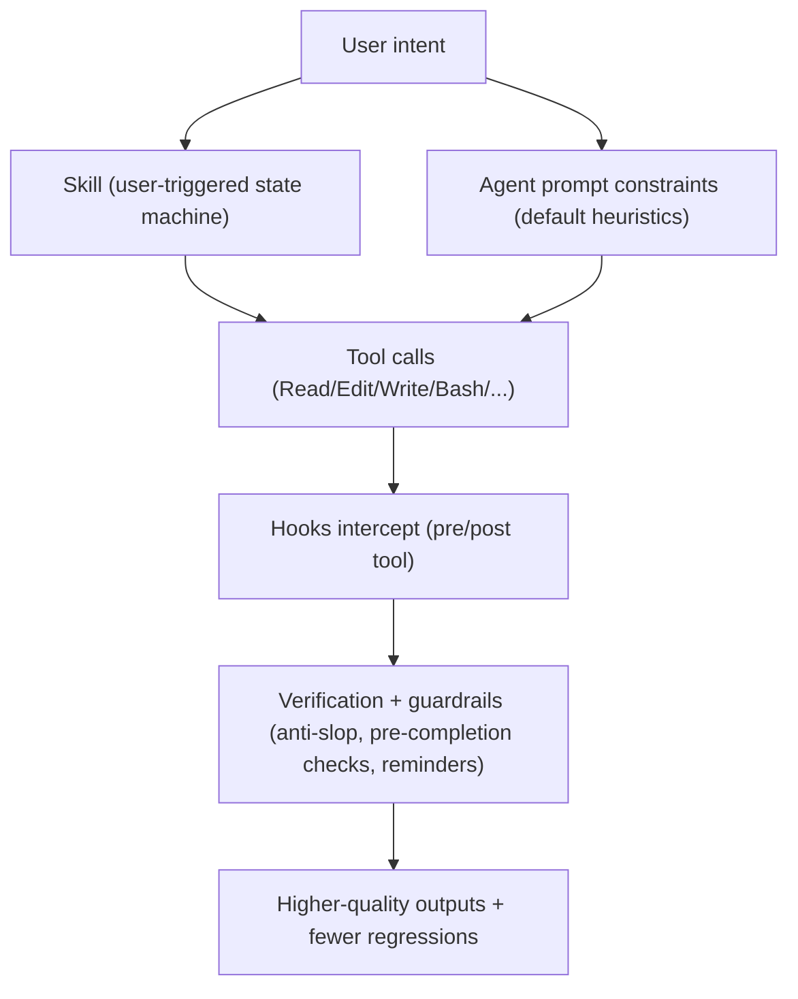
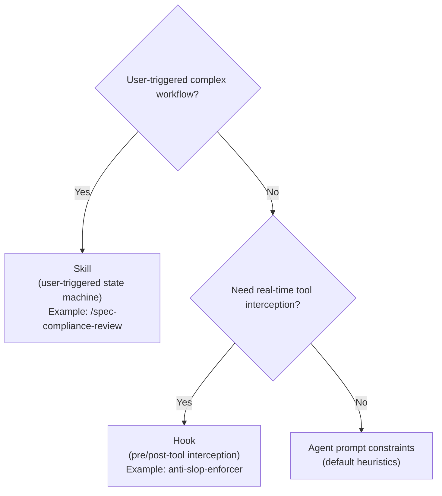
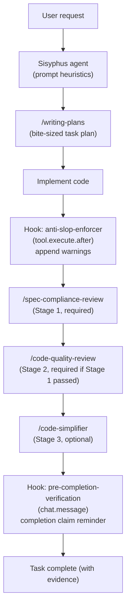

# Journey: Engineering Discipline (Skills, Hooks, and Prompts)

## User Perspective

You want agent output to look like senior-engineer work: complete, verifiable, consistent with repo conventions, and resilient against drift and “premature done”.
This journey explains how Oh-My-OpenCode encodes engineering discipline as enforceable behaviors using three levers: skills (user-triggered workflows), hooks (runtime interception), and agent prompt constraints (default heuristics).

## End-to-End Flow



> Embedding engineering best practices into AI Agent workflows through Skills, Hooks, and Agent Prompt enhancements for automated discipline enforcement.

## Background & Motivation

### Problem Statement

Common quality issues when AI Coding Agents execute tasks:

| Issue Type | Manifestation | Consequence |
|------------|---------------|-------------|
| **Premature Completion Claims** | Claiming "done" before task completion | User trust erosion, rework costs |
| **Shotgun Debugging** | Random code changes "to see what happens" | New bugs introduced, time wasted |
| **Spec Drift** | Implementation diverges from requirements | Features don't meet expectations |
| **Code Rot** | `as any`, empty catches, stray console.log | Technical debt accumulation |
| **Parallel Conflicts** | Improper parallelization causing file conflicts | Work lost, merge difficulties |

### Solution: Discipline as Prompts

Inspired by [obra/superpowers](https://github.com/obra/superpowers) design philosophy:

> **Skills are state machines with phases, stop conditions, and revisit conditions.**

Encoding engineering discipline as executable workflows rather than mere "suggestions".

## Core Patterns

### Key Patterns from Superpowers

| Pattern | Core Idea | Implementation |
|---------|-----------|----------------|
| **Three-Stage Review** | Spec Compliance → Code Quality → Code Simplification | Skill |
| **Parallel Dispatch Matrix** | Explicit parallel/sequential decision rules | Agent Prompt |
| **Bite-Sized Tasks** | 2-5 minutes to complete, exact file paths | Skill |
| **Hypothesis-Driven Debugging** | Hypothesize first, validate second, no blind changes | Skill |
| **Anti-Slop Detection** | Real-time code quality violation detection | Hook |
| **Pre-Completion Verification** | Mandatory verification before completion claims | Hook |

### Architecture Decision Matrix



## Implementation Components

### 1. Built-in Engineering Discipline Skills (5 skills)

These five skills are shipped as built-ins (unless disabled) and provide standardized workflows for planning, verification, debugging, and simplification.
Implementation: `src/features/builtin-skills/skills/`.

#### 1.1 `spec-compliance-review`

**Purpose**: Verify implementation matches specification requirements after task completion.

**Trigger Conditions**:
- After completing a feature implementation
- Before submitting a PR
- User invokes `/spec-compliance-review`

**Workflow**:

```
Phase 1: Context Gathering (BLOCKING)
  ├── Locate spec/plan file or task description
  ├── Read all acceptance criteria
  └── List all modified files (git diff --name-only)

Phase 2: Systematic Verification
  ├── Check each acceptance criterion
  ├── Record implementation location (file:line)
  └── Mark PASS/FAIL with evidence

Phase 3: Gap Analysis
  ├── Missing Requirements: Unimplemented requirements
  └── Scope Creep Detection: Work beyond specification

Phase 4: Verdict
  └── PASS (proceed to Code Quality Review) or FAIL (must fix)
```

**Key Constraints**:
- Must not skip any acceptance criterion
- Must not assume implementations are correct
- Must run verification commands before marking PASS

#### 1.2 `code-quality-review`

**Purpose**: Code quality review after spec compliance verification.

**Prerequisite**: `spec-compliance-review` must have passed.

**Review Dimensions**:

| Dimension | Checks |
|-----------|--------|
| Type Safety | No `any` types, no `@ts-ignore` |
| Error Handling | No empty catch blocks, errors are logged |
| Test Coverage | Unit tests for new functions, edge cases covered |
| Anti-Slop | No excessive comments, no over-abstraction, meaningful names, functions < 50 lines |

**Output**: `MERGE READY` or `NEEDS WORK: [specific issue list]`

#### 1.3 `writing-plans`

**Purpose**: Create high-quality implementation plans.

**Task Granularity Rules (Mandatory)**:

Each task must satisfy:
- Completable in 2-5 minutes
- Has exact file paths (no "relevant files")
- Has verification command
- Implementation paired with test

**Plan Structure Template**:

```markdown
### 1. Core Objective
[One sentence description]

### 2. Acceptance Criteria
1. [Verifiable criterion]
2. ...

### 3. Task Breakdown
- [ ] Task 1: [ACTION] [EXACT FILE PATH]
      Files: src/foo/bar.ts
      Test: src/foo/bar.test.ts
      Verify: bun test src/foo/bar.test.ts

### 4. Must NOT Do (Anti-Slop)
- [Forbidden patterns for this task]

### 5. References
- [Related code pattern links]
```

#### 1.4 `systematic-debugging`

**Purpose**: Hypothesis-driven systematic debugging.

**Phase 0: STOP (BLOCKING)**

> **Hard stop**:
> - Do not propose a fix yet.
> - Do not make “quick changes”.
> - Do not say “let me try this”.

**Workflow**:

**Phase 1: Observe**
- What is the exact error message/behavior?
- What is the expected behavior?
- When did it last work?

**Phase 2: Hypothesize**

| # | Hypothesis | Likelihood | Test to Disprove |
|---:|---|---|---|
| 1 | ... | High | ... |
| 2 | ... | Medium | ... |

**Phase 3: Test (one at a time)**
- Design a test to disprove the current hypothesis.
- Execute the test and record the result.
- If disproved, move to the next hypothesis.

**Phase 4: Fix (only after hypothesis confirmed)**
- Make the minimal change.
- Re-run the original failing test.
- Run the broader test suite (as appropriate for the repo).

**Forbidden Behaviors**:
- Making changes "to see what happens"
- Fixing symptoms instead of root cause
- Changing multiple things at once

#### 1.5 `code-simplifier`

**Purpose**: Further simplify code for readability and maintainability after code quality review passes.

**Core Principle**: **Preserve Functionality** - Only change HOW the code works, not WHAT it does.

**Trigger Conditions**:
- After `code-quality-review` passes but code feels complex
- User requests code cleanup
- Preparing code for long-term maintenance

**Simplification Dimensions**:

| Dimension | Action |
|-----------|--------|
| Structural Clarity | Nested ternary → switch/if-else, deep nesting → early returns |
| Redundancy Elimination | Remove unused variables/imports, eliminate duplicate code |
| Naming Improvements | `data` → domain-specific names, `handleClick` → `submitForm` |
| Comment Cleanup | Remove "what" comments, keep "why" comments |

**Balance Principles**:

```
DO NOT Over-Simplify:
├── Combining unrelated logic → Violates single responsibility
├── Removing helpful abstractions → Harms organization
├── Dense one-liners → Reduces readability
└── "Clever" solutions → Hard to understand/debug
```

**Workflow**:

```
Step 1: Identify targets (git diff --name-only)
Step 2: Analyze complexity hotspots
Step 3: Apply simplifications one at a time
Step 4: Verify behavior unchanged (run tests)
Step 5: Document significant changes
```

**Output Format**: `CODE SIMPLIFICATION REPORT` containing change list, verification status, complexity metrics

### 2. Hooks (2 hooks)

#### 2.1 `anti-slop-enforcer`

**Trigger Point**: `tool.execute.after` (after Write/Edit operations)

**Detection Patterns**:

| Pattern | Message | Severity |
|---------|---------|----------|
| `as any` | Type suppression: \`as any\` | error |
| `@ts-ignore` | Type suppression: \`@ts-ignore\` | error |
| `catch () {}` | Empty catch block | error |
| `console.log` | Debug logging: \`console.log\` | warning |

**Behavior**: Appends warning messages to tool output.

**Configuration**:

Hooks are enabled by default and can be disabled via `disabled_hooks`:

```jsonc
{
  "disabled_hooks": ["anti-slop-enforcer"]
}
```

#### 2.2 `pre-completion-verification`

**Trigger Point**: `chat.message` (after Agent message generation)

**Detection Logic**:

```typescript
if (messageContainsCompletionClaim(text) && hasIncompleteTodos(sessionID)) {
  injectVerificationReminder()
}
```

**Completion Claim Patterns**:
- `done`, `completed`, `finished`, `all done`
- `task is complete`, `work is done`
- `successfully completed/implemented`
- `ready for review/merge/deploy`

**Injected Reminder**:

```
─────────────────────────────────────────────────────
[COMPLETION VERIFICATION REQUIRED]

You claimed completion, but incomplete tasks remain.

Before claiming work is done, you MUST:
1. Run verification commands for each completed task
2. Confirm all tests pass
3. Mark each TODO as completed with evidence

Current incomplete tasks need to be addressed first.
Use TodoWrite to update task status after verification.
─────────────────────────────────────────────────────
```

### 3. Agent Prompt Enhancement (Sisyphus)

#### 3.1 Parallel Dispatch Decision Matrix

Added to Sisyphus system prompt:

```markdown
### Parallel Dispatch Decision Matrix

BEFORE parallel dispatch, evaluate:

| Condition | Dispatch Mode | Reason |
|-----------|---------------|--------|
| Tasks touch SAME files | **SEQUENTIAL** | Avoid conflicts |
| Task B depends on Task A output | **SEQUENTIAL** | Data dependency |
| Shared state modification | **SEQUENTIAL** | Race condition risk |
| Read-only exploration | **PARALLEL OK** | No side effects |
| Independent feature branches | **PARALLEL OK** | Isolated changes |
| Test + Implementation pair | **SEQUENTIAL** | Test verifies impl |

**DEFAULT RULE**: When uncertain, choose SEQUENTIAL.
Parallel is an optimization, not a requirement.
```

#### 3.2 Three-Stage Review Protocol

Added to Sisyphus Phase 3 (Execution):

```markdown
### Three-Stage Review Protocol (Post-Implementation)

After ANY implementation task:

1. **Stage 1: Spec Compliance** (REQUIRED)
   - Invoke `skill("spec-compliance-review")`
   - IF FAIL → Fix gaps before proceeding

2. **Stage 2: Code Quality** (REQUIRED)
   - Only after Stage 1 PASS
   - Invoke `skill("code-quality-review")`
   - IF NEEDS WORK → Address issues

3. **Stage 3: Code Simplification** (OPTIONAL)
   - Only after Stage 2 PASS
   - Invoke `skill("code-simplifier")` when:
     - Code feels complex
     - User requests cleanup
     - Preparing for long-term maintenance
   - Preserves functionality, improves clarity

4. **Completion**
   - Only mark task complete after REQUIRED stages pass
   - Evidence required for each TODO completion
```

## Data Flow



## Configuration

### Enable/Disable Hooks

Disable hooks via `disabled_hooks`:

```jsonc
{
  "disabled_hooks": ["anti-slop-enforcer", "pre-completion-verification"]
}
```

### Default State

Both hooks are **enabled** by default; no additional configuration required.

## Verification

### 1. Skills Can Be Invoked

```bash
# In oh-my-opencode session
> skill("spec-compliance-review")
> skill("code-quality-review")
> skill("writing-plans")
> skill("systematic-debugging")
> skill("code-simplifier")
```

### 2. Skills Appear in Sisyphus Key Triggers

Verify Sisyphus prompt contains:

```
### Key Triggers (check BEFORE classification):
...
- **Skill `spec-compliance-review`**: Post-task spec compliance verification...
- **Skill `code-quality-review`**: Post-spec-compliance code quality review...
- **Skill `writing-plans`**: Create implementation plans with bite-sized tasks...
- **Skill `systematic-debugging`**: Hypothesis-driven debugging...
- **Skill `code-simplifier`**: Simplifies code for clarity while preserving functionality...
```

### 3. Anti-Slop Hook Triggers

Write a file containing `as any`, should see in output:

```
[ANTI-SLOP WARNING]
Detected 1 issue(s):
- [ERROR] Type suppression: `as any` (line 42)
```

### 4. Pre-Completion Hook Triggers

Claim "task is complete" with incomplete TODOs, should see:

```
[COMPLETION VERIFICATION REQUIRED]
...
```

## Design Principles

### 1. Blocking vs Warning

| Mechanism | Type | Rationale |
|-----------|------|-----------|
| Skill phases marked BLOCKING | Blocking | Skipping invalidates subsequent phases |
| Anti-slop warning | Warning | `any` may be reasonable in some cases |
| Pre-completion reminder | Warning | Remind rather than block, preserve human judgment |

### 2. Extensibility

- **Skills**: Pure text templates, add via `src/features/builtin-skills/skills.ts`
- **Hooks**: Plugin architecture, implement `tool.execute.after` or `chat.message` interface
- **Patterns**: Anti-slop detection patterns are configurable and extensible

### 3. Minimal Intrusion

- Hooks only append information, do not modify original output
- Skills are user-triggered, not mandatory
- Agent prompts provide heuristics, do not restrict tool usage

## Related Files

| File Path | Purpose |
|-----------|---------|
| `src/features/builtin-skills/skills.ts` | 5 skill definitions |
| `src/hooks/anti-slop-enforcer.ts` | Anti-slop detection hook |
| `src/hooks/pre-completion-verification.ts` | Completion verification hook |
| `src/agents/sisyphus.ts` | Parallel Dispatch Matrix + Three-Stage Review |
| `src/config/schema.ts` | HookNameSchema, BuiltinSkillNameSchema |
| `src/index.ts` | Hook registration |
| `src/agents/utils.ts` | Skills passed to Sisyphus |
| `src/plugin-handlers/config-handler.ts` | Skills list construction |

## References

- [obra/superpowers](https://github.com/obra/superpowers) - Original design inspiration
- [Superpowers Skills](https://github.com/obra/superpowers/tree/main/skills) - Skill design patterns
- [Anthropic Code Simplifier](https://github.com/anthropics/claude-plugins-official/tree/main/plugins/code-simplifier) - Code Simplification Agent design reference
