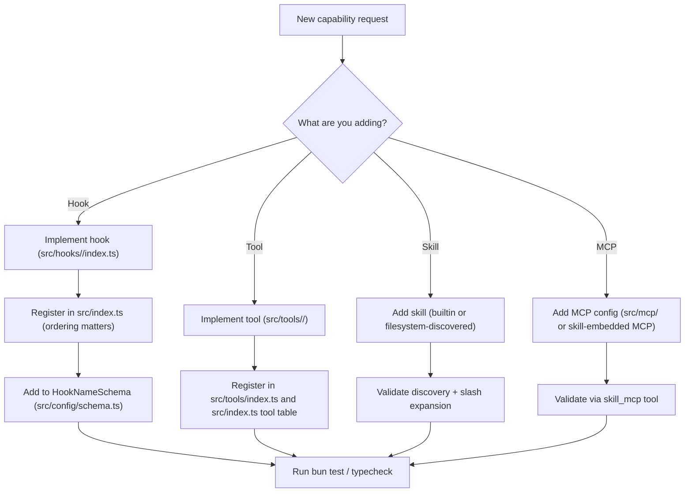

# Journey: Extensibility (Hooks, Tools, Skills, MCPs)

## User Perspective

You want to add or customize behavior (new automation, new tooling, new orchestration policies) without rewriting the system.
This journey shows where each extension point lives, what must be registered, and how to validate changes end-to-end.

## End-to-End Flow

This journey provides a map for adding new functionality without fighting the architecture.

## Add a Hook

- Implementation: `src/hooks/<name>/index.ts`
- Registration + lifecycle order: `src/index.ts`
- Schema: add `<name>` to `HookNameSchema` in `src/config/schema.ts`
- Documentation order mirror: `src/hooks/AGENTS.md`

## Add a Tool

- Implementation: `src/tools/<name>/`
- Registration: `src/tools/index.ts` and `src/index.ts` tool table
- Prefer strict schemas and explicit argument errors.

## Add a Skill

- Built-in skills: `src/features/builtin-skills/`
- External skills: loaded via skill loader; see `docs/reference/configuration.md`

## Add an MCP

- Built-in MCPs: `src/mcp/`
- Config surface: `docs/reference/mcps.md`
