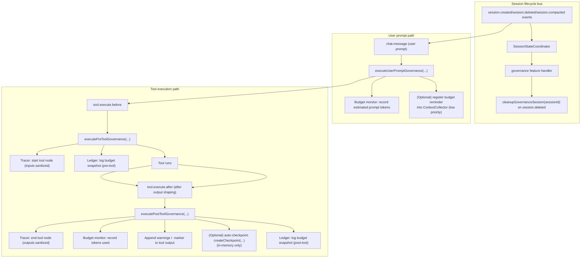

# Journey: Governance (Tracing, Budgeting, Ledger, Checkpoints)

## User Perspective

You want guardrails that keep long-running development sessions under control:

- **Observability**: understand what the agent did and why (trace + audit log).
- **Budget awareness**: avoid silently exhausting the context window.
- **Recovery**: create checkpoints so you can resume or fork work safely.

This journey describes the end-to-end governance path as it is currently wired in this repo, and calls out surfaces that exist in code but are not integrated yet.

## End-to-End Flow



## What Governance Does Today (Wired)

Governance is **opt-in** via `governance.enabled=true`.

When enabled, the plugin currently wires:

- **Session lifecycle dispatch via coordinator**: governance cleanup is triggered by the `SessionStateCoordinator` handler on `session.deleted` (single lifecycle entrypoint shared with other features).
- **Execution tracing**: a per-session trace of tool calls and key nodes, persisted on session cleanup.
- **Budget monitoring**: budget phase warnings and “wrap up / fork” hints based on estimated token usage.
- **Ledger**: an append-only JSONL audit log for governance-significant events (budget snapshots, checkpoint events, etc.).
- **Auto-checkpoint creation (optional)**: creates semantic checkpoints at an interval (in-memory).

## What Governance Does Not Do Yet (Present but Not Integrated)

These components exist in `src/features/governance/` but are not integrated into the main plugin flow:

- **Approval gate**: tool-level approval/deny flow is not enforced (no pre-tool blocking today).
- **Checkpoint persistence**: checkpoints can be saved to disk by the checkpoint manager, but the default integration does not auto-save them.

If you enable `governance.approval_gate` config today, it SHOULD be treated as “reserved”: it does not currently gate tool calls.

## How to Enable

Minimal config:

```jsonc
{
  "governance": {
    "enabled": true
  }
}
```

Recommended starting point (observability + budget hints, without checkpoints):

```jsonc
{
  "governance": {
    "enabled": true,
    "tracer": { "enabled": true },
    "budget_monitor": { "enabled": true },
    "checkpoint": { "enabled": false },
    "ledger": { "enabled": true }
  }
}
```

## Where to Look in Code

- Wiring and call sites: `src/index.ts`
- Integration layer (what is actually executed): `src/features/governance/integration.ts`
- Ledger writer + retention: `src/features/governance/ledger.ts`
- Trace persistence: `src/features/governance/trace-persistence.ts`
- Budget monitor: `src/features/governance/budget-monitor.ts`
- Checkpoint manager (in-memory + optional persistence): `src/features/governance/checkpoint.ts`

## Debug Checklist

- Confirm `governance.enabled=true` in config.
- Check logs for `[governance] Integration enabled`.
- Ledger file: `~/.sisyphus/ledger/<sessionId>.jsonl`
- Trace file (on session cleanup): `~/.sisyphus/traces/<sessionId>.json`

## Further Reading

- Contract: `docs/reference/governance.md`
- Contract: `docs/reference/session-lifecycle.md`
- Contract: `docs/reference/configuration.md` (config loading/precedence)
- Research: `docs/research/governance-orchestration-design.md`
