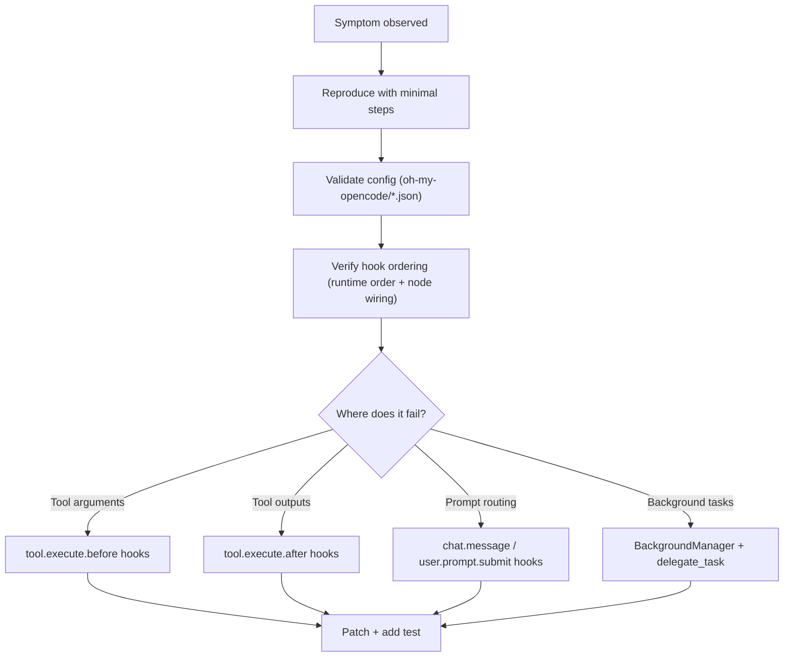

# Journey: Operations & Debugging

## User Perspective

Something looks wrong in real usage: outputs are missing, ordering is surprising, an agent gets stuck waiting for confirmation, or behavior differs across machines.
This journey gives a practical, end-to-end debugging chain: reproduce → inspect configuration → verify lifecycle ordering → isolate the responsible hook/tool/feature.

## End-to-End Flow

This journey focuses on diagnosing misbehavior in production-like usage: ordering issues, configuration drift, and environment constraints.

## First Line Checks

- Run doctor: see `docs/guide/cli.md`
- Validate config: `docs/reference/configuration.md`
- Confirm hook order: `src/hooks/runtime/pipeline-order.ts` + `src/index.ts` + `docs/reference/hooks.md`

## Common Symptoms → Where to Inspect

- **Tool output missing/changed**:
  - `src/hooks/silent-tool-output/`
  - `src/features/context-view/output-append.ts`
  - `src/hooks/runtime/pipeline-order.ts` (`tool.execute.after` ordering)
- **Unexpected compaction / lost constraints**:
  - `src/features/context-view/assembler.ts`
  - `src/features/policy-runtime/`
  - Compaction-time injection helpers (wired via `experimental.session.compacting`): `src/hooks/claude-code-hooks/pre-compact.ts` + policy/context-view runtime nodes
- **Delegation feels “wrong”**:
  - `src/tools/delegate-task/`
  - `docs/guide/orchestration.md`
  - `docs/journeys/delegation-safety.md`

## Troubleshooting

- See `docs/troubleshooting/`
