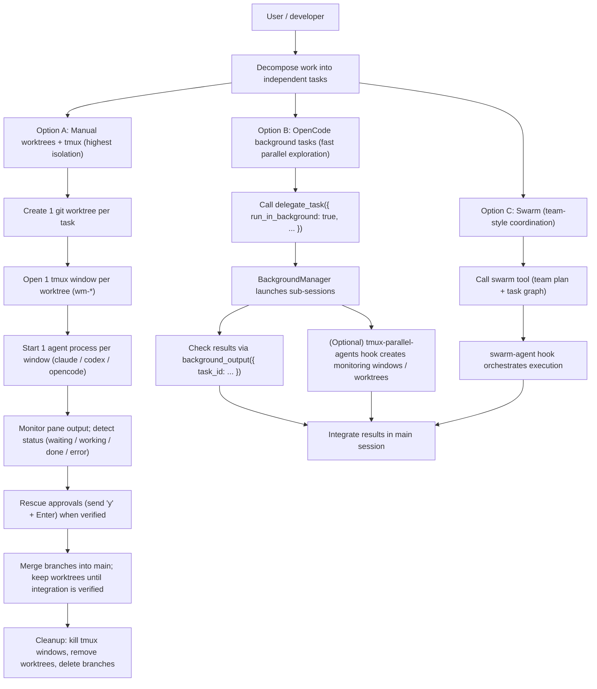

# Journey: Parallel Agents (Worktrees, tmux, Swarm)

## User Perspective

You want to split a large engineering goal into multiple independent subtasks and run them concurrently without losing control.
The core challenge is avoiding interference (filesystem conflicts, shared state) while keeping progress observable (status, approvals, failures) and integration safe (merge strategy, cleanup).

## End-to-End Flow

## Choosing the Right Path

- Prefer **Option A** when you need strong isolation (multiple agents will modify the same files, or tasks will run destructive commands, or you want clean merge boundaries).
- Prefer **Option B** when you want fast parallel exploration (inventory, grep, doc lookup, alternative hypotheses) and integration remains in the main session.
- Prefer **Option C** when you want a structured “team execution” model (explicit roles/tasks, coordination, progress tracking). Swarm can be started manually (`/swarm ...`) or bootstrapped from `/start-work` when Swarm-first is enabled.
### Parallel Runtime Admission Coverage

| Path | Admission Control | Notes |
|------|-------------------|-------|
| **Option A** (manual worktrees + tmux) | **Not controlled** | Intentional — power users manage concurrency themselves |
| **Option B** (background tasks) | **Controlled** via `parallel_runtime` | BackgroundManager acquires/releases slots per task |
| **Option C** (Swarm) | **Controlled** via `parallel_runtime` | Coordinator acquires slots during task assignment |

The `tmux-parallel-agents` hook is a pure infrastructure layer (windows, worktrees, rescue). It does not acquire slots because the underlying subsystem (Background or Swarm) already does.
## Key Docs

- Swarm coordination journey: `docs/journeys/swarm-coordination.md`
- Orchestration guide: `docs/guide/orchestration.md`
- Engineering discipline (skill-based QA loop): `docs/journeys/engineering-discipline.md`
- Contract: `docs/reference/artifacts-and-paths.md`
- Contract: `docs/reference/tools.md`

## Where to Look in Code

- Manual workflow cheat sheet (built-in skill): `src/features/builtin-skills/skills/parallel-agents.ts`
- Background tasks: `src/features/background-agent/` and `src/tools/delegate-task/`
- Tmux integration: `src/hooks/tmux-parallel-agents/`
- Swarm core: `src/features/sisyphus-swarm/`
- Swarm agent hook: `src/hooks/swarm-agent.ts`

## Operational Notes (Safety / UX)

- Treat \`worktree.auto_cleanup=true\` as potentially destructive (forced removal). Keep it off unless you are confident background sessions never leave uncommitted changes.
- Always verify pane content before sending rescue keys; approvals are easy to misfire when an agent is mid-command.
- If you already have a custom \`parallel-agents\` skill installed in `.opencode/skills/` or `~/.claude/skills/`, it will override the built-in \`parallel-agents\` skill with the same name.
