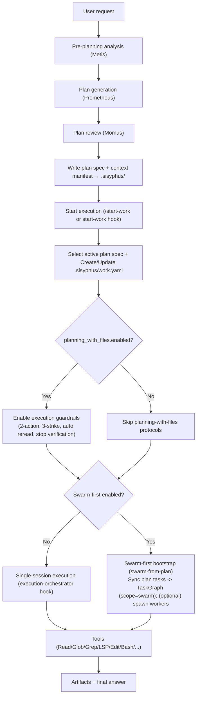

# Journey: Planning → Execution

## User Perspective

You want a repeatable way to go from an ambiguous request (“refactor X”, “add feature Y”) to a concrete plan and then to disciplined execution, without drifting or skipping validation.
This journey maps the end-to-end chain: plan generation → plan selection → (optional) plan persistence → execution orchestration → tool-level work.

## End-to-End Flow

This journey explains how a plan is produced, validated, bound into execution state (`work.yaml` + TaskGraph), and then executed through orchestration.

## Swarm-first (Optional)

If Swarm-first is enabled, `/start-work` can act as a bootstrap point for parallel execution:

- Plan tasks (from `plan.md` `## Tasks`) are synced into TaskGraph scope `swarm` (storage path: `.sisyphus/tasks/swarm/<team>/task_*.json`).
- Workers can be spawned in tmux windows, optionally one git worktree per worker.
- Progress and completion are tracked in TaskGraph, making recovery (across sessions) deterministic.
- Global concurrency can be governed by `parallel_runtime` so Swarm + Background share one slot budget.

See: `docs/journeys/swarm-coordination.md` and `docs/guide/orchestration.md`.

## Recommended Reading Order

1. Planning concepts: `docs/journeys/prometheus-planning.md`
2. Planning with files: `docs/journeys/planning-with-files.md`
3. Orchestration: `docs/guide/orchestration.md`
4. Deterministic delegation context: `docs/journeys/context-packs-and-manifests.md`
5. Feature catalog: `docs/guide/features.md`

## Where to Look in Code

- Orchestrator hook: `src/hooks/execution-orchestrator/`
- Start-work bootstrap: `src/hooks/start-work/`
- Planning-with-files hook: `src/hooks/planning-with-files/`
- Pre-planning agent: `src/agents/metis.ts`
- Plan review agent: `src/agents/momus.ts`

## Execution Chain (Code Is Source of Truth)

- Lifecycle order table is implemented in `src/hooks/runtime/pipeline-order.ts` and wired in `src/index.ts`.
- The documentation mirror is `src/hooks/AGENTS.md`.
