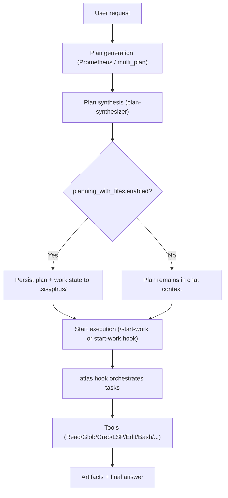

# Journey: Planning → Execution

## User Perspective

You want a repeatable way to go from an ambiguous request (“refactor X”, “add feature Y”) to a concrete plan and then to disciplined execution, without drifting or skipping validation.
This journey maps the end-to-end chain: plan generation → plan selection → (optional) plan persistence → execution orchestration → tool-level work.

## End-to-End Flow

This journey explains how a plan is produced, validated, and executed through orchestration.

## Recommended Reading Order

1. Planning concepts: `docs/journeys/prometheus-planning.md`
2. Multi-model planning: `docs/journeys/multi-model-planning.md`
3. Planning with files: `docs/journeys/planning-with-files.md`
4. Orchestration: `docs/guide/orchestration.md`
5. Feature catalog: `docs/guide/features.md`

## Where to Look in Code

- Orchestrator hook: `src/hooks/atlas/`
- Start-work bootstrap: `src/hooks/start-work/`
- Planning-with-files hook: `src/hooks/planning-with-files/`
- Multi-plan trigger: `src/hooks/multi-plan-trigger/`
- Multi-plan tool: `src/tools/multi-plan/`
 - Plan synthesis agent: `src/agents/plan-synthesizer.ts`

## Execution Chain (Code Is Source of Truth)

- Lifecycle ordering is implemented in `src/index.ts`.
- The documentation mirror is `src/hooks/AGENTS.md`.
