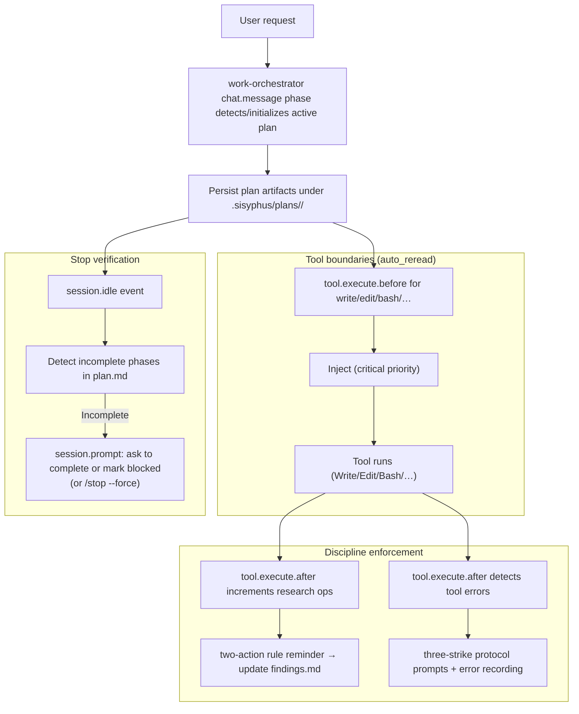
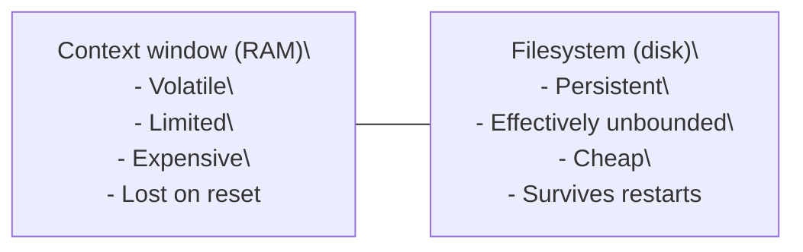

# Journey: Planning Protocol (Work-Orchestrator / `.sisyphus/`)

## User Perspective

You want complex work to remain coherent across long sessions and interruptions without relying on a volatile chat context.
The planning protocol persists the plan, findings, and progress under `.sisyphus/` and uses `work-orchestrator` phases to re-inject active plan context at tool boundaries, enforce disciplined research logging, and prevent premature “stop” when phases remain incomplete.

## End-to-End Flow



## Overview

Planning with Files implements a persistent markdown-based planning system inspired by [Manus](https://github.com/OthmanAdi/planning-with-files). It uses three files as "working memory on disk" to overcome AI context window limitations.

### The Core Problem

AI agents suffer from:
- **Volatile memory**: Information lost during context resets
- **Goal drift**: Original objectives fade after many operations
- **Context bloat**: Everything crammed into limited active memory
- **Hidden errors**: Failures not tracked, causing repetition

### The Solution

Treat the filesystem as persistent storage and context windows as temporary RAM:



## The 3-File Pattern

Every complex task creates three markdown files plus a YAML ledger:

```
.sisyphus/plans/{plan-id}/
├── plan.md        # Phases, goals, decisions, errors, blockers
├── ledger.yaml    # Runtime errors/blockers/decisions
├── findings.md    # Research results (2-action rule)
├── progress.md    # Session logs, phase transitions
└── discoveries.jsonl  # Deferred findings captured from DISCOVERY markers
```

Shared runtime state is persisted in `.sisyphus/work.yaml` (single active plan).

### plan.md - Working Memory

Your primary planning document containing:
- **Goal**: North-star statement to prevent drift
- **Phases**: Status-tracked stages (pending → in_progress → complete → blocked)
- **Decisions**: Documented choices with rationale
- **Errors**: 3-strike protocol tracking (forced recording on Strike 2+)
- **Blockers**: Issues requiring external intervention

### findings.md - Knowledge Base

Persistent research storage containing:
- **Research**: Source-attributed discoveries
- **Resources**: URLs and references

### progress.md - Session History

Execution log for context continuity containing:
- **Session Log**: Actions and files modified
- **Phase Transitions**: Tracks when phases started/completed/revisited
- **5-Question Reboot Check**: Context recovery helper

## Configuration

Enable in `.opencode/oh-my-opencode/00-core.json`:

```json
{
  "work_orchestrator": {
    "planning_with_files": {
      "enabled": true,
      "two_action_rule": true,
      "three_strike_protocol": true,
      "auto_reread": true,
      "stop_verification": true
    }
  }
}
```

**Note**: `work_orchestrator.planning_with_files.directory` is removed in latest-only mode and rejected by schema validation. The canonical layout is fixed to `.sisyphus/plans/`.

### Configuration Options

| Option | Default | Description |
|--------|---------|-------------|
| `enabled` | `false` | Enable the planning-with-files pattern |
| `bdd_alignment` | `"warn"` | BDD task alignment mode: `off` \| `warn` \| `required` |
| `two_action_rule` | `true` | Remind to update findings after 2 research ops |
| `three_strike_protocol` | `true` | Structured error handling with escalation |
| `auto_reread` | `true` | Re-read task_plan before Write/Edit/Bash/NotebookEdit |
| `stop_verification` | `true` | Block stopping if phases are incomplete |
| `reread_trigger_tools` | `["Write", "Edit", "Bash", "NotebookEdit"]` | Tools that trigger plan.md injection |
| `action_count_tools` | `["Read", "WebFetch", "WebSearch", "Glob", "Grep", "Task"]` | Tools counted for 2-action rule |

## Core Mechanisms

### 1. tool.execute.before - Full plan.md Injection

Before Write/Edit/Bash/NotebookEdit operations, the **full** plan.md content is injected:

```xml
<plan-context>
# Task Plan: feature-name

> **Goal**: Implement user authentication

## Phases
| # | Phase | Status |
|---|-------|--------|
| 1 | Discovery | complete |
| 2 | Implementation | in_progress |
...
</plan-context>

<reminder>
Stay focused on the current phase. Do not deviate from the goal.
</reminder>
```

**Claude Code terminology note**: In Claude Code vocabulary this corresponds to `PreToolUse`, but the runtime surface in OpenCode is `tool.execute.before`. See `docs/reference/hooks.md`.

**OpenCode Implementation Note**: Injection is performed via ContextCollector + `experimental.chat.messages.transform`, so the plan appears as a stable prefix without mutating stored conversation history.

**KV-Cache Optimization**: By keeping the prefix stable across tool calls, we maximize KV-cache hits, reducing latency and cost.

### 2. Two-Action Rule - Auto-Reset Detection

After every 2 research operations (Read/WebFetch/WebSearch/Glob/Grep/Task), reminds to update findings.md (2, 4, 6, ...). The counter auto-resets when you modify findings.md (mtime-based).

```xml
<two-action-rule>
## Update findings.md NOW

2 research operations completed.

Update `.sisyphus/plans/{plan}/findings.md` with:
- Key discoveries
- Technical decisions
- Resources found

Counter auto-resets when you modify findings.md.
</two-action-rule>
```

**Auto-Detection**: Uses file mtime to detect findings.md modifications. No need to say "updated findings" - the counter resets automatically when the file is modified.

### 3. Three-Strike Error Protocol

Structured error handling with forced recording and escalation:

| Strike | Action | Guidance |
|--------|--------|----------|
| 1 | Diagnose | Read error carefully, check context |
| 2 | Pivot | Try alternative approach + **MUST record in plan.md** |
| 3 | Reassess | Review assumptions + **MUST record in plan.md** |
| 4+ | Escalate | Add to Blockers section, ask for help |

**Forced Error Recording (Strike 2+)**

On the second occurrence of an error, the agent is required to document it:

```xml
<error-recording-required>
## Record Error Before Continuing

This error has occurred 2 times. You MUST record it in plan.md before retrying.

**Add to ## Errors section:**

| # | Error | Phase | Attempts | Root Cause | Resolution |
|---|-------|-------|----------|------------|------------|
| N | Bash:npm install failed | Phase 2 | 2 | [ANALYZE] | [PLAN] |

**Required fields:**
- **Root Cause**: Why is this happening? (not just "it failed")
- **Resolution**: What different approach will you try?
</error-recording-required>
```

This prevents blind retries and forces the agent to analyze before trying again.

### 4. Blockers vs Errors

**Errors** are issues that can potentially be resolved by the agent:
- Command failures
- Syntax errors
- Missing dependencies

**Blockers** require external intervention:
- Missing credentials or permissions
- External service unavailable
- Design decisions needing human input
- Multiple approaches exhausted

The Blockers section in plan.md:

```markdown
## Blockers (Require Escalation)

| # | Blocker | Phase | Impact | Status | Escalation |
|---|---------|-------|--------|--------|------------|
| 1 | Missing API key | 2 | Cannot test auth | open | Need user to provide key |
```

### 5. Phase Reflection

When a phase transitions to `complete`, the agent receives a reflection prompt encouraging non-linear planning adjustments:

```xml
<phase-reflection>
## Phase 2 Complete: Implementation

**Before proceeding, reflect on:**

1. **Discoveries**: Did you learn anything that affects the remaining plan?
2. **Assumptions**: Were any assumptions proven wrong?
3. **Remaining Phases**: Do they still make sense?

**Remaining:**
  - Phase 3: Verification (pending)

**Actions you can take:**
- Add new phases if needed
- Remove phases that are no longer relevant
- Reorder phases based on new understanding
- Update phase descriptions with new context

**Update plan.md if any changes are needed, then continue.**
</phase-reflection>
```

### 6. Completion Gate + Deferred Discoveries

Execution completion is now gated by verifier evidence:

- `task_transition(next_state=completed)` is denied when verifier evidence is missing (`lsp_diagnostics` and/or test-build evidence, per config).
- The gate is hard-enforced via policy/runtime guards (`payload.guards.verifier.*`).

Deferred findings are persisted in `.sisyphus/plans/{plan}/discoveries.jsonl`:

- Sources: delegate output markers and assistant update markers (`<discovery>...</discovery>` / `DISCOVERY:`).
- Purpose: prevent “noticed but dropped” issues from disappearing during long execution loops.
- Auto handoff path carries top unresolved discoveries into the next session when triggered.
- Optional `work_orchestrator.discovery_channel.auto_task_create=true` creates low-priority plan tasks for newly captured discoveries (deduped by title).

This enables graph-like navigation instead of linear Phase 1 → Phase 2 → Phase 3 execution.

### 6. Stop Verification

Supports both `complete` and `blocked` as terminal states:

```markdown
## Phases
| # | Phase | Status |
|---|-------|--------|
| 1 | Discovery | complete |    ← Allows stop
| 2 | Implementation | blocked | ← Allows stop (with reason)
| 3 | Testing | pending |        ← Blocks stop
```

If incomplete phases exist, provides options:

```
Incomplete phases:
- Phase 3: Testing (pending)

**Options**:
1. Complete remaining phases
2. Mark phases as `blocked` in plan.md
3. Use `/stop --force` to override
```

**Operational Notes**:
- Stop verification is advisory (prompt-based) and throttled per session to avoid repeated injections.
- If `task-auto-continuation` is enabled and pending tasks exist, stop verification defers to it to avoid duplicate continuation prompts.

### 7. State Persistence

Planning protocol state is persisted to `.sisyphus/work.yaml`:

```yaml
schema_version: 2
plan_id: add-auth
execution_plan_path: .sisyphus/plans/add-auth/plan.md
runtime_ledger_path: .sisyphus/plans/add-auth/ledger.yaml
started_at: 2026-01-01T01:00:00.000Z
session_ids:
  - ses_main
research_ops: 1
last_findings_mtime: 1767225600000
errors:
  - key: Bash:npm install failed
    strikes: 2
    recorded: false
    last_at: 2026-01-01T01:20:00.000Z
blockers: []
phase_completions: []
decisions: []
session_ids:
  - session-123
started_at: 2026-01-01T00:00:00.000Z
last_updated: 2026-01-01T01:30:00.000Z
```

This enables:
- **Session recovery**: State survives process restarts
- **Cross-session continuity**: Resume the active plan where you left off
- **Accurate mtime detection**: No keyword matching needed
- **Single-plan semantics**: Protocol counters/strikes are scoped to the current `plan_id`

## Silent Tool Output

To further reduce context consumption, use the `silent-tool-output` hook in conjunction with planning-with-files.

### The Problem

Even when content is written to persistent files, the tool output returns full content back into context:

```
Agent: Write("plan.md", <200 lines>)
    ↓
Tool Output: "Successfully wrote:\n<200 lines>"  ← Full content in context!
    ↓
Context: Contains 200 lines (defeats the purpose of persistent storage)
```

### The Solution

Silent Tool Output replaces verbose outputs with minimal metadata:

```
Agent: Write("plan.md", <200 lines>)
    ↓
Tool Output: "✓ plan.md updated"  ← Only metadata
    ↓
Context: Just the confirmation (trust the filesystem)
```

### Configuration

```json
{
  "silent_tool_output": {
    "silent_write": true,
    "optimize_planning_reads": true,
    "optimize_search": true,
    "search_max_lines": 20,
    "preview_max_chars": 200
  }
}
```

### Options

| Option | Default | Description |
|--------|---------|-------------|
| `silent_write` | `true` | Replace write outputs with metadata only |
| `optimize_planning_reads` | `true` | Minimize read output for planning files |
| `optimize_search` | `true` | Truncate long search results |
| `search_max_lines` | `20` | Max lines before truncation |
| `preview_max_chars` | `200` | Max characters for content preview |

### Before/After Comparison

| Tool | Before | After | Reduction |
|------|--------|-------|-----------|
| **Write** | `Successfully wrote:\n<200 lines>` | `✓ file.ts written (5000 bytes, 200 lines)` | ~95% |
| **Edit** | `Modified:\n<full content>` | `✓ file.ts updated` | ~95% |
| **Read** (planning) | `<full content>` | `✓ plan.md loaded (50 lines) - content available in <plan-context>` | ~90% |
| **Grep** | `<100 matches>` | `<20 matches>\n... and 80 more results (use Read tool to view specific files)` | ~80% |

### Core Principle

**"Trust the filesystem, not the context"**

- Write tools only need to confirm success, not echo content
- Planning files are already injected via `tool.execute.before`, Read output is redundant
- Search results provide location references; use Read for detailed content

## Usage

### Starting a Planning Session

Use keywords to initialize:

```
start planning for "feature-name"
init plan "bug-fix"
create plan for "refactoring"
```

The system creates the 3-file structure and activates the work-orchestrator planning protocol.
Initialization is idempotent: existing planning files are not overwritten; re-running the directive simply (re)activates the plan.

### During Work

1. **Before Write/Edit/Bash**: plan.md auto-injected as context
2. **After every 2 research operations**: Reminded to update findings.md (until findings.md is updated)
3. **When findings.md modified**: Action counter auto-resets
4. **On errors**: 3-strike protocol guidance provided (best-effort, based on tool output markers)
5. **On session idle**: If phases are incomplete, a continuation prompt is injected unless you force-stop

### Completing Work

Ensure all phases are `complete` or `blocked` before stopping.

## File Templates

### plan.md

```markdown
# Task Plan: {name}

> **Goal**: {goal}

## Phases

| # | Phase | Status | Notes |
|---|-------|--------|-------|
| 1 | Discovery | pending | Understand requirements |
| 2 | Implementation | pending | Build the solution |
| 3 | Verification | pending | Test and validate |

## Decisions

| # | Decision | Rationale | Phase |
|---|----------|-----------|-------|
| - | (none yet) | - | - |

## Errors (Must Record on Strike 2+)

| # | Error | Phase | Attempts | Root Cause | Resolution |
|---|-------|-------|----------|------------|------------|
| - | (none yet) | - | - | - | - |

## Blockers (Require Escalation)

| # | Blocker | Phase | Impact | Status | Escalation |
|---|---------|-------|--------|--------|------------|
| - | (none yet) | - | - | - | - |

---
*Created: 2026-01-01*
*Last Reflection: (none yet)*
```

### findings.md

```markdown
# Findings: {name}

## Research

| Source | Finding |
|--------|---------|
| - | (update after 2 actions) |

## Resources

| Name | URL |
|------|-----|
| - | - |

---
*Last updated: 2026-01-01*
```

### progress.md

```markdown
# Progress: {name}

## Session Log

| Time | Action | Files |
|------|--------|-------|
| 10:30 | Session started | - |

## Phase Transitions

| Phase | Started | Completed | Revisited |
|-------|---------|-----------|-----------|
| - | - | - | - |

## 5-Question Reboot

1. **Where am I?** -
2. **Where am I going?** -
3. **What is my goal?** -
4. **What have I learned?** -
5. **What have I completed?** -
```

## Performance Summary

| Metric | Effect |
|--------|--------|
| KV-cache utilization | Improved via a stable, repeatable prefix |
| State recovery | Survives restarts via `work.yaml` |
| Findings reset signal | mtime-based (no keyword parsing) |
| Context reduction (with `silent-tool-output`) | Reduces redundant Write/Edit echoes |
| Error retry prevention | Forced recording on Strike 2+ |
| Plan adaptability | Reflection prompts on phase completion |

## Design Trade-offs

### What This Optimizes For

- **Context stability**: A stable task plan prefix to reduce drift across long sessions.
- **Persistence**: Critical state lives on disk and survives restarts.
- **Low redundancy**: Hooks inject the minimum needed context; the filesystem remains the source of truth.

### What This Trades Off

- **Active plan selection**: Session-scoped when possible; otherwise resolved by `work.yaml` first, then fallback to newest `plan.md` mtime.
- **Single active-plan semantics**: Protocol state is not sharded per plan; switching plans starts a fresh active context.
- **3-strike detection**: Best-effort (based on output markers), so signatures may be imperfect across tools/providers.
- **Stop verification**: Advisory (prompt-based). It cannot hard-block `/stop` in OpenCode today; it encourages explicit `complete`/`blocked` states or a conscious `/stop --force`.

## Best Practices

### When to Use

Apply planning-with-files for:
- Multi-step tasks (3+ steps)
- Research-heavy projects
- Tasks with many tool calls (5+)
- Complex feature implementations
- Debugging sessions

### When to Skip

Skip for:
- Simple questions
- Single-file edits
- Quick lookups
- Trivial fixes

### Tips

1. **Update findings immediately**: Capture discoveries as you find them
2. **Log errors promptly**: Prevents repeating failed approaches
3. **Use blocked status**: Don't leave phases stuck in_progress indefinitely
4. **Trust the filesystem**: Don't manually re-read files that are auto-injected
5. **Review task_plan regularly**: Keep the goal visible
6. **Distinguish errors from blockers**: Errors can be retried; blockers need external help
7. **Embrace reflection prompts**: Use phase completion as opportunity to adapt the plan
8. **Record root causes**: On Strike 2+, analyze why before trying again

## Troubleshooting

### Files not created

Ensure unified orchestrator wiring is enabled:

```json
{
  "disabled_hooks": [],  // Should not include "work-orchestrator"
  "work_orchestrator": {
    "planning_with_files": {
      "enabled": true
    }
  }
}
```

### State not persisting

Check that `.sisyphus/work.yaml` exists and is writable.
The legacy planning state file is no longer used.

### Stop not blocked

Verify `stop_verification: true` and that an active plan exists for the session.

### Auto-reset not working

Ensure you're modifying the actual `findings.md` file, not a different file. The mtime detection only works on the exact planning file paths.
