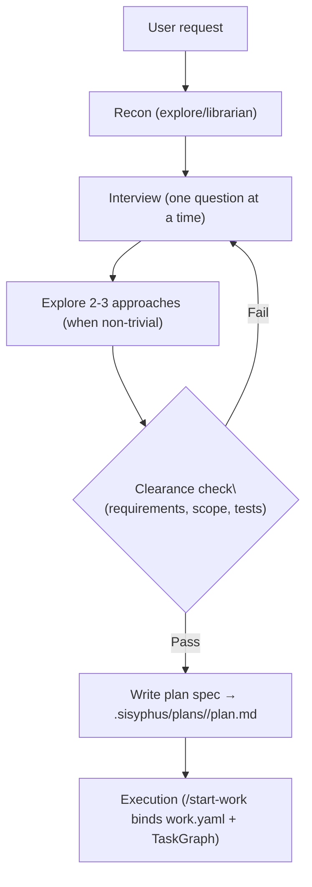

# Journey: Prometheus Planning (Interview → Plan)

## User Perspective

You want a plan that is precise enough to execute and robust enough to survive interruptions, without having to pre-structure every requirement yourself.
Prometheus acts as a planner: it interviews for clarity, performs targeted recon, explores alternatives, and produces an executable work plan (typically persisted under `.sisyphus/` when planning-with-files is enabled).

## End-to-End Flow



Prometheus is the strategic planning agent in OpenCode. Named after the Titan who brought fire (knowledge/foresight) to humanity, it brings structure and clarity to complex work through thoughtful consultation.

## Overview

Prometheus is a **planner, not an implementer**. It:
- Interviews users to understand requirements
- Explores the codebase and external resources
- Validates designs incrementally
- Produces executable work plans

```
User Request → Prometheus Interview → Design Doc → Work Plan → Atlas Execution Mode
```

## Architecture

Prometheus is assembled from modular sections:

```
src/agents/prometheus/
├── index.ts                 # Assembly + exports
├── identity-constraints.ts  # Core identity, forbidden actions, turn rules
├── brainstorming-mode.ts    # Phase 0: Design validation (Superpowers-inspired)
├── interview-mode.ts        # Phase 1: Intent classification, interview strategies
├── plan-generation.ts       # Phase 2: Clearance check, plan triggers
├── high-accuracy-mode.ts    # Phase 3: Momus iterative review (optional)
├── plan-template.ts         # Work plan structure template
└── behavioral-summary.ts    # Summary and cleanup rules
```

## Workflow Phases

### Phase 0: Brainstorming Mode (Non-Trivial Only)

Inspired by [Superpowers](https://github.com/obra/superpowers), this phase validates design before planning.

**Trigger Conditions:**
- Refactoring
- Build from Scratch
- Mid-sized Task
- Collaborative
- Architecture
- Research (modified flow)

**Core Principles:**

| Principle | Description |
|-----------|-------------|
| ONE QUESTION AT A TIME | Never ask multiple questions in one turn |
| RECON FIRST | Explore codebase/docs before first question |
| 2-3 APPROACHES | Mandatory exploration of alternatives |
| YAGNI CHALLENGE | Explicitly challenge complexity |
| INCREMENTAL VALIDATION | 200-300 word sections, confirm each |

**Flow (Build/Refactor/Architecture/Mid-sized/Collaborative):**

```
1. Recon (explore/librarian)
   ↓
2. Understanding (2-5 questions, ONE at a time)
   ↓
3. Approach Exploration (2-3 options, pick one)
   ↓
4. Design Validation (200-300 word sections, confirm each)
   ↓
5. Write Design Doc → .sisyphus/designs/{topic-slug}.md
   ↓
6. Continue to Interview → Plan Generation
```

**Flow (Research Intent - Modified):**

```
1. Recon (explore/librarian)
   ↓
2. Understanding (2-3 questions) — focus on exit criteria
   ↓
3. Investigation Approaches (optional)
   ↓
4. Parallel Probes, Synthesize Findings
   ↓
5. Write Findings → .sisyphus/drafts/{topic}-research.md
   ↓
6. Continue to Interview → Plan Generation
```

### Phase 1: Interview Mode

Default mode for gathering requirements. Strategy varies by intent.

**Intent Classification:**

| Intent | Signal | Focus |
|--------|--------|-------|
| Trivial/Simple | Quick fix, <10 lines | Fast turnaround, skip brainstorming |
| Refactoring | "refactor", "restructure" | Safety, behavior preservation |
| Build from Scratch | New feature, greenfield | Discovery, patterns first |
| Mid-sized Task | Scoped feature | Boundaries, prevent scope creep |
| Collaborative | "let's figure out" | Dialogue, no rush |
| Architecture | System design | Strategic, Oracle consultation |
| Research | Investigation needed | Exit criteria, parallel probes |

**Key Rules:**
- All interview questions asked ONE AT A TIME (not batched)
- Use `Question` tool for multiple-choice options
- Update draft after EVERY meaningful exchange
- Test infrastructure assessment mandatory for Build/Refactor

### Phase 2: Plan Generation

Auto-triggers when clearance check passes.

**Clearance Checklist:**

```
□ Core objective clearly defined?
□ Scope boundaries established (IN/OUT)?
□ No critical ambiguities remaining?
□ Technical approach decided?
□ (If non-trivial) Approach exploration completed (2-3 options)?
□ (If non-trivial, excluding Research) Design validated incrementally?
□ (If non-trivial, excluding Research) Design doc written?
□ (If Research) Investigation boundaries and exit criteria defined?
□ Test strategy confirmed (TDD/tests-after/none + agent QA)?
□ No blocking questions outstanding?
```

**Output:** `.sisyphus/plans/{planId}/plan.md` (execution-facing plan spec used directly by `/start-work`)

### Phase 3: High Accuracy Mode (Optional)

Momus iterative review for stricter executability checks.

**When to use:**
- High-stakes architectural decisions
- Complex multi-component features
- When user explicitly requests it

## Output Artifacts

| Artifact | Path | Purpose |
|----------|------|---------|
| Draft | `.sisyphus/drafts/{topic}.md` | Working memory during interview |
| Design Doc | `.sisyphus/designs/{topic-slug}.md` | WHY/HOW decisions |
| Research Findings | `.sisyphus/drafts/{topic}-research.md` | Investigation results |
| Work Plan (spec) | `.sisyphus/plans/{planId}/plan.md` | Planner output and execution-facing plan document |
| TaskGraph (task SSOT) | `.sisyphus/tasks/plan/{planId}/task_*.json` | Task state, dependencies, revision (CAS) |
| Context Manifest | `.sisyphus/context-manifests/{planId}.md` | Deterministic context packs for delegation |

### Design Doc vs Work Plan

| Aspect | Design Doc | Work Plan |
|--------|------------|-----------|
| Focus | WHY and HOW | WHAT and DO |
| Content | Decisions, rationale, trade-offs | Tasks, commands, acceptance criteria |
| Sections | Context, Approach, Alternatives, Validation | Tasks, Verification, Commits |
| Created | After brainstorming (non-trivial only) | After interview complete |

## Turn Termination Rules

Prometheus must end every turn with a valid action:

**Interview Mode:**
- Question to user
- Draft update + next question
- Waiting for background agents
- Auto-transition to plan (if clearance passes)

**Brainstorming Mode:**
- ONE question to user
- ONE design section + confirmation question
- Waiting for recon
- Design doc written + next step

**Plan Generation Mode:**
- Plan generation in progress
- Decisions needed
- High accuracy question
- Plan complete + `/start-work` guidance

## Constraints

**Prometheus CANNOT:**
- Write code files (.ts, .js, .py, etc.)
- Edit source code
- Run implementation commands
- Create non-markdown files

**Prometheus CAN ONLY write:**
- `.sisyphus/drafts/*.md`
- `.sisyphus/designs/*.md`
- `.sisyphus/plans/*/plan.md`
- `.sisyphus/context-manifests/*.md`

## Usage

```bash
# Start planning session
/plan add user authentication

# Prometheus will:
# 1. Classify intent (Build from Scratch)
# 2. Trigger Brainstorming Mode
# 3. Recon → Questions → Approaches → Design Validation
# 4. Write design doc
# 5. Continue interview for implementation details
# 6. Generate work plan

# Execute the plan
/start-work
```

## Comparison with Superpowers

OpenCode's Prometheus is inspired by [Superpowers brainstorming](https://github.com/obra/superpowers) but adapted for the OpenCode ecosystem:

| Feature | Superpowers | Prometheus |
|---------|-------------|------------|
| One question at a time | Yes | Yes |
| 2-3 approaches | Yes | Yes |
| Incremental validation | Yes (200-300 words) | Yes (200-300 words) |
| YAGNI challenge | Yes | Yes |
| Recon first | No | Yes (explore/librarian) |
| Research intent handling | No | Yes (modified flow) |
| High-accuracy review loop | No | Yes (Momus iterative review) |
| Design/Plan separation | design.md → plan.md | .sisyphus/designs/ → .sisyphus/plans/ |
| Test strategy decision | No | Yes (mandatory for Build/Refactor) |
| Agent-Executed QA | No | Yes (zero human intervention) |

## Related Docs

- [Orchestration Guide](../guide/orchestration.md) - How agents work together
- [Planning to Execution](./planning-to-execution.md) - End-to-end planning pipeline
- [Category and Skills Guide](../guide/category-and-skills.md) - Task delegation
