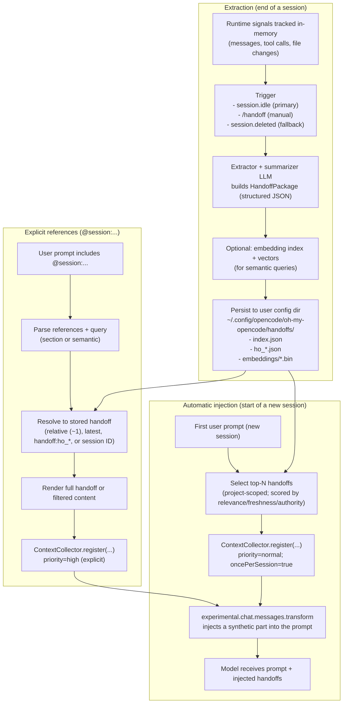

# Journey: Session Handoff & Session Reference

## User Perspective

You want continuity across coding sessions without manually re-explaining decisions, re-discovering failures, or copy-pasting large context blobs.
This journey explains how Oh-My-OpenCode extracts a structured **handoff package** at the end of a session, automatically injects the most relevant handoffs at the start of the next session, and supports explicit “bring context from that session” references via `@session:...`.

## End-to-End Flow

## What a Handoff Contains

A handoff is a structured package (not free-form prose) that typically includes:

- **Decisions**: what was chosen and why.
- **Artifacts**: files created/modified and the intent of changes.
- **Anti-patterns**: approaches that failed and should not be repeated.
- **Domain context**: project- or feature-specific insights.
- **Recovery patterns** (optional): failure → fix sequences (useful for debugging playbooks).

## How to Use

### Automatic Flow (recommended default)

1. Work normally.
2. When the session becomes idle, the hook extracts and saves a handoff (subject to thresholds like minimum messages / file changes).
3. In a later session, your first prompt triggers auto-injection of the most relevant handoffs for the same project.

### Manual Flow (`/handoff`)

The handoff hook supports a self-contained command surface:

- `/handoff <goal>`: extract and save a handoff now (goal-oriented).
- `/handoff list`: list recent handoffs for the current project.
- `/handoff show <idPrefix>`: render a handoff (partial ID supported).
- `/handoff delete <idPrefix>`: delete a handoff.
- `/handoff cleanup`: delete expired handoffs (L3-promoted handoffs are exempt).

### Explicit References (`@session:...`)

Use `@session:` when you want deterministic, targeted carry-over for the current prompt.

Supported identifiers (project-scoped):

- `@session:latest` (alias for `~1`)
- `@session:~1`, `@session:~2` (relative handoff order)
- `@session:handoff:ho_...` (direct handoff ID)
- `@session:<sessionId>` (find handoff whose `sourceSessionId` matches)

Supported queries:

- `@session:~1:decisions`
- `@session:~1:artifacts`
- `@session:~1:antiPatterns`
- `@session:~1:context`
- `@session:~1:"jwt refresh"` (semantic query; quoted)

Important: current implementation resolves references **only from stored handoffs**. If no handoff exists yet for the referenced session, nothing is injected. Use `/handoff <goal>` or wait for `session.idle` extraction first.

## Configuration & Defaults

Key knobs:

- `session_handoff.*`: enable/disable, extraction thresholds, expiry, max injected count, extractor model, and embedding generation.
- `session_handoff.reference` (preferred) or `session_reference` (deprecated): enable/disable `@session:` parsing and semantic query thresholds.

Precedence:

- `session_handoff.reference` overrides top-level `session_reference` if both are present.

Implementation note (precision over intent): the schema includes `resolve_options.allow_session_fallback` and `resolve_options.create_handoff_if_missing`, but current resolver logic does not implement session-message fallback or on-demand handoff creation.

## Storage & Artifacts

Handoffs are persisted under:

- `~/.config/opencode/oh-my-opencode/handoffs/`
  - `index.json` (metadata index)
  - `ho_*.json` (handoff packages)
  - `embeddings/*.bin` (optional vector store)

## Where to Look in Code

- Lifecycle wiring + config precedence: `src/index.ts`
- Handoff extraction/injection hook: `src/features/session-handoff/hook.ts`
- Storage + index + embeddings persistence: `src/features/session-handoff/storage.ts`
- Session reference resolver: `src/features/session-handoff/reference-resolver.ts`
- Renderers: `src/features/session-handoff/renderer.ts`
- Context injection mechanism (collector + message transform): `src/features/context-injector/`

## Debug Checklist

- Confirm `session-handoff` hook is enabled (not in `disabled_hooks`).
- Confirm extraction thresholds: `min_messages_for_extract` and `min_file_changes_for_extract`.
- Check filesystem artifacts (`index.json`, `ho_*.json`) exist under the handoff directory.
- Use `/handoff list` to confirm a handoff exists before relying on `@session:...`.
- Inspect logs for `[session-handoff]` messages (injection, extraction triggers, errors).

## Further Reading

- Contract: `docs/reference/hooks.md` (lifecycle wiring and ordering)
- Contract: `docs/reference/artifacts-and-paths.md` (storage locations and ownership)
- Contract: `docs/reference/configuration.md` (full configuration surface)
