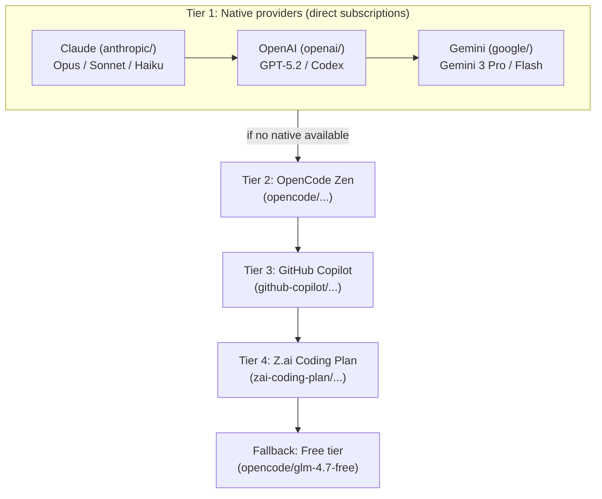
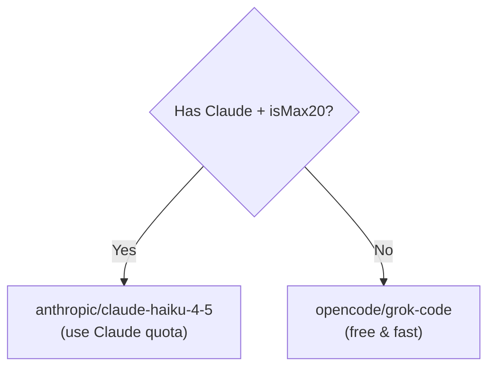
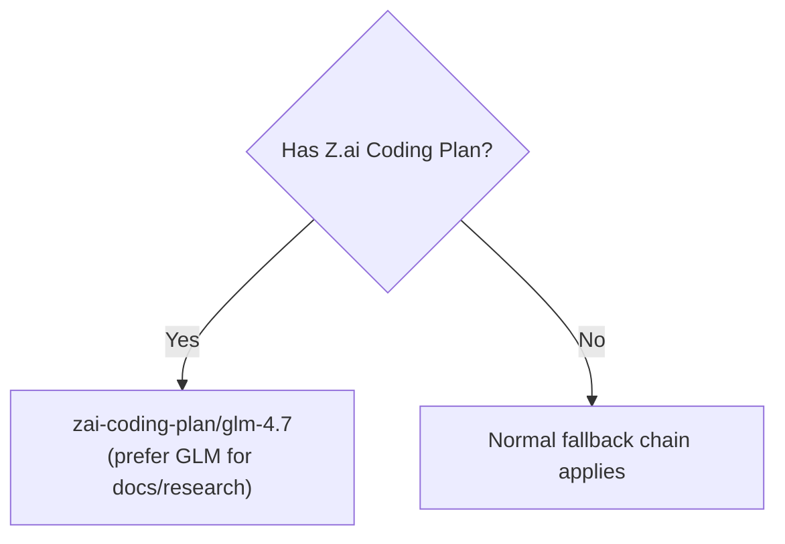

# Contract: Configuration

This document is a **normative contract** for configuration surfaces in this repo.

## Normative Language

The keywords **MUST**, **MUST NOT**, **SHOULD**, **SHOULD NOT**, and **MAY** are to be interpreted as described in RFC 2119.

## Scope

This document defines:

- Supported configuration file locations and precedence.
- JSON vs JSONC behavior.
- High-signal configuration keys that affect wiring and behavior.

This document does **not** restate every Zod schema field. The schema is authoritative.

## Source of Truth

- Schema: `src/config/schema.ts`
- Merge semantics: `src/plugin-config.ts`
- Generated JSON schema: `assets/oh-my-opencode.schema.json`

## Config File Locations

Config file locations (priority order):
1. `.opencode/oh-my-opencode.json` (project)
2. User config (platform-specific):

| Platform        | User Config Path                                                                                            |
| --------------- | ----------------------------------------------------------------------------------------------------------- |
| **Windows**     | `~/.config/opencode/oh-my-opencode.json` (preferred) or `%APPDATA%\opencode\oh-my-opencode.json` (fallback) |
| **macOS/Linux** | `~/.config/opencode/oh-my-opencode.json`                                                                    |

Schema autocomplete supported:

```json
{
  "$schema": "https://raw.githubusercontent.com/code-yeongyu/oh-my-opencode/master/assets/oh-my-opencode.schema.json"
}
```

## JSONC Support

The `oh-my-opencode` configuration file supports JSONC (JSON with Comments):
- Line comments: `// comment`
- Block comments: `/* comment */`
- Trailing commas: `{ "key": "value", }`

When both `oh-my-opencode.jsonc` and `oh-my-opencode.json` files exist, `.jsonc` takes priority.

**Example with comments:**

```jsonc
{
  "$schema": "https://raw.githubusercontent.com/code-yeongyu/oh-my-opencode/master/assets/oh-my-opencode.schema.json",

  /* Agent overrides - customize models for specific tasks */
  "agents": {
    "oracle": {
      "model": "openai/gpt-5.2"  // GPT for strategic reasoning
    },
    "explore": {
      "model": "opencode/grok-code"  // Free & fast for exploration
    },
  },
}
```

## Google Auth

**Recommended**: For Google Gemini authentication, install the [`opencode-antigravity-auth`](https://github.com/NoeFabris/opencode-antigravity-auth) plugin. It provides multi-account load balancing, more models (including Claude via Antigravity), and active maintenance. See [Installation > Google Gemini (Antigravity OAuth)](../guide/installation.md#google-gemini-antigravity-oauth).

## Agents

Override built-in agent settings:

```json
{
  "agents": {
    "explore": {
      "model": "anthropic/claude-haiku-4-5",
      "temperature": 0.5
    },
    "multimodal-looker": {
      "disable": true
    }
  }
}
```

Each agent supports: `model`, `temperature`, `top_p`, `prompt`, `prompt_append`, `tools`, `disable`, `description`, `mode`, `color`, `permission`.

**Note**: The `agents` override keys are limited to `AgentOverridesSchema` in `src/config/schema.ts` (unknown agent keys are ignored). Some built-in agents (e.g., `hephaestus`) can be disabled via `disabled_agents` but are not currently overrideable via the `agents` block.

Use `prompt_append` to add extra instructions without replacing the default system prompt:

```json
{
  "agents": {
    "librarian": {
      "prompt_append": "Always use the elisp-dev-mcp for Emacs Lisp documentation lookups."
    }
  }
}
```

You can also override settings for `sisyphus` (the main orchestrator) and `build` (the default agent) using the same options.

### Permission Options

Fine-grained control over what agents can do:

```json
{
  "agents": {
    "explore": {
      "permission": {
        "edit": "deny",
        "bash": "ask",
        "webfetch": "allow"
      }
    }
  }
}
```

| Permission           | Description                            | Values                                                                      |
| -------------------- | -------------------------------------- | --------------------------------------------------------------------------- |
| `edit`               | File editing permission                | `ask` / `allow` / `deny`                                                    |
| `bash`               | Bash command execution                 | `ask` / `allow` / `deny` or per-command: `{ "git": "allow", "rm": "deny" }` |
| `webfetch`           | Web request permission                 | `ask` / `allow` / `deny`                                                    |
| `doom_loop`          | Allow infinite loop detection override | `ask` / `allow` / `deny`                                                    |
| `external_directory` | Access files outside project root      | `ask` / `allow` / `deny`                                                    |

Or disable via `disabled_agents` in `~/.config/opencode/oh-my-opencode.json` or `.opencode/oh-my-opencode.json`:

```json
{
  "disabled_agents": ["oracle", "multimodal-looker"]
}
```

Available built-in agents: `sisyphus`, `sisyphus`, `oracle`, `librarian`, `explore`, `multimodal-looker`, `plan-synthesizer`, `hephaestus`

## Multi-Plan Pipeline

Unified configuration for multi-model planning routing and synthesizer verification behavior:

```jsonc
{
  "multi_plan_pipeline": {
    "auto_complexity_detection": true,
    "smart_skip_interview": true,
    "deep_verification": true,
    "adhd_detection": true
  }
}
```

| Field | Default | Description |
|------|---------|-------------|
| `auto_complexity_detection` | `true` | Adds per-message complexity routing hints for planners (`single_model` vs `multi_model`) |
| `smart_skip_interview` | `true` | Adds per-message clarity hints (`skip` / `brief` / `full`) |
| `deep_verification` | `true` | Plan Synthesizer Phase 3 deep verification toggle |
| `adhd_detection` | `true` | Plan Synthesizer ADHD-omission scan toggle |

## Built-in Skills

Oh My OpenCode includes built-in skills that provide additional capabilities:

- **playwright**: Browser automation via Playwright MCP. Default browser provider.
- **agent-browser**: Browser automation via agent-browser CLI. Alternate provider (selected only when explicitly configured by an integration point).
- **frontend-ui-ux**: UI/UX execution guidance (designer-turned-developer persona).
- **git-master**: Git expert for atomic commits, rebase/squash, and history search (blame, bisect, log -S).
- **parallel-agents**: Worktree + tmux orchestration for parallel agent workflows (spawn/monitor/rescue/merge/cleanup).
- **dev-browser**: Stateful browser automation (requires separate local server setup).
- **spec-compliance-review**: Strict acceptance-criteria verification with PASS/FAIL verdict and file:line evidence.
- **code-quality-review**: Post-spec code quality review (type safety, error handling, tests, maintainability, safety risks).
- **writing-plans**: Structured implementation planning with dependencies, risks, and verification steps.
- **systematic-debugging**: Hypothesis-driven debugging workflow (experiments, minimal fixes, verification).
- **code-simplifier**: Behavior-preserving simplification pass to reduce complexity and improve readability.

Disable schema-recognized built-in skills via `disabled_skills` in `~/.config/opencode/oh-my-opencode.json` or `.opencode/oh-my-opencode.json`:

```json
{
  "disabled_skills": ["playwright"]
}
```

You can also disable any skill (including built-ins) via the `skills` map:

```jsonc
{
  "skills": {
    "parallel-agents": false,
    "dev-browser": false
  }
}
```

Available built-in skills include: `playwright` (or `agent-browser` when explicitly selected), `frontend-ui-ux`, `git-master`, `parallel-agents`, `dev-browser`, `spec-compliance-review`, `code-quality-review`, `writing-plans`, `systematic-debugging`, `code-simplifier`.

## Git Master

Configure git-master skill behavior:

```json
{
  "git_master": {
    "commit_footer": true,
    "include_co_authored_by": true
  }
}
```

| Option                   | Default | Description                                                                      |
| ------------------------ | ------- | -------------------------------------------------------------------------------- |
| `commit_footer`          | `true`  | Adds "Ultraworked with Sisyphus" footer to commit messages.                      |
| `include_co_authored_by` | `true`  | Adds `Co-authored-by: Sisyphus <clio-agent@sisyphuslabs.ai>` trailer to commits. |

## Sisyphus Agent

When enabled (default), Sisyphus provides a powerful orchestrator with optional specialized agents:

- **Sisyphus**: Primary orchestrator agent (Claude Opus 4.5)
- **OpenCode-Builder**: OpenCode's default build agent, renamed due to SDK limitations (disabled by default)
- **Prometheus**: OpenCode's default plan agent with work-planner methodology (enabled by default)
- **plan-synthesizer**: Multi-model plan arbiter that critiques and synthesizes competing plans
- **Sisyphus-Junior**: Focused executor used in multi-plan generation/rebuttals; cannot delegate implementation

**Configuration Options:**

```jsonc
{
  "sisyphus_agent": {
    "disabled": false,
    "default_builder_enabled": false,
    "planner_enabled": true,
    "replace_plan": true
  }
}
```

**Example: Enable OpenCode-Builder:**

```jsonc
{
  "sisyphus_agent": {
    "default_builder_enabled": true
  }
}
```

This enables OpenCode-Builder agent alongside Sisyphus. The default build agent is always demoted to subagent mode when Sisyphus is enabled.

**Example: Disable all Sisyphus orchestration:**

```jsonc
{
  "sisyphus_agent": {
    "disabled": true
  }
}
```

You can also customize Sisyphus agents like other agents:

```jsonc
{
  "agents": {
    "sisyphus": {
      "model": "anthropic/claude-sonnet-4",
      "temperature": 0.3
    },
    "OpenCode-Builder": {
      "model": "anthropic/claude-opus-4"
    },
    "prometheus": {
      "model": "openai/gpt-5.2"
    },
    "plan-synthesizer": {
      "model": "anthropic/claude-opus-4-5"
    },
    "sisyphus-junior": {
      "model": "anthropic/claude-sonnet-4-5"
    }
  }
}
```

For **multi-model planning**, you can set `agents.prometheus.model` to a `string[]` (2-5 models). Prometheus will use the **first** entry as its own runtime model, and the full array will be used for the multi-plan pipeline.

**Example: Enable multi-model planning via `agents.prometheus.model` array:**

```jsonc
{
  "agents": {
    "prometheus": {
      "model": [
        "anthropic/claude-opus-4-5",
        "openai/gpt-5.2"
      ]
    }
  }
}
```

| Option                    | Default | Description                                                                                                                            |
| ------------------------- | ------- | -------------------------------------------------------------------------------------------------------------------------------------- |
| `disabled`                | `false` | When `true`, disables all Sisyphus orchestration and restores original build/plan as primary.                                          |
| `default_builder_enabled` | `false` | When `true`, enables OpenCode-Builder agent (same as OpenCode build, renamed due to SDK limitations). Disabled by default.             |
| `planner_enabled`         | `true`  | When `true`, enables Prometheus agent with work-planner methodology. Enabled by default.                                               |
| `replace_plan`            | `true`  | When `true`, demotes default plan agent to subagent mode. Set to `false` to keep both Prometheus and default plan available.          |

## Background Tasks

Configure concurrency limits for background agent tasks. This controls how many parallel background agents can run simultaneously.

```json
{
  "background_task": {
    "defaultConcurrency": 5,
    "providerConcurrency": {
      "anthropic": 3,
      "openai": 5,
      "google": 10
    },
    "modelConcurrency": {
      "anthropic/claude-opus-4-5": 2,
      "google/gemini-3-flash": 10
    }
  }
}
```

| Option                | Default | Description                                                                                                             |
| --------------------- | ------- | ----------------------------------------------------------------------------------------------------------------------- |
| `defaultConcurrency`  | -       | Default maximum concurrent background tasks for all providers/models                                                    |
| `providerConcurrency` | -       | Per-provider concurrency limits. Keys are provider names (e.g., `anthropic`, `openai`, `google`)                        |
| `modelConcurrency`    | -       | Per-model concurrency limits. Keys are full model names (e.g., `anthropic/claude-opus-4-5`). Overrides provider limits. |

**Priority Order**: `modelConcurrency` > `providerConcurrency` > `defaultConcurrency`

**Use Cases**:
- Limit expensive models (e.g., Opus) to prevent cost spikes
- Allow more concurrent tasks for fast/cheap models (e.g., Gemini Flash)
- Respect provider rate limits by setting provider-level caps

## Parallel Runtime

Configure global concurrency admission shared by Background and Swarm execution paths.

```json
{
  "parallel_runtime": {
    "enabled": true,
    "mode": "shadow",
    "global_slots": 6,
    "lease_ttl_ms": 120000,
    "heartbeat_ms": 10000,
    "acquire_timeout_ms": 15000,
    "lock_timeout_ms": 2000
  }
}
```

| Option | Default | Description |
| --- | --- | --- |
| `enabled` | `true` | Enable shared runtime admission control and slot tracking |
| `mode` | `shadow` | `shadow`: observe and log pressure without blocking, `enforce`: hard cap |
| `global_slots` | `6` | Global slot budget shared across subsystems |
| `lease_ttl_ms` | `120000` | Lease expiry window used for crash/stale recovery |
| `heartbeat_ms` | `10000` | Recommended renewal cadence for long-running runs |
| `acquire_timeout_ms` | `15000` | Max wait for slot acquisition in enforce mode |
| `lock_timeout_ms` | `2000` | Timeout for runtime state lock acquisition |

**Effective behavior**:
- `background_task` local limits still apply.
- Global admission is evaluated in addition to local limits (both must pass in enforce mode).
- `acquire_timeout_ms` applies to blocking admissions (Background); Swarm admission is non-blocking in `enforce` and simply stops new assignments when at capacity.

## Categories

Categories enable domain-specific task delegation via the `delegate_task` tool. Each category applies runtime presets (model, temperature, prompt additions) when calling the `sisyphus-junior` agent.

**Built-in Categories (defaults):**

| Category | Model | Description |
|---|---|---|
| `visual-engineering` | `google/gemini-3-pro` | Frontend, UI/UX, design, styling, animation |
| `ultrabrain` | `openai/gpt-5.2-codex` (xhigh) | Deep logical reasoning and complex architecture |
| `deep` | `openai/gpt-5.2-codex` (medium) | Goal-oriented autonomous problem-solving |
| `artistry` | `google/gemini-3-pro` (max) | Highly creative/artistic tasks |
| `quick` | `anthropic/claude-haiku-4-5` | Trivial tasks (small changes) |
| `unspecified-low` | `anthropic/claude-sonnet-4-5` | Moderate-effort tasks that don't fit other categories |
| `unspecified-high` | `anthropic/claude-opus-4-5` (max) | High-effort tasks that don't fit other categories |
| `writing` | `google/gemini-3-flash` | Documentation, prose, technical writing |

**Usage:**

```
// Via delegate_task tool
delegate_task(
  category="visual-engineering",
  load_skills=["frontend-ui-ux"],
  description="dashboard UI",
  prompt="Create a responsive dashboard component",
  run_in_background=false
)

// Or target a specific agent directly
delegate_task(
  subagent_type="oracle",
  load_skills=[],
  description="architecture review",
  prompt="Review this architecture",
  run_in_background=false
)
```

**Custom Categories:**

Add custom categories in `oh-my-opencode.json`:

```json
{
  "categories": {
    "data-science": {
      "model": "anthropic/claude-sonnet-4-5",
      "temperature": 0.2,
      "prompt_append": "Focus on data analysis, ML pipelines, and statistical methods."
    },
    "visual": {
      "model": "google/gemini-3-pro-preview",
      "prompt_append": "Use shadcn/ui components and Tailwind CSS."
    }
  }
}
```

Each category supports: `model`, `temperature`, `top_p`, `maxTokens`, `thinking`, `reasoningEffort`, `textVerbosity`, `tools`, `prompt_append`.

## Model Selection System

The installer automatically configures optimal models based on your subscriptions. This section explains how models are selected for each agent and category.

### Overview

**Problem**: Users have different subscription combinations (Claude, OpenAI, Gemini, etc.). The system needs to automatically select the best available model for each task.

**Solution**: A tiered fallback system that:
1. Prioritizes native provider subscriptions (Claude, OpenAI, Gemini)
2. Falls back through alternative providers in priority order
3. Applies capability-specific logic (e.g., Oracle prefers GPT, visual tasks prefer Gemini)

### Provider Priority



### Native Tier Cross-Fallback

Within the Native tier, models fall back based on capability requirements:

| Capability | 1st Choice | 2nd Choice | 3rd Choice |
|------------|------------|------------|------------|
| **High-tier tasks** (Sisyphus, Sisyphus Execution Mode) | Claude Opus | OpenAI GPT-5.2 | Gemini 3 Pro |
| **Standard tasks** | Claude Sonnet | OpenAI GPT-5.2 | Gemini 3 Flash |
| **Quick tasks** | Claude Haiku | OpenAI GPT-5.1-mini | Gemini 3 Flash |
| **Deep reasoning** (Oracle) | OpenAI GPT-5.2-Codex | Claude Opus | Gemini 3 Pro |
| **Visual/UI tasks** | Gemini 3 Pro | OpenAI GPT-5.2 | Claude Sonnet |
| **Writing tasks** | Gemini 3 Flash | OpenAI GPT-5.2 | Claude Sonnet |

### Agent-Specific Rules

#### Standard Agents

| Agent | Capability | Example (Claude + OpenAI + Gemini) |
|-------|------------|-------------------------------------|
| **Sisyphus** | High-tier (isMax20) or Standard | `anthropic/claude-opus-4-5` or `anthropic/claude-sonnet-4-5` |
| **Oracle** | Deep reasoning | `openai/gpt-5.2-codex` |
| **Prometheus** | High-tier/Standard | Same as Sisyphus |
| **Sisyphus Execution Mode** | High-tier/Standard | Same as Sisyphus |
| **plan-synthesizer** | High-tier/Standard | Typically Opus-class or same as Sisyphus |
| **multimodal-looker** | Visual | `google/gemini-3-pro-preview` |

#### Special Case: explore Agent

The `explore` agent has unique logic for cost optimization:



#### Special Case: librarian Agent

The `librarian` agent prioritizes Z.ai when available:



### Category-Specific Rules

Categories follow the same fallback logic as agents:

| Category | Primary Capability | Fallback Chain |
|----------|-------------------|----------------|
| `visual-engineering` | Visual | Gemini → OpenAI → Claude |
| `ultrabrain` | Deep reasoning | OpenAI → Claude → Gemini |
| `artistry` | Visual/Creative | Gemini → OpenAI → Claude |
| `quick` | Quick tasks | Claude Haiku → OpenAI mini → Gemini Flash |
| `unspecified-low` | Standard | Claude Sonnet → OpenAI → Gemini Flash |
| `unspecified-high` | High-tier | Claude Opus → OpenAI → Gemini Pro |
| `writing` | Writing | Gemini Flash → OpenAI → Claude |

### Subscription Scenarios

#### Scenario 1: Claude Only (Standard Plan)

```json
// User has: Claude Pro (not max20)
{
  "agents": {
    "sisyphus": { "model": "anthropic/claude-sonnet-4-5" },
    "oracle": { "model": "anthropic/claude-opus-4-5" },
    "explore": { "model": "opencode/grok-code" },
    "librarian": { "model": "opencode/glm-4.7-free" }
  }
}
```

#### Scenario 2: Claude Only (Max20 Plan)

```json
// User has: Claude Max (max20 mode)
{
  "agents": {
    "sisyphus": { "model": "anthropic/claude-opus-4-5" },
    "oracle": { "model": "anthropic/claude-opus-4-5" },
    "explore": { "model": "anthropic/claude-haiku-4-5" },
    "librarian": { "model": "opencode/glm-4.7-free" }
  }
}
```

#### Scenario 3: ChatGPT Only

```json
// User has: OpenAI/ChatGPT Plus only
{
  "agents": {
    "sisyphus": { "model": "openai/gpt-5.2" },
    "oracle": { "model": "openai/gpt-5.2-codex" },
    "explore": { "model": "opencode/grok-code" },
    "multimodal-looker": { "model": "openai/gpt-5.2" },
    "librarian": { "model": "opencode/glm-4.7-free" }
  }
}
```

#### Scenario 4: Full Stack (Claude + OpenAI + Gemini)

```json
// User has: All native providers
{
  "agents": {
    "sisyphus": { "model": "anthropic/claude-opus-4-5" },
    "oracle": { "model": "openai/gpt-5.2-codex" },
    "explore": { "model": "anthropic/claude-haiku-4-5" },
    "multimodal-looker": { "model": "google/gemini-3-pro-preview" },
    "librarian": { "model": "opencode/glm-4.7-free" }
  }
}
```

#### Scenario 5: GitHub Copilot Only

```json
// User has: GitHub Copilot only (no native providers)
{
  "agents": {
    "sisyphus": { "model": "github-copilot/claude-sonnet-4.5" },
    "oracle": { "model": "github-copilot/gpt-5.2-codex" },
    "explore": { "model": "opencode/grok-code" },
    "librarian": { "model": "github-copilot/gpt-5.2" }
  }
}
```

### isMax20 Flag Impact

The `isMax20` flag (Claude Max 20x mode) affects high-tier task model selection:

| isMax20 | High-tier Capability | Result |
|---------|---------------------|--------|
| `true` | Uses `unspecified-high` | Opus-class models |
| `false` | Uses `unspecified-low` | Sonnet-class models |

**Affected agents**: Sisyphus, Prometheus, Sisyphus Execution Mode

**Why?**: Max20 users have 20x more Claude usage, so they can afford Opus for orchestration. Standard users should conserve quota with Sonnet.

### Manual Override

You can always override automatic selection in `oh-my-opencode.json`:

```json
{
  "agents": {
    "sisyphus": {
      "model": "anthropic/claude-sonnet-4-5"  // Force specific model
    },
    "oracle": {
      "model": "openai/o3"  // Use different model
    }
  },
  "categories": {
    "visual-engineering": {
      "model": "anthropic/claude-opus-4-5"  // Override category default
    }
  }
}
```

## Context Budget

All context injection hooks share a unified token budget governed by a single `ContextBudgetArbiter` singleton (`src/features/context-budget/`). This prevents any one hook from starving others.

```json
{
  "context_budget": {
    "total_budget": 2000,
    "reserved_budget": 400,
    "overflow_strategy": "drop-low-priority",
    "source_limits": {
      "codemap-injector": 600,
      "rules-injector": 500
    },
    "channel_limits": {
      "tool-output": 1200,
      "synthetic-message": 400
    }
  }
}
```

| Key | Default | Description |
|-----|---------|-------------|
| `total_budget` | `2000` | Total tokens per turn across all injection sources |
| `reserved_budget` | `400` | Tokens reserved for `critical`/`high` priority injections. Normal/low priority sources can only use `total_budget - reserved_budget`. |
| `overflow_strategy` | `"drop-low-priority"` | `"drop-low-priority"` drops normal/low entries that exceed budget; `"truncate"` truncates content to fit |
| `source_limits` | — | Per-source token caps (e.g., `"codemap-injector": 600`) |
| `channel_limits` | — | Per-channel token caps. Channels: `messages-transform`, `tool-output`, `chat-message`, `delegate-prompt`, `synthetic-message`, `session-prompt` |

**Injection channels** route through the arbiter via two paths:

1. **`ContextCollector.register()`** → `arbiter.decide()` — used by `planning-with-files`, `claude-code-hooks`
2. **Direct `arbiter.decide()`** — used by `rules-injector`, `directory-agents/readme`, `repo-overview`, `codemap-injector`, `keyword-detector`, `context-manifest-injector`, `conditional-rules`, `hook-message-injector`, `category-skill-reminder`

Budget counters reset at the start of each user turn via `beginTurn()`.

## Hooks

Disable specific built-in hooks via `disabled_hooks` in `~/.config/opencode/oh-my-opencode.json` or `.opencode/oh-my-opencode.json`:

```json
{
  "disabled_hooks": ["comment-checker", "agent-usage-reminder"]
}
```

Hook names MUST come from `HookNameSchema` in `src/config/schema.ts`. For wiring status (including reserved-but-not-wired names) and ordering, see `docs/reference/hooks.md`.

**Note on `claude-code-hooks` enablement**:

- `disabled_hooks` supports `"claude-code-hooks"`.
- `claude_code.hooks=false` is treated as a compatibility alias that disables the same bridge.
- If both are set and conflict, **disabled wins**.

**Note on `directory-agents-injector`**: This hook is **automatically disabled** when running on OpenCode 1.1.37+ because OpenCode now has native support for dynamically resolving AGENTS.md files from subdirectories (PR #10678). This prevents duplicate AGENTS.md injection. For older OpenCode versions, the hook remains active to provide the same functionality.

**Note on `compaction-context-injector`**: This hook is wired in `src/index.ts` under the `experimental.session.compacting` lifecycle surface. When OpenCode emits that event during compaction, the plugin can run Claude Code compat `PreCompact` hooks and/or inject extra compaction-time context via `compaction-context-injector` (best-effort; depends on runtime support and hook enablement).

**Note on `auto-update-checker` and `startup-toast`**: The `startup-toast` hook is a sub-feature of `auto-update-checker`. To disable only the startup toast notification while keeping update checking enabled, add `"startup-toast"` to `disabled_hooks`. To disable all update checking features (including the toast), add `"auto-update-checker"` to `disabled_hooks`.

## MCPs

Exa, Context7 and grep.app MCP enabled by default.

- **websearch**: Real-time web search powered by [Exa AI](https://exa.ai) - searches the web and returns relevant content
- **context7**: Fetches up-to-date official documentation for libraries
- **grep_app**: Ultra-fast code search across millions of public GitHub repositories via [grep.app](https://grep.app)

Don't want them? Disable via `disabled_mcps` in `~/.config/opencode/oh-my-opencode.json` or `.opencode/oh-my-opencode.json`:

```json
{
  "disabled_mcps": ["websearch", "context7", "grep_app"]
}
```

## LSP

OpenCode provides LSP tools for analysis.
Oh My OpenCode adds refactoring tools (rename, code actions).
All OpenCode LSP configs and custom settings (from opencode.json) are supported, plus additional Oh My OpenCode-specific settings.

Add LSP servers via the `lsp` option in `~/.config/opencode/oh-my-opencode.json` or `.opencode/oh-my-opencode.json`:

```json
{
  "lsp": {
    "typescript-language-server": {
      "command": ["typescript-language-server", "--stdio"],
      "extensions": [".ts", ".tsx"],
      "priority": 10
    },
    "pylsp": {
      "disabled": true
    }
  }
}
```

Each server supports: `command`, `extensions`, `priority`, `env`, `initialization`, `disabled`.

## Experimental

Opt-in experimental features that may change or be removed in future versions. Use with caution.

```json
{
  "experimental": {
    "truncate_all_tool_outputs": true,
    "aggressive_truncation": true,
    "auto_resume": true,
    "hook_runtime_v2": {
      "enabled": true,
      "mode": "shadow"
    }
  }
}
```

| Option                      | Default | Description                                                                                                                                                                                   |
| --------------------------- | ------- | --------------------------------------------------------------------------------------------------------------------------------------------------------------------------------------------- |
| `truncate_all_tool_outputs` | `false` | Truncates ALL tool outputs instead of just whitelisted tools (Grep, Glob, LSP, AST-grep). Tool output truncator is enabled by default - disable via `disabled_hooks`.                         |
| `aggressive_truncation`     | `false` | When token limit is exceeded, aggressively truncates tool outputs to fit within limits. More aggressive than the default truncation behavior. Falls back to summarize/revert if insufficient. |
| `auto_resume`               | `false` | Automatically resumes session after successful recovery from thinking block errors or thinking disabled violations. Extracts the last user message and continues.                             |
| `preemptive_compaction`     | `true`  | Proactively summarizes sessions before hitting the context window limit (Anthropic only).                                                                                                    |
| `preemptive_compaction_threshold` | `0.85` | Trigger compaction when token usage ratio exceeds this threshold (range: 0.5–0.95).                                                                                                       |
| `hook_runtime_v2.enabled` | `false` | Enables Hook Runtime V2 dispatcher. `false`: legacy path. `true`: use runtime mode below. |
| `hook_runtime_v2.mode` | `shadow` | `shadow`: execute legacy path and log runtime-order mismatch. `enforce`: runtime dispatcher order is authoritative. |

**Warning**: These features are experimental and may cause unexpected behavior. Enable only if you understand the implications.

Runtime V2 failure-policy defaults:

- `tool.execute.before`: fail-closed
- `event`, `tool.execute.after`, `chat.message`, `experimental.session.compacting`: fail-open

## Session Handoff

Session handoff enables knowledge transfer between sessions by extracting and injecting structured context (decisions, anti-patterns, domain knowledge).

```json
{
  "session_handoff": {
    "enabled": true,
    "auto_extract": true,
    "auto_inject": true,
    "min_messages_for_extract": 5,
    "min_file_changes_for_extract": 1,
    "max_inject_count": 3,
    "expiry_days": 7,
    "async_extraction": true,
    "extractor": {
      "model": "haiku",
      "max_decisions": 10,
      "max_artifacts": 20,
      "generate_embeddings": true
    },
    "reference": {
      "enabled": true,
      "strip_from_prompt": false,
      "resolve_options": {
        "max_results": 5,
        "min_relevance": 0.3
      }
    }
  }
}
```

| Option | Default | Description |
|--------|---------|-------------|
| `enabled` | `true` | Enable session handoff feature |
| `auto_extract` | `true` | Automatically extract handoff when session ends |
| `auto_inject` | `true` | Automatically inject relevant handoffs on session start |
| `min_messages_for_extract` | `5` | Minimum messages required for auto-extraction |
| `min_file_changes_for_extract` | `1` | Minimum file modifications required (prevents chat-only sessions from generating handoffs) |
| `max_inject_count` | `3` | Maximum handoffs to inject into new sessions |
| `expiry_days` | `7` | Days until handoffs expire |
| `async_extraction` | `true` | Run extraction in background (non-blocking) |

### Extractor Configuration

| Option | Default | Description |
|--------|---------|-------------|
| `extractor.model` | `haiku` | Model for extraction (`haiku`, `sonnet`, `opus`) |
| `extractor.max_decisions` | `10` | Maximum decisions to extract per session |
| `extractor.max_artifacts` | `20` | Maximum artifacts to track |
| `extractor.generate_embeddings` | `true` | Generate embedding index for semantic search |

### Session Reference Syntax

Use `@session:id` syntax in prompts to reference previous sessions:

```
# Reference by session ID
@session:abc123

# Reference most recent session
@session:latest
@session:~1

# Relative references (1 = most recent)
@session:~2

# Direct handoff reference
@session:handoff:ho_xxx

# Section queries
@session:abc123:decisions
@session:abc123:artifacts
@session:abc123:antiPatterns
@session:abc123:context

# Semantic queries (quoted)
@session:abc123:"authentication flow"
```

| Option | Default | Description |
|--------|---------|-------------|
| `reference.enabled` | `true` | Enable `@session:id` reference syntax |
| `reference.strip_from_prompt` | `false` | Remove references from prompt after resolution |
| `reference.resolve_options.max_results` | `5` | Maximum results for semantic search |
| `reference.resolve_options.min_relevance` | `0.3` | Minimum relevance score (0-1) for semantic results |

### Goal-Oriented Handoff

Use `/handoff <goal>` to create a focused handoff and start a new session:

```
# Active handoff with goal
/handoff execute phase one of the plan
/handoff check if this bug exists elsewhere
/handoff build admin panel for this

# Management commands
/handoff              # List handoffs
/handoff list         # List handoffs
/handoff show <id>    # Show specific handoff
/handoff delete <id>  # Delete handoff
/handoff cleanup      # Remove expired handoffs
```

Goal-oriented handoff filters the extracted context based on the specified goal, transferring only relevant decisions, anti-patterns, and domain knowledge to the new session.

### Migration Note

The top-level `session_reference` config is deprecated. Use `session_handoff.reference` instead:

```jsonc
// Deprecated
{
  "session_reference": { "enabled": true }
}

// Preferred
{
  "session_handoff": {
    "reference": { "enabled": true }
  }
}
```

Both are supported for backward compatibility, with `session_handoff.reference` taking precedence.

## Environment Variables

| Variable              | Description                                                                                                                                     |
| --------------------- | ----------------------------------------------------------------------------------------------------------------------------------------------- |
| `OPENCODE_CONFIG_DIR` | Override the OpenCode configuration directory. Useful for profile isolation with tools like [OCX](https://github.com/kdcokenny/ocx) ghost mode. |
