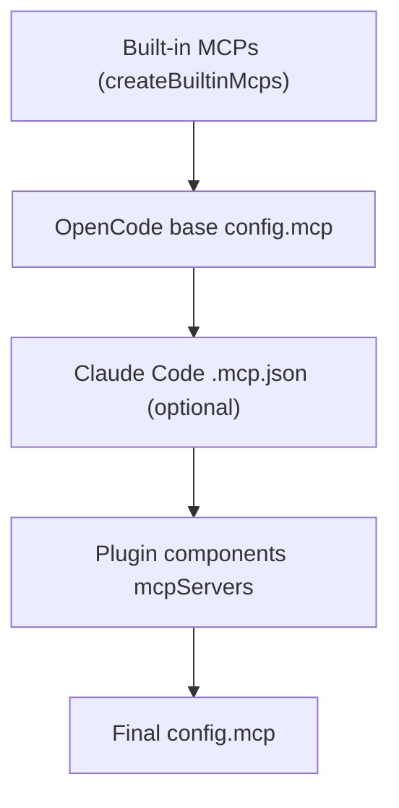

# Contract: MCPs

This document is a **normative contract** for MCP server configuration and resolution in this repo.

## Normative Language

The keywords **MUST**, **MUST NOT**, **SHOULD**, **SHOULD NOT**, and **MAY** are to be interpreted as described in RFC 2119.

## Scope

This document defines:

- The MCP server sources supported by the plugin.
- Merge/precedence rules and disable semantics.
- The built-in MCP server set shipped by this repo and its authentication requirements.

This document does **not** document the full MCP protocol or the runtime’s MCP implementation details.

## Source of Truth

- Built-in MCP definitions: `src/mcp/`
- Built-in MCP registry: `src/mcp/index.ts` (`createBuiltinMcps`)
- Claude Code `.mcp.json` loader: `src/features/claude-code-mcp-loader/`
- MCP merge wiring: `src/plugin-handlers/config-handler.ts`

## MCP Sources

The plugin can source MCP servers from three places:

1. **Built-in MCPs** (shipped by this repo): `src/mcp/`
2. **Claude Code MCP configs** (`.mcp.json`): loaded and transformed into OpenCode format
3. **Skill-embedded MCP configs**: declared by skills and managed via `skill_mcp`

## Built-in MCPs

### Names

The built-in MCP name enum (`McpNameSchema`) includes:

- `websearch`
- `context7`
- `grep_app`

See `src/mcp/types.ts`.

### Remote endpoints and authentication

Built-in MCPs are configured as remote MCP servers:

- `websearch`: remote Exa MCP endpoint; supports API key via `$EXA_API_KEY` header injection. See `src/mcp/websearch.ts`.
- `context7`: remote Context7 MCP endpoint; supports API key via `$CONTEXT7_API_KEY` Bearer token. See `src/mcp/context7.ts`.
- `grep_app`: remote grep.app MCP endpoint. See `src/mcp/grep-app.ts`.

Contract:

- If the relevant API key env var is missing, the MCP entry may still be present, but the remote server MAY reject requests at runtime.

## Claude Code `.mcp.json` (compat loader)

### Search paths and precedence

The loader scans the following paths (in order) and applies last-write-wins by server name:

1. User: `$CLAUDE_CONFIG_DIR/.mcp.json` (default `~/.claude/.mcp.json`)
2. Project: `./.mcp.json`
3. Local project: `./.claude/.mcp.json`

Later scopes override earlier scopes for the same server name. A later scope can also “remove” a server previously defined in an earlier scope by setting `disabled: true` for that name (within `.mcp.json` resolution only).

See `src/features/claude-code-mcp-loader/loader.ts`.

### Enable/disable toggle

The Claude Code MCP loader is enabled by default and can be disabled via:

- `claude_code: { mcp: false }` in `oh-my-opencode/*.json`

## Skill-embedded MCP servers

Skills can embed MCP configuration via:

- Built-in skill `mcpConfig` (TypeScript definition), or
- Filesystem skill frontmatter `mcp` (see `SkillMetadata` in `src/features/opencode-skill-loader/types.ts`)

These MCP servers are not merged into the global `config.mcp` table; they are managed at runtime via:

- Tool: `skill_mcp` (`src/tools/skill-mcp/`)

## Merge and Precedence (global MCP table)

The OpenCode `config.mcp` table is assembled in `src/plugin-handlers/config-handler.ts` as:

1. Built-in MCPs (filtered by `disabled_mcps`)
2. OpenCode base config `mcp` (if any)
3. Claude Code `.mcp.json` servers (if enabled)
4. Plugin-provided MCP servers (`pluginComponents.mcpServers`)

Later layers override earlier layers for the same server name.

## Disable Semantics

### `disabled_mcps`

- Configuration key: `disabled_mcps: string[]` (schema: `AnyMcpNameSchema`)
- Contract: `disabled_mcps` **MUST** disable only the plugin’s built-in MCP set produced by `createBuiltinMcps(...)`.

Important limitation:

- `disabled_mcps` does **not** filter MCP servers loaded from `.mcp.json` or plugin components. To disable those, use the relevant upstream configuration mechanism (e.g., `.mcp.json` with `disabled: true` for Claude Code servers).

## See Also

- Contract: skills and embedded MCP config: `docs/reference/skills.md`
- Journey: browser automation: `docs/journeys/browser-automation.md`
