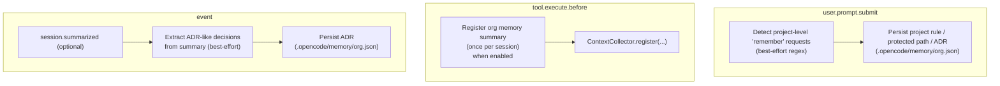

# Contract: Org Memory

This document is a **normative contract** for the org-memory subsystem in this repo.

## Normative Language

The keywords **MUST**, **MUST NOT**, **SHOULD**, **SHOULD NOT**, and **MAY** are to be interpreted as described in RFC 2119.

## Scope

This document defines:

- The configuration surface under `org_memory` and how it affects behavior.
- The lifecycle integration points (prompt/tool/session events) and their side effects.
- On-disk artifacts owned by org-memory.

This document does **not** define the full set of heuristic patterns org-memory uses to infer rules/decisions. Those are implementation details and may change.

## Source of Truth

- Schema: `src/config/schema.ts` (`OrgMemoryConfigSchema`)
- Wiring: `src/index.ts` (org-memory hook instantiation)
- Hook implementation: `src/features/org-memory/hook.ts`
- Storage: `src/features/org-memory/storage.ts`
- Types: `src/features/org-memory/types.ts`

## Artifacts & Storage

Org-memory owns a **project-scoped** storage file in the project root:

- `.opencode/memory/org.json`

Contract:

- If this file is missing, org-memory MUST behave as empty and MUST NOT crash.
- Failures to read/write MUST NOT crash the plugin; org-memory SHOULD degrade gracefully.

## Lifecycle and Wiring Contract

Org-memory is implemented as a hook and participates in these lifecycle events:

Injection contract:

- When `org_memory.enabled=true` and `org_memory.auto_inject=true`, org-memory SHOULD register a baseline context snippet once per session (via the context collector).

Capture contract:

- When `org_memory.enabled=true`, org-memory MAY capture:
  - project rules (from explicit "remember for project" style prompts),
  - protected paths (from "never modify ..." prompts),
  - architectural decisions (from "ADR:"/"decided:" style prompts and/or compaction summaries).

## Configuration Surface

### Enablement

- `org_memory.enabled`:
  - When `false`, org-memory MUST NOT inject context and MUST NOT persist new memory entries.

### Injection behavior

- `org_memory.auto_inject`:
  - When `false`, org-memory MUST NOT register injection context, but it MAY still persist memory (capture remains best-effort).

### Output shaping (limits)

The following limits apply to the **rendered summary** injected into context:

- `org_memory.max_conventions`
- `org_memory.max_decisions`
- `org_memory.max_patterns`
- `org_memory.max_terminology`
- `org_memory.max_custom_rules`

See the schema for supported fields and defaults.

## Known Limitations

- Capture is heuristic/regex-based and is best-effort.
- Org-memory does not currently provide a dedicated tool for managing entries; it is driven by lifecycle capture + file storage.

## Further Reading

- Journey: `docs/journeys/context-and-memory.md`
- Contract: `docs/reference/artifacts-and-paths.md`

