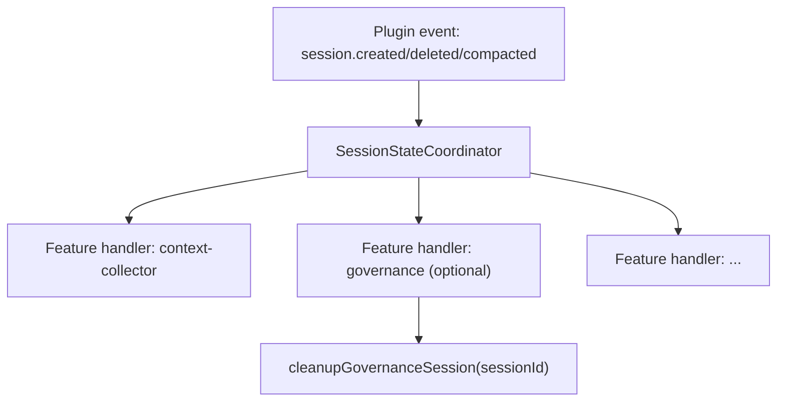

# Contract: Session Lifecycle

This document is a **normative contract** for session lifecycle handling in this repo.

## Normative Language

The keywords **MUST**, **MUST NOT**, **SHOULD**, **SHOULD NOT**, and **MAY** are to be interpreted as described in RFC 2119.

## Scope

This document defines:

- The single source of truth (SSOT) for session lifecycle state.
- How features integrate with session lifecycle events.
- The compatibility boundary for legacy Claude Code session state APIs.

This document does **not** define domain-specific state internals (governance internals, background task internals, work-state internals).

## Source of Truth

- Lifecycle types: `src/features/session-state-coordinator/types.ts`
- Lifecycle runtime: `src/features/session-state-coordinator/coordinator.ts`
- Compatibility wrappers: `src/features/claude-code-session-state/state.ts`
- Event ingress: `src/index.ts`

## Architecture

Session state is split into two layers:

1. **Session Lifecycle SSOT (centralized)**  
   `SessionStateCoordinator` owns identity and lifecycle facts: main/subagent classification, parent/root relation, agent binding, and lifecycle fan-out.

2. **Domain state (autonomous)**  
   Features such as Governance/Background/WorkState keep their own domain models and clean up by subscribing to lifecycle events from the coordinator.

## SessionLifecycleState Contract

`SessionLifecycleState` MUST include:

- `id: string`
- `type: "main" | "background" | "subagent"`
- `parentID?: string`
- `createdAt: number`
- `agent?: string`
- `isSubagent: boolean`
- `rootSessionID?: string`
- `deletedAt?: number`

Feature-contributed metadata MAY be merged into read views via `contributeMetadata`.

## Coordinator API Contract

The coordinator API includes:

- `setSessionAgent(sessionID, agent)` first-write semantics (set only when missing)
- `getSessionAgent(sessionID)`
- `markSubagentSession(sessionID, parentID?)`
- `unmarkSubagentSession(sessionID)`
- `isSubagentSession(sessionID)`
- `onSessionCreated/onSessionDeleted/onSessionCompacted`

Semantics:

- `markSubagentSession` MUST be idempotent.
- `unmarkSubagentSession` MUST be idempotent and safe for unknown sessions.
- `onSessionDeleted` MUST dispatch handlers before local cleanup and MUST tolerate handler failures (non-fatal logging).

## Event Flow Contract

`src/index.ts` MUST treat `SessionStateCoordinator` as the lifecycle ingress for session events.

## Compatibility Layer Contract

`src/features/claude-code-session-state/state.ts` is a compatibility shim:

- It MUST preserve existing function signatures:
  - `setMainSession/getMainSessionID/updateSessionAgent/getSessionAgent/clearSessionAgent`
- It MUST delegate to `SessionStateCoordinator`.
- It MUST NOT export mutable global collections (e.g., direct `Set` state).

## Migration Rules

- Callers MUST NOT mutate session markers directly (no raw `Set.add/delete/has` on exported globals).
- Callers SHOULD use:
  - `markSubagentSession/unmarkSubagentSession`
  - `isSubagentSession`
  - `getMainSessionID/getSessionAgent`
- Domain modules SHOULD register cleanup in coordinator handlers instead of duplicating manual cleanup branches.

## Verification Checklist

- `session.deleted` triggers feature cleanup through coordinator once per emitted event.
- Main/subagent classification is consistent across hooks.
- Compatibility wrappers and coordinator return consistent results.
- Governance disabled (`governance.enabled=false`) remains strict no-op for governance runtime behavior.

