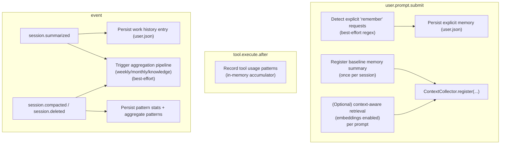

# Contract: User Memory

This document is a **normative contract** for the user-memory subsystem in this repo.

## Normative Language

The keywords **MUST**, **MUST NOT**, **SHOULD**, **SHOULD NOT**, and **MAY** are to be interpreted as described in RFC 2119.

## Scope

This document defines:

- The configuration surface under `user_memory` and how it affects behavior.
- The lifecycle integration points (prompt/tool/session events) and their side effects.
- On-disk artifacts owned by user-memory.

This document does **not** restate every internal algorithm (clustering, entity reconciliation, embedding math). Those are implementation details.

## Source of Truth

- Schema: `src/config/schema.ts` (`UserMemoryConfigSchema`)
- Wiring: `src/index.ts` (user-memory hook instantiation)
- Hook implementation: `src/features/user-memory/hook.ts`
- Storage: `src/features/user-memory/storage.ts`
- Embedding cache: `src/features/user-memory/embeddings/cache.ts`
- Operations log: `src/features/user-memory/operations-log.ts`

## Artifacts & Storage

User-memory owns a user-scoped storage directory:

- Base dir: `~/.opencode/memory/`

Files (current implementation):

- `user.json`: primary user-memory store (hierarchy + explicit memories + entity graph).
- `pattern-stats.json`: tool-usage pattern statistics.
- `embeddings.json`: embedding cache + BM25 index (when embeddings are enabled and cache is enabled).
- `operations.jsonl`: append-only JSONL log of user-memory operations (best-effort).

Contract:

- Writes to `user.json` MUST be crash-safe (atomic write semantics are used).
- Failure to read/write these files MUST NOT crash the plugin; user-memory SHOULD degrade gracefully.

## Lifecycle and Wiring Contract

User-memory is implemented as a hook and participates in these lifecycle events:

Injection contract:

- When `user_memory.enabled=true` and `user_memory.auto_inject=true`, user-memory SHOULD register a baseline context snippet once per session (via the context collector).
- If `user_memory.embeddings.enabled=true`, user-memory MAY register additional per-prompt “relevant memory” context (higher priority than baseline).

Capture contract:

- When `user_memory.persist_work_history=true`, user-memory SHOULD capture a brief work-history entry on `session.summarized` events when a summary is available.
- If entity memory is enabled, entity extraction MAY run as part of work-history capture and/or weekly aggregation.

## Configuration Surface

### Enablement

- `user_memory.enabled`:
  - When `false`, user-memory MUST NOT inject context and MUST NOT persist new memory entries.

### Persistence

- `user_memory.persist_preferences`:
  - Controls whether preference updates are persisted when they occur.
- `user_memory.persist_work_history`:
  - Controls whether work-history entries are persisted on `session.summarized`.
- `user_memory.max_history_entries`:
  - The persisted work-history list MUST be truncated to this maximum (newest-first).

### Injection behavior

- `user_memory.auto_inject`:
  - When `false`, user-memory MUST NOT register injection context, but it MAY still persist memory (depending on other flags).
- `user_memory.disclosure_level`:
  - Controls how much memory is rendered into injected context (the rendering policy is implementation-defined).

### Optional subsystems

The following sections exist to tune internal behavior (implementation-defined, but stable configuration surface):

- `user_memory.hierarchical_memory`
- `user_memory.temporal_validity`
- `user_memory.consolidation`
- `user_memory.semantic_clustering`
- `user_memory.entity_memory`
- `user_memory.embeddings`

See the schema for supported fields and defaults.

## Known Limitations

- Explicit memory capture uses heuristic regex patterns and is best-effort.
- Embedding-based retrieval is opt-in and depends on provider availability; failures SHOULD fall back to text-only behavior.

## Further Reading

- Journey: `docs/journeys/context-and-memory.md`
- Deep dive (non-normative): `docs/research/user-memory-deep-dive.md`
- Contract: `docs/reference/artifacts-and-paths.md`

