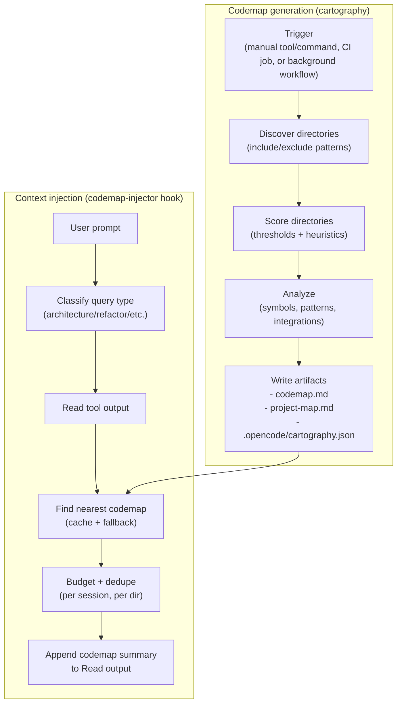

# Research: Cartography (Codemaps) and Codemap Injection

This document is **non-normative**. It describes the cartography and codemap injection modules, their artifacts, and current wiring status. If this conflicts with runtime behavior, the code is the source of truth.

## Status (Wiring)

As of this repo state:

- `src/features/cartography/` is exposed via runtime command/tool surfaces (`/cartography` command template + `cartography` tool).
- `src/hooks/codemap-injector/` is wired in `src/index.ts`, included in `HookNameSchema`, and can be controlled through `disabled_hooks`.
- Stable user-facing configuration keys exist in `src/config/schema.ts`: `cartography` and `codemap_injector`.
- `cartography` is part of the default built-in skills set.

Implication: end-users can invoke cartography deterministically. Codemap injection remains opt-in by config (`codemap_injector.enabled` defaults to `false`).

## Artifacts (Implemented)

Cartography generates and consumes the following artifacts:

- `codemap.md`: per-directory codemap file (`src/features/cartography/constants.ts` → `CODEMAP_FILE_NAME`).
- `project-map.md`: root project map index (`ROOT_ATLAS_FILE_NAME`).
- `.opencode/cartography.json`: project-local state for incremental updates (`STATE_FILE_NAME` under `PROJECT_STORAGE_DIR`).

The state file tracks content hashes and codemap metadata to support incremental rebuilds and staleness detection.

## Intended End-to-End Flow (When Wired)

This flow matches the intended layering in:

- Cartography: `src/features/cartography/`
- Injector: `src/hooks/codemap-injector/` + `src/features/codemap-injector/`

## Core Mechanics (Implemented)

### Directory discovery and filtering

- Defaults live in `src/features/cartography/types.ts` (`DEFAULT_CARTOGRAPHY_CONFIG`).
- Include patterns cover common languages (`ts/tsx/js/jsx/py/go/rs`).
- Excludes include build outputs, VCS dirs, and test directories.

### Complexity scoring and thresholds

Cartography uses a weighted scoring model to decide which directories merit a codemap:

- Weights and thresholds: `src/features/cartography/constants.ts` (`SCORING_WEIGHTS`, `SCORE_THRESHOLDS`).
- Decision thresholds: `SCORE_THRESHOLD_GENERATE` (generate) and `SCORE_THRESHOLD_CONDITIONAL` (conditional).
- Root directory is treated specially (root codemap is generated).

### Incremental update and staleness

- State is persisted under `.opencode/cartography.json`.
- Staleness threshold: `STALENESS_THRESHOLD` in `src/features/cartography/constants.ts`.
- Update mode computes a change report, then regenerates only impacted codemaps and updates the sisyphus.

### Codemap injection (hook implementation)

The injector hook (`src/hooks/codemap-injector/index.ts`) is designed to:

- Intercept `Read` tool output (`tool.execute.after`) and append a codemap summary for the directory.
- Optionally enqueue root project map injection based on prompt classification (`user.prompt.submit`).
- Enforce token budgets and per-session de-duplication.
- Suggest running cartography for frequently accessed directories without an exact codemap.

Note: root `project-map.md` injection is configurable (`codemap_injector.inject_root_project_map`) and defaults to `false` to avoid overlap with `repo-overview-injector`.

## Remaining Gaps

1. Explorer-based deep analysis in `analyzer.ts` is still a stub path (`Would spawn explorer` log + null return).
2. Runtime coverage for `codemap-injector` hook behavior should be expanded with dedicated hook tests.

## Where to Look in Code

- Cartography module: `src/features/cartography/`
- Injector hook: `src/hooks/codemap-injector/index.ts`
- Injector cache + triggers: `src/features/codemap-injector/`
- Artifact paths and constants: `src/features/cartography/constants.ts`
