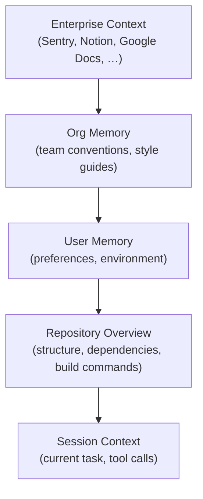
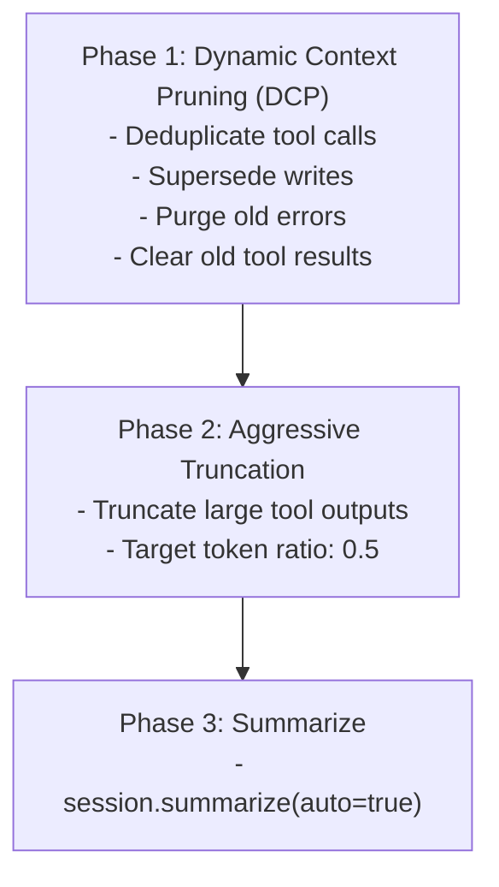

# Context Distillation Research: Factory.ai Droid CLI vs Oh-My-OpenCode

## Executive Summary

This document compares Factory.ai Droid CLI’s progressive context distillation strategy with Oh-My-OpenCode’s current context-management implementation, then proposes repo-aligned improvements.

Key observations:

- Oh-My-OpenCode already implements a three-phase token-limit recovery pipeline: **Dynamic Context Pruning (DCP) → aggressive truncation → session summarization**.
- Persistent memories exist (**User Memory** and **Org Memory**) and can inject context via the context collector.
- **Repository overview injection** and **runtime tracking** have schemas and code modules, but are **not currently wired** in `src/index.ts`.
- Compaction-time injection helpers exist (`compaction-context-injector`, Claude Code `PreCompact`) but are **not currently wired** due to missing/unstable OpenCode lifecycle surfaces in this plugin.

---

## 1. Droid CLI Context Strategy

### 1.1 Progressive Context Stack

Droid applies progressive distillation: it starts from broad enterprise knowledge and filters down to the minimal task-relevant context.



### 1.2 Core Capabilities

| Capability | Description |
|---|---|
| Repository Overview | Generates a per-repo structural summary (tree, packages, build commands, key files) |
| Lazy Loading | Fetches context only when needed and avoids repeated dumps |
| Runtime Tracking | Tracks tool runtimes and avoids repeating expensive operations |
| Hierarchical Memory | Persists user and org memory in separate layers |
| Plan-based Coherence | Uses a plan artifact to preserve task structure across long sessions |

### 1.3 Hierarchical Memory

User Memory:

- Development environment configuration (OS, containers, tooling)
- Work history / past decisions
- Personal style and workflow preferences

Org Memory:

- Team style guide and conventions
- Coding standards and patterns
- Architecture decisions

---

## 2. Oh-My-OpenCode: Current Implementation

### 2.1 Context-management components

| Component | Code | Role | Status |
|---|---|---|---|
| Context collector / injector | `src/features/context-injector/` | Central registry for injectable context | Wired |
| Preemptive compaction | `src/hooks/preemptive-compaction/` | Proactively triggers session summarize at a threshold | Wired |
| Token-limit recovery | `src/hooks/context-window-limit-recovery/` | Automatic recovery when a hard token limit is hit | Wired |
| Dynamic Context Pruning (DCP) | `src/hooks/context-window-limit-recovery/` | Low-risk pruning of redundant tool history | Wired (optional via `experimental.dynamic_context_pruning`) |
| Tool output shaping | `src/hooks/tool-output-truncator.ts`, `src/hooks/silent-tool-output/` | Reduce context bloat from tool output | Wired |
| Directory context injection | `src/hooks/directory-agents-injector/`, `src/hooks/directory-readme-injector/` | Inject AGENTS.md/README.md where relevant | Wired (AGENTS injector may auto-disable on new OpenCode versions) |
| Rules injection | `src/hooks/rules-injector/` + `src/features/conditional-rules/` | Inject path-sensitive rules into tools/delegation | Wired |
| User memory | `src/features/user-memory/` | Persistent user-layer memory with retrieval and injection | Wired |
| Org memory | `src/features/org-memory/` | Persistent org-layer memory with injection | Wired |
| Session handoff | `src/features/session-handoff/` | Cross-session summaries and references | Wired |
| Repo overview injector | `src/hooks/repo-overview-injector/` | Generate and inject a per-repo overview | Present, not wired in `src/index.ts` |
| Runtime tracker | `src/hooks/runtime-tracker/` | Track tool runtimes and inject hints | Present, not wired in `src/index.ts` |
| Compaction-time injection helper | `src/hooks/compaction-context-injector/` | Add structured context at compaction time | Present, not wired in `src/index.ts` |
| Claude Code `PreCompact` | `src/hooks/claude-code-hooks/pre-compact.ts` | Compatibility layer for compaction injection | Implemented, not wired (no `experimental.session.compacting` handler) |

### 2.2 Token-limit recovery pipeline

Oh-My-OpenCode’s hard-limit recovery follows a three-phase escalation:



Notes:

- Phase 1 is gated by `experimental.dynamic_context_pruning.enabled=true`.
- Phase 2 and 3 run only when the session is over the provider token limit.

### 2.3 Strengths

1. **Three-phase recovery**: progressively escalates from reversible pruning to lossy summarization.
2. **Configurable DCP strategies**: fine-grained pruning controls with safety defaults.
3. **Hierarchical file injection** (AGENTS/README): retrieves project constraints without manual prompting.
4. **Multiple memory layers**: user/org memory and session handoff are separate mechanisms.

### 2.4 Gaps and limitations (as of current wiring)

1. **Repo overview**: the schema and hook exist, but the injector is not wired, so onboarding still relies on ad-hoc exploration.
2. **Runtime tracking**: the schema and hook exist, but the tracker is not wired, so there is no systematic “avoid repeating expensive tools” feedback.
3. **Compaction-time injection**: utilities exist but are not wired because OpenCode does not currently expose a stable compaction lifecycle surface in this plugin.
4. **Observation masking**: not implemented (tool outputs are truncated/pruned, not masked with reversible handles).

---

## 3. Industry Best Practices (Context Engineering)

### 3.1 Raw vs compaction vs summarization

| Method | Property | Priority |
|---|---|---|
| Raw | Original, fully detailed data | Highest |
| Compaction (reversible) | Remove redundant environment observations that can be re-derived | Medium |
| Summarization (lossy) | LLM compresses history into a summary | Lowest |

Guideline: prefer `Raw > Compaction > Summarization`.

### 3.2 Threshold management

- Do not wait for provider errors; trigger preemptive actions earlier.
- For large context models, trigger before “context rot” (quality degradation) becomes visible.

### 3.3 Preserving momentum

Keep the most recent 3–5 turns uncompressed to preserve “rhythm” and formatting.

### 3.4 Structured summaries

Use a stable, parseable summary skeleton, for example:

```markdown
## Files Modified
- path/to/file.ts: Added function X

## Decisions Made
- Chose approach A over B because ...

## Current State
- Working on feature Y
- Blocked by issue Z

## Next Steps
1. Complete task A
2. Test feature B
```

### 3.5 Clearing old tool results

Old tool outputs deep in history can often be removed safely; the agent generally needs:

- The tool name
- The high-level outcome
- A minimal pointer for re-running if needed

---

## 4. Repo-aligned recommendations

### 4.1 Quick wins (wiring and defaults)

1. Wire `repo-overview-injector` into `src/index.ts` (respect `repo_overview` config).
2. Wire `runtime-tracker` into `src/index.ts` (respect `runtime_tracker` config).
3. Validate `experimental.dynamic_context_pruning` defaults and document safe tuning for `strategies.clear_tool_results.keep_recent_turns`.

### 4.2 Medium-term improvements

1. Improve session summarization templates to preserve:
   - active TODOs / next steps
   - “do not do” constraints
   - critical environment state and tool prerequisites
2. Add “preserve recent turns” behavior as an explicit knob to reduce momentum loss.

### 4.3 Future enhancements

1. Observation masking: replace large tool outputs with stable handles while retaining the ability to re-fetch.
2. Multi-agent context isolation: enforce that subagents return condensed results and do not leak full transcripts upstream.

---

## 5. Suggested roadmap (implementation order)

Phase 1 (1–2 weeks):

- Wire repo overview
- Wire runtime tracker
- Harden and document DCP tuning

Phase 2 (2–4 weeks):

- Improve summarization templates + preserve-recent-turns
- Add compaction-time injection when OpenCode exposes a stable lifecycle surface

Phase 3 (4–8 weeks):

- Observation masking
- Isolation improvements

---

## 6. Configuration sketch (current schema)

The following example uses the current `OhMyOpenCodeConfigSchema` keys.
Note: features that are “present but not wired” will not take effect until integrated in `src/index.ts`.

```jsonc
{
  "experimental": {
    "preemptive_compaction": true,
    "preemptive_compaction_threshold": 0.85,
    "dynamic_context_pruning": {
      "enabled": true,
      "strategies": {
        "deduplication": { "enabled": true },
        "supersede_writes": { "enabled": true, "aggressive": false },
        "purge_errors": { "enabled": true, "turns": 5 },
        "clear_tool_results": { "enabled": true, "keep_recent_turns": 5 }
      }
    }
  },
  "repo_overview": {
    "enabled": true,
    "auto_generate": true,
    "max_tree_depth": 50,
    "cache_duration_ms": 3600000
  },
  "runtime_tracker": {
    "enabled": true,
    "threshold_ms": 3000,
    "max_recent": 10,
    "inject_hints": true,
    "hint_cooldown_ms": 60000
  }
}
```

---

## 7. References

- [Factory.ai - The Context Window Problem](https://factory.ai/news/context-window-problem)
- [Factory.ai - Memory and Context Management](https://docs.factory.ai/guides/power-user/memory-management)
- [Factory.ai - Evaluating Compression](https://factory.ai/news/evaluating-compression)
- [Two Experiments on Context Compaction - Jason Liu](https://jxnl.co/writing/2025/08/30/context-engineering-compaction/)
- [JetBrains Research - Efficient Context Management](https://blog.jetbrains.com/research/2025/12/efficient-context-management/)
- [Google ADK - Context Compaction](https://google.github.io/adk-docs/context/compaction/)
- [Anthropic - Effective Context Engineering](https://www.anthropic.com/engineering/effective-context-engineering-for-ai-agents)

---

## 8. Conclusion

Oh-My-OpenCode already has a robust recovery pipeline and memory primitives.
The highest-leverage improvements are wiring repo overview and runtime tracking, and enabling compaction-time injection once the runtime surface is available.
