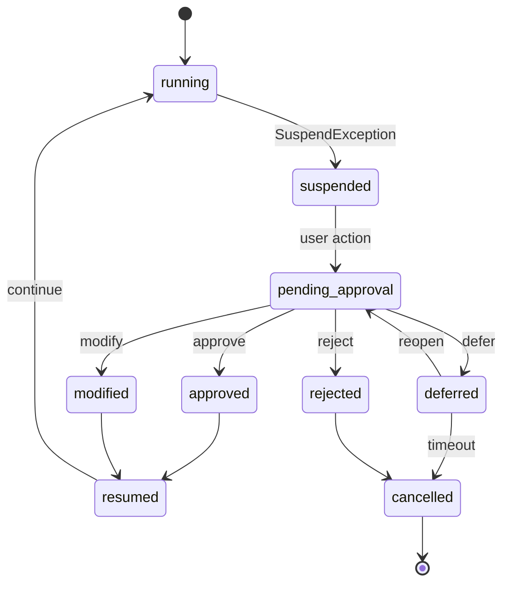
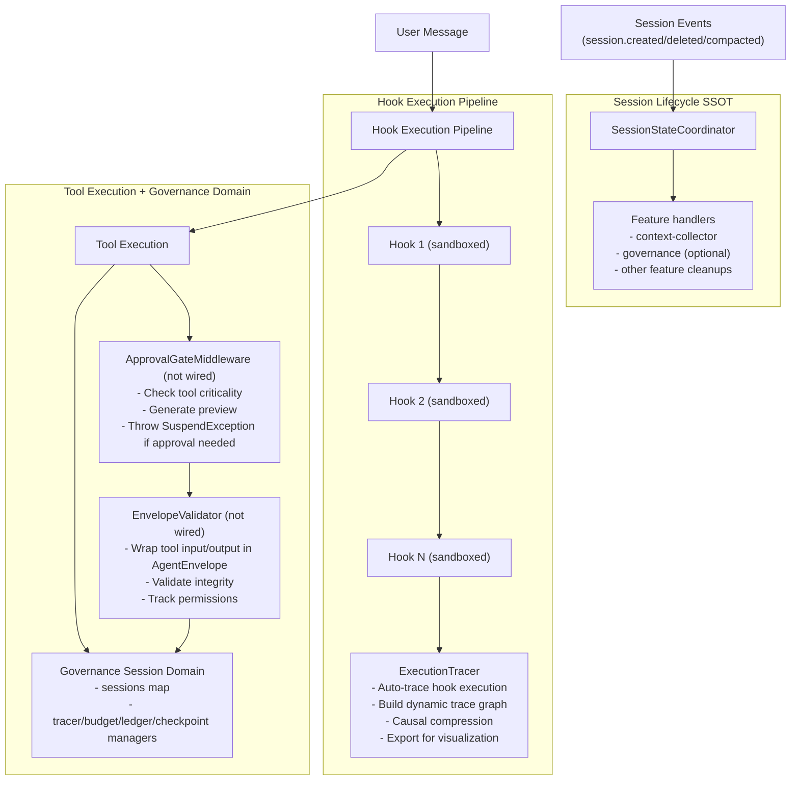

# Research: Governance Orchestration Design

This document is **non-normative**. It records design rationale and implementation ideas for governance-oriented orchestration.
For the runtime contract and user-facing workflow, prefer:

- Journey: `docs/journeys/governance.md`
- Contract: `docs/reference/governance.md`

> Architecture design document for governance-oriented orchestration

## 1. Design Philosophy

### 1.1 Core Principle: Governance over Definition

The core value of oh-my-opencode lies not in "defining workflows" but in "establishing guardrails for LLM behavior."

| Dimension | Definition-Oriented (Lobster) | Governance-Oriented (oh-my-opencode) |
|-----------|-------------------------------|--------------------------------------|
| Workflow Definition | Explicit DSL (YAML/Pipeline) | Implicit Hook Chain |
| Execution Path | Predefined, Deterministic | LLM Dynamic Decision |
| Core Value | Predictable, Replayable | Observable, Intervenable |
| Target Scenario | Data Processing Tasks | Development Tasks |

**Key Insight**: Development task paths are dynamically decided by LLMs. Forcing predefined workflows limits agent autonomy. What we need is **observability**, not **definability**.

### 1.2 Environment Philosophy: Reconciliation over Snapshot

**Lobster's Snapshot Logic**: Resume Tokens assume immutability—each step's output is treated as a constant, and resuming execution is like restarting from a snapshot.

**oh-my-opencode's Reconciliation Logic**: Similar to Kubernetes' Reconciliation Loop, we don't trust "snapshots"—we only trust "the currently observed system state."

**Design Choice**: In development scenarios, external codebases change constantly, and Token-captured context may become stale. Therefore:
- No **snapshot-style Resume Tokens** (tokens that assume immutable state)
- Allow **checkpoint-refs** (references to semantic checkpoints for recovery)
- Allow **approval-tokens** (short-lived tokens for suspend/resume flow)
- Introduce **Semantic State Checkpoints** with environment awareness
- Environment hash changes trigger "partial re-perception" rather than full reruns

> **Terminology Clarification**: When we say "no Resume Tokens," we specifically mean snapshot-style tokens that treat past state as immutable truth. We DO use:
> - `resumeToken` in `SuspendInfo` - a short-lived approval flow token (default TTL: 30 minutes; configurable via `governance.approval_gate.token_expiry_minutes` once approval gating is integrated)
> - `checkpointId` - a reference to a semantic checkpoint that can be re-validated

---

## 2. Component Design Rationale

This section documents the design decisions for each governance component. For implementation details and TypeScript interfaces, see `src/features/governance/`.

### 2.1 Semantic Checkpoint

**Problem Statement**: Resume Tokens work for data processing scenarios but have fundamental issues in development contexts:
- Codebases can change at any time (other commits, manual edits)
- Environment dependencies may change (package.json, lock files)
- LLM context assumptions may become invalid

Simple "rerun if environment hash changed" is also imprecise, causing unnecessary repeated work.

**Design Decision: Layered State Model**

The environment is not a single entity but multi-layered:

```
Layer 0: Task Intent      - The task definition itself (plan.md intent)
Layer 1: Affected Files   - Code files involved in the task
Layer 2: Dependencies     - Environment dependencies (package.json, lock files)
Layer 3: System State     - Git status, branch information
```

**Recovery Logic**:

| Change Layer | Change Type | Recovery Strategy |
|--------------|-------------|-------------------|
| Layer 0 | Task intent changed | Full rerun |
| Layer 1 | "write" file externally modified | Rerun from affected phase |
| Layer 1 | "read" file changed | Partial re-perception |
| Layer 2 | Dependency version changed | Warning + user decision |
| Layer 3 | Branch switched | Full rerun |
| Layer 3 | New commits on base | Warning + user decision |

Implementation: `src/features/governance/checkpoint.ts`

---

### 2.2 Hook Isolation (Logical Sandbox)

**Problem Statement**: The current Hook chain operates in "trust mode":
- Hooks run in the same process space
- A badly written Hook can crash the entire coordinator
- Erroneous state modifications can cause cascading failures

Subprocess isolation is too heavy for Claude Code plugin scenarios (high Hook call frequency, unacceptable startup overhead).

**Design Decision: StateProposal Pattern**

Plugin-level hooks cannot directly modify state. Instead, they propose changes through a proposal queue, which the core governance layer reviews and applies. This adds latency but provides full auditability.

**Caveat**: Proxy isolation at the JS layer is a "soft constraint." Hooks can bypass it via `require('fs')`, `process.env`, or global pollution. Mitigation strategies include runtime permissions (Node 20+) or context injection patterns.

Implementation: `src/features/governance/isolation.ts` (implemented but not currently wired)

---

### 2.3 Execution Trace (Shadow Execution)

**Problem Statement**: Explicit DSL (YAML) has pitfalls:
- When you start writing `condition: $approve.approved`, you're reinventing a poor programming language
- Developers don't need to hardcode paths in YAML, but they need to see paths clearly in a Dashboard

**Design Decision: Dynamic Trace Graph**

While implicit Hooks run, automatically generate an observable dynamic trace graph. Traces are built at runtime, not defined statically.

**Causal Compression**: In long sessions, Hooks fire hundreds of times. Full recording leads to visualization chaos. Solution: merge consecutive low-impact nodes into "GovernanceBlocks" and extract only critical decision points for the simplified view.

| Mode | Description | Use Case |
|------|-------------|----------|
| Full | All nodes, no compression | Debugging specific issues |
| Compressed | Causal merge applied | Normal review |
| Critical Path | Only decision points | Quick overview |

Implementation: `src/features/governance/tracer.ts`

---

### 2.4 Agent Envelope (State Contract)

**Problem Statement**: Tools and Agents passing raw strings lack structural guarantees:
- Cannot track resource consumption
- Cannot verify input/output integrity
- Cannot dynamically adjust permissions

**Design Decision**: Wrap all agent/tool communication in structured envelopes containing metadata (gas/tokens, integrity hash, timestamp, source) and permission guidance (suggested actions, escalation requirements, forbidden actions).

Implementation: `src/features/governance/envelope.ts`

---

### 2.5 Approval Gate Middleware

**Problem Statement**: The current system relies on Claude Code's built-in permission system, lacking:
- Standardized approval workflows
- Configurable approval policies
- Integration with Checkpoints

**Design Decision: SuspendException-based Approval**

Critical tool invocations throw a `SuspendException` containing a checkpoint and resume token. The user reviews a preview and responds (approve/reject/modify/defer). On approval, execution resumes from the checkpoint.

**State Machine** (not yet integrated with UI):



**Key Behaviors:**

1. **Idempotent Approval Keys**: Each approval is keyed by `hash(toolName + canonicalArgs)`. Repeat approvals for the same key within a session do not re-prompt.

2. **Token Expiry**: Resume tokens expire after `governance.approval_gate.token_expiry_minutes` (default: 30 minutes) once approval gating is integrated.

3. **Checkpoint Re-validation (design)**: On resume, if the checkpoint's environment fingerprint has drifted significantly, return to user with error (requires wiring approval gate ↔ checkpoint validation).

Implementation: `src/features/governance/approval-gate.ts` (implemented but not integrated with UI)

---

### 2.6 Circuit Breaker (Budget Monitor)

**Problem Statement**: The current truncator's problem is **passive truncation**:
- Loses context coherence
- Agent may become disoriented after truncation
- Cannot recover gracefully

#### 2.6.1 The "Terminal Hallucination" Problem

**Critical Issue**: When the model receives a 70% budget warning, it may trigger "terminal hallucination":
- To forcibly "converge," it skips necessary validation steps
- Produces simplified incorrect solutions
- Makes false "task complete" claims

**Root Cause**: Directly telling the model Token counts triggers anxiety behavior.

**Solution: Hidden Budget Strategy**

Never expose raw token counts to the LLM. Instead, present budget as:
- **Estimated steps** (more intuitive than tokens)
- **Qualitative phases**: healthy → midpoint → wrapUp → critical

Phase descriptions guide behavior without inducing anxiety:

| Phase | Message |
|-------|---------|
| healthy | "You have plenty of capacity to navigator thoroughly." |
| midpoint | "Good progress. Continue with your current approach." |
| wrapUp | "Begin consolidating your work toward deliverables." |
| critical | "Focus only on essential remaining tasks." |

**Design Decision: Two-Phase Refactor (threshold-driven)**

- **Phase 1 (`warn_threshold`, default: 0.7)**: Garbage Collection - Delete stale tool outputs, compress verbose results, keep essential history
- **Phase 2 (`refactor_threshold`, default: 0.85)**: Session Fork (design) - Generate TransferManifest, create new session with compressed context, inject handoff prompt

**Wiring note**: current integration emits budget warnings and `<budget-exhausted>` markers, but does **not** auto-fork sessions. Auto-fork requires a refactor strategy and is disabled by default.

Implementation: `src/features/governance/budget-monitor.ts`

---

### 2.7 Governance Ledger (Audit Log)

**Problem Statement**: Trace as a visualization tool has value, but lacks audit capability:
- Cannot trace back to root cause of abnormal behavior
- Permission escalations and violation warnings are scattered
- Hard to distinguish "environment drift causing misjudgment" from "90% forced refactor causing context loss"

**Design Decision: Immutable Audit Ledger**

Upgrade Trace to an immutable audit ledger where all governance events are recorded. Event categories:

| Category | Events |
|----------|--------|
| Permissions | Escalation requests, violations, grants |
| Budget | Warnings, GC triggered, fork triggered, exhausted |
| Checkpoints | Created, restored, invalidated |
| Recovery | Decisions (continue/partial-rerun/full-rerun) |
| Approvals | User decisions with timing |
| State Proposals | Submitted, applied, rejected |
| Environment Drift | File changes, dependency changes, branch switches |

Each entry includes a hash of the previous entry for integrity verification.

Storage: `~/.orchestrator/ledger/{sessionId}.jsonl` (append-only JSONL, one entry per line)

Implementation: `src/features/governance/ledger.ts`

---

### 2.8 Trace Persistence

**Problem Statement**: Traces and ledgers are primarily in-memory. Post-session debugging requires persistence.

**Design Decision**: Automatically persist compressed traces on session end.

- Storage: `~/.orchestrator/traces/{sessionId}.json`
- Compression: Keep only critical node types, failed nodes, nodes with significant duration
- Retention: Last 50 traces
- Correlation: Ledger entries include `traceNodeId` for cross-reference

Implementation: `src/features/governance/trace-persistence.ts`

---

## 3. Integration Architecture

### 3.1 Component Interaction Diagram



**Current implementation boundary**: `SessionStateCoordinator` centralizes lifecycle dispatch and cleanup fan-out. Governance keeps independent domain state and subscribes to lifecycle events; it is not stored inside coordinator state.

### 3.2 Event Flow

```
1. User Message Received
   │
   ├─► BudgetMonitor.recordConsumption()
   │   └─► If warning threshold: triggerGarbageCollection() (once) + injectConvergenceHint()
   │   └─► If refactor threshold: triggerRefactor() (fork)
   │
   ├─► For each Hook:
   │   ├─► ExecutionTracer.traceHook() starts
   │   ├─► createSandboxedContext()
   │   ├─► Hook.execute(sandboxedCtx)
   │   └─► ExecutionTracer.traceHook() ends
   │
   ├─► Tool Execution Request
   │   ├─► (Planned) ApprovalGateMiddleware.execute()
   │   │   └─► If critical: suspend and return approval request (resumeToken)
   │   │        └─► User responds via UI (integration TBD)
   │   │            └─► ResumeHandler.processResume()
   │   │                 └─► If approved/modified: re-invoke tool with resolved args
   │   ├─► (Planned) EnvelopeValidator.wrap(input)
   │   ├─► Tool.execute()
   │   ├─► (Planned) EnvelopeValidator.wrap(output)
   │   └─► SemanticCheckpointManager.maybeCheckpoint()
   │
   └─► Response to User
       └─► ExecutionTracer.exportForVisualization()
```

---

## 4. Historical Notes

### 4.1 Resolved Design Questions

| Question | Decision | Rationale |
|----------|----------|-----------|
| Checkpoint storage | Filesystem (`.opencode/checkpoints/`) | Project-local, debuggable, no external dependencies |
| Trace visualization | JSON export + Mermaid | External tools (Mermaid Live Editor) preferred over built-in UI |
| Budget communication | Hidden phases, not raw tokens | Prevents terminal hallucination behavior |
| Approval UX | Defer to Claude Code integration | Don't reinvent existing permission mechanisms |
| Hook isolation granularity | Per-namespace | Reduces configuration complexity |

### 4.2 Implementation Status

Components implemented in `src/features/governance/`:

| Component | Files | Status |
|-----------|-------|--------|
| Session lifecycle integration | `src/index.ts`, `src/features/session-state-coordinator/*` | Active (governance cleanup wired via coordinator `onSessionDeleted`) |
| Checkpoint | `checkpoint.ts`, `checkpoint-types.ts` | Active |
| Tracer | `tracer.ts`, `tracer-types.ts` | Active |
| Budget Monitor | `budget-monitor.ts`, `budget-types.ts` | Active |
| Ledger | `ledger.ts` | Active |
| Approval Gate | `approval-gate.ts`, `tool-criticality.ts` | Implemented, not wired (no tool blocking) |
| Hook Isolation | `isolation.ts`, `isolation-types.ts` | Implemented, not wired |
| Trace Persistence | `trace-persistence.ts`, `visualization.ts` | Active |
| Envelope | `envelope.ts` | Implemented, not wired |
| Suspend/Resume | `suspend-exception.ts` | Implemented, not wired (used by approval gate) |
| Integration | `integration.ts`, `index.ts` | Active |

### 4.3 Open Questions (Remaining)

1. **Approval UX Integration**: How to surface suspend/resume flow in Claude Code UI? Currently implemented but needs integration work.

2. **Hook Isolation Rollout**: When to enable isolation by default? Needs more testing to ensure stability.

---

## Related Documents

- Journey: [Governance](../journeys/governance.md)
- Reference: [Governance](../reference/governance.md)
- Glossary: [Governance terms](../reference/glossary.md#governance)
- Context Management: [Context Window Management](../journeys/context-window-management.md)
