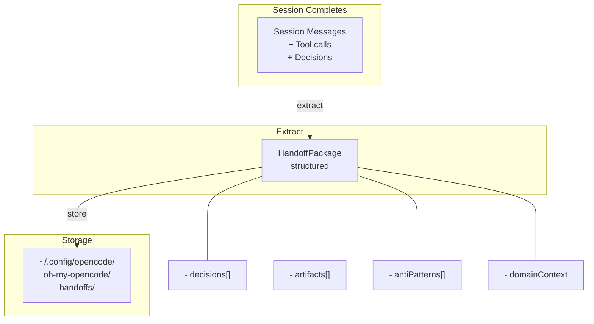
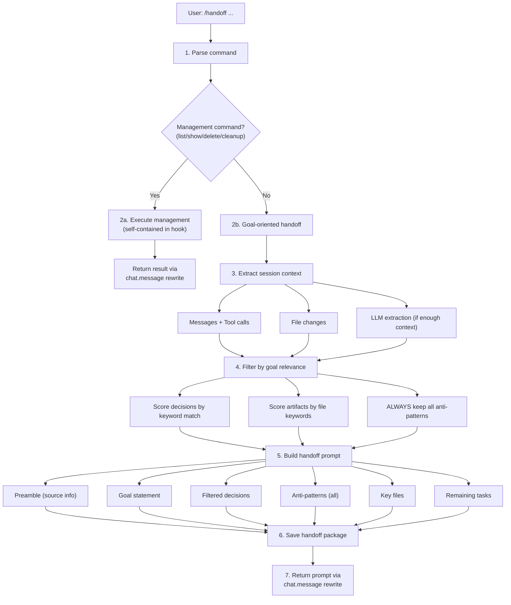
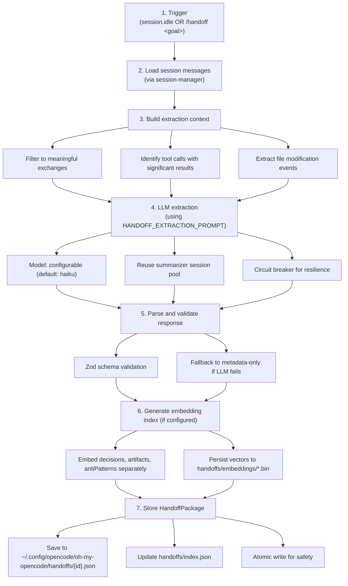
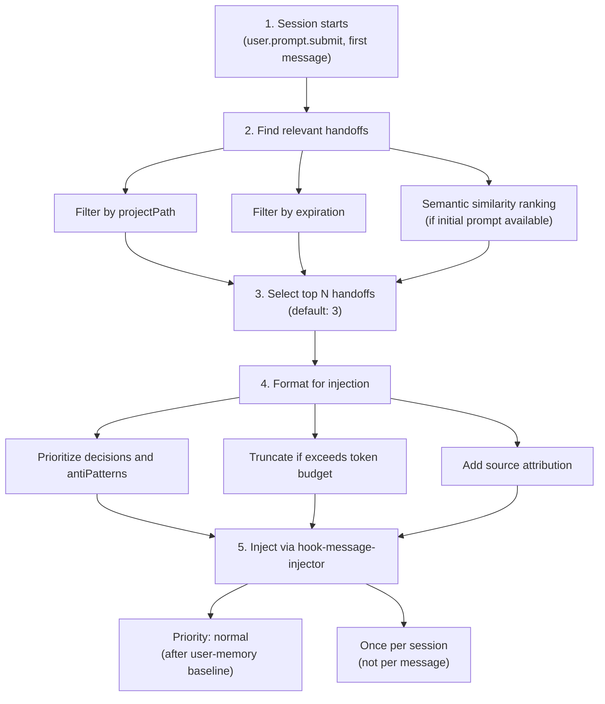

# Session Handoff Design

Session Handoff provides structured knowledge extraction and transfer between sessions, enabling continuous learning across coding sessions.

## Overview

A **Handoff Package** is a structured "graduation certificate" for a completed session, containing transferable knowledge for future sessions working on related tasks.



### Motivation

**Problem**: Each new session starts with zero context about previous work. This leads to:

- Re-explaining architecture decisions already made
- Re-discovering failed approaches
- Inconsistent coding patterns across sessions
- Manual context rebuilding via copy-paste

**Solution**: Structured knowledge transfer that preserves:

- **Decisions** - What was chosen and why
- **Artifacts** - What was created or modified
- **Anti-patterns** - What failed and should be avoided
- **Domain knowledge** - Insights about the codebase

### Design Philosophy

| Principle | Implementation |
|-----------|----------------|
| **Structured over free-form** | Handoff packages have defined schemas, not prose dumps |
| **Compaction-aligned** | Handoff extraction mirrors `compaction-context-injector` structure |
| **Embedding-ready** | All content indexable for semantic retrieval |
| **Lazy extraction** | Handoffs created on-demand or at session idle, not continuously |
| **Declarative reference** | `@session:id` syntax is explicit and parseable |
| **Goal-oriented transfer** | Active handoffs filter context by goal relevance |

---

## Active Handoff (Goal-Oriented)

Active Handoff transforms the handoff mechanism from "passive archive" to "active task launcher". Instead of waiting for session end, users can proactively transfer context with a specific goal.

### Usage

```
/handoff <goal>
```

**Examples:**
- `/handoff execute phase one of the plan`
- `/handoff check if this bug exists elsewhere`
- `/handoff build admin panel for this feature`
- `/handoff complete the authentication tests`

### When to Use

| Situation | Recommended Action |
|-----------|-------------------|
| Context limit reached, work ongoing | `/handoff <next-goal>` |
| Compact failed multiple times | `/handoff <continue-goal>` |
| Starting focused work on specific aspect | `/handoff <specific-task>` |
| Session naturally ending | Automatic extraction on idle |
| Minor token reduction needed | Let compact run |

### Active Handoff Flow



> **Note**: All `/handoff` commands are self-contained within the session-handoff hook. Management commands (list/show/delete/cleanup) execute directly and return results. Goal-oriented handoffs extract context and generate prompts. Both paths use `chat.message` hook to rewrite the user message, ensuring results are displayed to the user.

### Goal Filtering

The goal extractor filters payload items by relevance to the specified goal:

**Scoring Logic:**
1. Extract keywords from goal text (excluding common stop words)
2. Extract file-related keywords (extensions, directories)
3. Score each item:
   - Decisions: keyword overlap in what/chosen/why + related files
   - Artifacts: file path + summary keyword matches
   - Domain context: keyword overlap
4. Normalize scores and filter by threshold

**Important:** Anti-patterns are **ALWAYS** preserved in full. Failed approaches are universally valuable regardless of the current goal.

### Active Handoff Types

```typescript
interface ActiveHandoffRequest {
  /** The goal/task for the new session */
  goal: string

  /** Source session ID */
  sourceSessionId: string

  /** Project path */
  projectPath: string

  /** Launch mode: auto creates new session, preview returns prompt only */
  launchMode: "auto" | "preview"
}

interface ActiveHandoffResult {
  /** The created handoff package */
  handoffPackage: HandoffPackage

  /** The generated prompt for the new session */
  prompt: string

  /** New session ID (if launchMode was "auto") */
  newSessionId?: string

  /** User-facing message describing what happened */
  message: string

  /** Count of decisions transferred */
  decisionsTransferred: number

  /** Count of anti-patterns transferred */
  antiPatternsTransferred: number

  /** Key files included */
  keyFiles: string[]
}
```

### Handoff Prompt Structure

When `/handoff <goal>` is executed, the generated prompt follows this structure:

```markdown
## Session Handoff

This session continues from a previous session (ho_xxx).
The following context has been transferred to help you accomplish the goal.

---

## Goal

<user's goal text>

## Key Decisions

These decisions were made in the previous session and should guide your approach:

1. **Decision topic**
   - Chose: chosen approach
   - Reason: rationale
   - Rejected: alternatives
   - Files: related files

## Domain Knowledge

Important insights about this codebase:

- insight 1
- insight 2

## Approaches to AVOID

These approaches were tried and FAILED. Do NOT repeat them:

1. **Failed approach**: reason for failure
   - Error: error signature
   - Context: where it failed

## Relevant Files

Files from the previous session:

- [+] `path/to/new.ts`: summary
- [~] `path/to/modified.ts`: summary

## Remaining Tasks

Tasks carried over from the previous session:

- [ ] task 1
- [ ] task 2

---

**Instructions**: Use the context above to accomplish the stated goal.
If any previous decision conflicts with the goal, prioritize the goal.
Avoid the documented anti-patterns unless you have a specific reason to revisit them.
```

### Integration with Compact Recovery

When all compact recovery phases fail, the system suggests using handoff:

```
Toast: "Recovery Exhausted - Consider /handoff <goal> for a fresh session with context."
```

This guides users to use handoff as an alternative to lossy summarization when context limits are reached.

---

## HandoffPackage Schema

```typescript
interface HandoffPackage {
  /** Unique identifier (format: "ho_{timestamp}_{hash}") */
  id: string

  /** Source session ID */
  sourceSessionId: string

  /** Creation timestamp */
  createdAt: number

  /** Expiration timestamp (default: 7 days) */
  expiresAt: number

  /** Package metadata */
  metadata: HandoffMetadata

  /** Knowledge payload */
  payload: HandoffPayload

  /**
   * Embedding index metadata for semantic search (lazy-computed).
   * Vectors are stored separately in `handoffs/embeddings/{id}.bin`.
   */
  embeddingIndex?: EmbeddingIndexEntry[]
}

interface EmbeddingIndexEntry {
  /** Stable identifier for this entry */
  id: string

  /** The embedded content */
  content: string

  /** Category: decision, artifact, antiPattern, domainContext */
  category: "decision" | "artifact" | "antiPattern" | "domainContext"

  /** Index within category */
  index: number

  /** Index into `handoffs/embeddings/{handoffId}.bin` */
  vectorIndex: number
}

interface HandoffMetadata {
  /** Original goal/request from the session */
  originalGoal: string

  /** Session duration in milliseconds */
  durationMs: number

  /** Project path where work occurred */
  projectPath: string

  /** Target intent description (optional, for guided handoffs) */
  targetIntent?: string

  /** Key files involved */
  keyFiles: string[]

  /** Session outcome */
  outcome: "completed" | "partial" | "blocked"
}

interface HandoffPayload {
  /** Key decisions made during the session */
  decisions: Decision[]

  /** Files created or modified */
  artifacts: Artifact[]

  /** Approaches that failed (to prevent re-exploration) */
  antiPatterns: AntiPattern[]

  /** Domain knowledge discovered */
  domainContext: string[]

  /** Remaining tasks (optional, for continuation) */
  remainingTasks?: string[]
}
```

## Decision Schema

Decisions are the most valuable part of a handoff - they capture **why** choices were made.

```typescript
interface Decision {
  /** What decision was made */
  what: string

  /** The chosen approach */
  chosen: string

  /** Rationale for the choice */
  why: string

  /** Alternatives that were considered and rejected */
  rejected?: RejectedAlternative[]

  /** Files affected by this decision */
  relatedFiles?: string[]

  /** Decision category for filtering */
  category?: "architecture" | "implementation" | "tooling" | "convention"
}

interface RejectedAlternative {
  approach: string
  reason: string
}
```

**Example Decision:**

```json
{
  "what": "State management approach for user preferences",
  "chosen": "Zustand with persist middleware",
  "why": "Simpler API than Redux, built-in persistence, good TypeScript support",
  "rejected": [
    { "approach": "Redux Toolkit", "reason": "Overkill for this use case, more boilerplate" },
    { "approach": "React Context", "reason": "No built-in persistence, prop drilling issues" }
  ],
  "relatedFiles": ["src/stores/preferences.ts", "src/hooks/usePreferences.ts"],
  "category": "architecture"
}
```

## Artifact Schema

Artifacts track what files were created or modified, providing a map of changes.

```typescript
interface Artifact {
  /** File path (relative to project root) */
  path: string

  /** Change type */
  changeType: "created" | "modified" | "deleted"

  /** Brief summary of what changed */
  summary: string

  /** Key line ranges with descriptions (optional) */
  lineRanges?: LineRange[]

  /** Dependencies this file introduced or modified */
  dependencies?: string[]
}

interface LineRange {
  start: number
  end: number
  description: string
}
```

## AntiPattern Schema

Anti-patterns prevent future sessions from repeating failed experiments.

```typescript
interface AntiPattern {
  /** The approach that was tried */
  approach: string

  /** Why it failed */
  reason: string

  /** Error signature for matching (optional) */
  errorSignature?: string

  /** Context in which this failed */
  context?: string
}
```

**Example AntiPattern:**

```json
{
  "approach": "Using native fetch for file uploads",
  "reason": "No built-in progress tracking, had to switch to axios",
  "errorSignature": "Cannot read property 'onUploadProgress' of undefined",
  "context": "Large file upload feature in src/components/FileUploader.tsx"
}
```

---

## Passive Extraction Flow

This flow runs automatically on session idle to archive session knowledge.



## Extraction Prompt

The extraction prompt aligns with `compaction-context-injector` structure but focuses on **cross-session value**:

```typescript
const HANDOFF_EXTRACTION_PROMPT = `
You are extracting transferable knowledge from a completed coding session.

Focus ONLY on information valuable to FUTURE sessions working on RELATED tasks.

## Extraction Guidelines

### Decisions (max 10)
Extract technical decisions with clear rationale.
- Focus on "why" over "what" - code can be re-read, reasoning cannot
- Include rejected alternatives to prevent re-exploration
- Tag with category: architecture | implementation | tooling | convention

### Artifacts (max 20)
List files created/modified with their purpose.
- Include line ranges for significant changes
- Note new dependencies introduced
- Skip trivial changes (typo fixes, formatting)

### Anti-Patterns (critical)
Document approaches that FAILED.
- Include error signatures when available
- Explain why the approach didn't work
- This prevents future sessions from repeating failures

### Domain Context
Capture non-obvious insights about the codebase:
- Component relationships not evident from imports
- Naming conventions and patterns
- Gotchas and quirks
- Performance considerations discovered

## Output Format

Return a JSON object matching the HandoffPayload schema.

## Exclusions

Do NOT include:
- Debugging attempts that were just exploration
- Typo fixes and formatting changes
- Generic programming knowledge
- Information obvious from reading the files
`
```

---

## Injection Flow

When a new session starts, relevant handoffs are automatically injected:



## Injection Format

```markdown
## Previous Session Context

The following context was extracted from recent sessions on this project.

### Session: ho_1706500000_abc123 (2 days ago)
**Goal**: Implement user authentication system

⚠️ **Staleness Warning**: 60% of related files have been modified since this session.
Modified: src/stores/auth.ts, src/api/interceptors.ts
*Some decisions or context may be outdated. Verify before applying.*

**Key Decisions:**
1. **JWT storage**: Chose httpOnly cookies over localStorage
   - Why: XSS protection, automatic inclusion in requests
   - Rejected: localStorage (XSS vulnerable), sessionStorage (no persistence)

2. **Token refresh**: Implemented silent refresh with interceptor
   - Why: Better UX than forcing re-login
   - Related: src/api/interceptors.ts

**Avoid These Approaches:**
- ❌ Storing refresh token in memory: Lost on page reload
- ❌ Using axios instance without interceptor: Refresh logic duplicated

**Domain Knowledge:**
- Auth state lives in src/stores/auth.ts, syncs with cookie on load
- All protected routes check useAuth() hook, not direct store access
```

---

## Staleness Detection

When injecting handoffs, the system checks if related files have been modified after the handoff was created. This helps prevent outdated decisions from being applied blindly.

**Detection Logic:**
1. Check all `keyFiles` and `artifacts` mentioned in the handoff
2. Use `git log` to get accurate file modification times (falls back to filesystem mtime)
3. Calculate staleness percentage: `modifiedFiles.length / totalFiles.length`

**Staleness Triggers:**
- **>50% files modified** → Mark as stale
- **Handoff >3 days old AND any file modified** → Mark as stale

**Warning Format:**
```markdown
⚠️ **Staleness Warning**: 60% of related files have been modified since this session.
Modified: src/foo.ts, src/bar.ts and 3 more
*Some decisions or context may be outdated. Verify before applying.*
```

This helps the LLM understand that handoff content may be outdated and should be verified against current code.

---

## Storage Structure

```
~/.config/opencode/oh-my-opencode/
└── handoffs/
    ├── index.json                    # Metadata index for quick lookup
    ├── ho_1706500000_abc123.json     # Individual handoff packages
    ├── ho_1706400000_def456.json
    └── embeddings/
        ├── ho_1706500000_abc123.bin  # Embedding vectors (optional)
        └── ho_1706400000_def456.bin
```

**Index Schema:**

```typescript
interface HandoffIndex {
  /** Schema version */
  version: 1

  /** Indexed handoffs */
  handoffs: HandoffIndexEntry[]

  /** Last cleanup timestamp */
  lastCleanup: number
}

interface HandoffIndexEntry {
  id: string
  sourceSessionId: string
  projectPath: string
  originalGoal: string
  createdAt: number
  expiresAt: number
  outcome: "completed" | "partial" | "blocked"
  decisionCount: number
  artifactCount: number
}
```

---

## Commands

### Goal-Oriented (Primary Usage)

| Command | Description |
|---------|-------------|
| `/handoff <goal>` | Create goal-oriented handoff with context transfer |

**Examples:**
- `/handoff execute phase one of the plan`
- `/handoff check if this bug exists elsewhere`
- `/handoff build admin panel for this feature`

### Management Commands

| Command | Description |
|---------|-------------|
| `/handoff` or `/handoff list` | List handoffs for current project |
| `/handoff show <id>` | Display handoff details |
| `/handoff delete <id>` | Delete a handoff |
| `/handoff cleanup` | Remove expired handoffs |

---

## Configuration

```typescript
interface SessionHandoffConfig {
  /** Enable session handoff feature */
  enabled: boolean  // default: true

  /** Automatically extract handoff on session idle */
  auto_extract: boolean  // default: true

  /** Automatically inject relevant handoffs on session start */
  auto_inject: boolean  // default: true

  /** Minimum messages for auto-extraction */
  min_messages_for_extract: number  // default: 5

  /** Minimum file modifications for auto-extraction (prevents chat-only sessions) */
  min_file_changes_for_extract: number  // default: 1

  /** Maximum handoffs to inject */
  max_inject_count: number  // default: 3

  /** Handoff expiration in days */
  expiry_days: number  // default: 7

  /** Run extraction asynchronously (non-blocking) */
  async_extraction: boolean  // default: true

  /** Extractor configuration */
  extractor: {
    /** Model for extraction (haiku is cost-effective) */
    model: "haiku" | "sonnet" | "opus"  // default: "haiku"

    /** Maximum decisions to extract */
    max_decisions: number  // default: 10

    /** Maximum artifacts to track */
    max_artifacts: number  // default: 20

    /** Generate embedding index */
    generate_embeddings: boolean  // default: true
  }
}
```

**Configuration location:** `session_handoff` in oh-my-opencode.json

---

## Known Limitations

| Limitation | Impact | Mitigation |
|------------|--------|------------|
| LLM extraction cost | Each session idle may incur API cost | Use haiku model, skip short sessions |
| Extraction quality | Depends on LLM's understanding | Structured prompt, fallback to metadata |
| Storage growth | Handoffs accumulate over time | Auto-expiry, cleanup command |
| Cross-project isolation | Handoffs filtered by project path | Could miss related work in different paths |
| Goal filtering accuracy | Keyword-based scoring may miss semantic relevance | Anti-patterns always preserved; manual review recommended |
| Manual session start | Active handoff returns prompt; user must start new session | Future: auto-launch with session API |
| Quick handoff limits | Minimal context when session has few tracked changes | Falls back to file list only |

---

## Module Structure

```
src/features/session-handoff/
├── types.ts              # Core types and config
├── extractor.ts          # LLM-based knowledge extraction
├── injector.ts           # Handoff injection into sessions
├── storage.ts            # Filesystem persistence
├── embeddings.ts         # Semantic search support
├── summarizer.ts         # Circuit-breaker wrapped summarizer
├── hook.ts               # Plugin lifecycle integration
├── goal-extractor.ts     # Goal-relevance filtering
├── prompt-builder.ts     # Handoff prompt construction
├── launcher.ts           # Active handoff execution
└── index.ts              # Public exports
```
