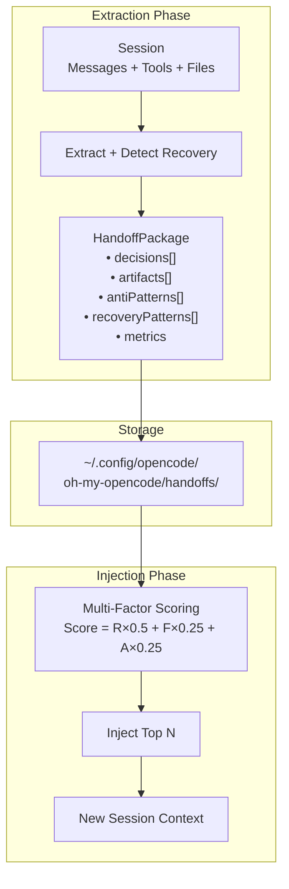
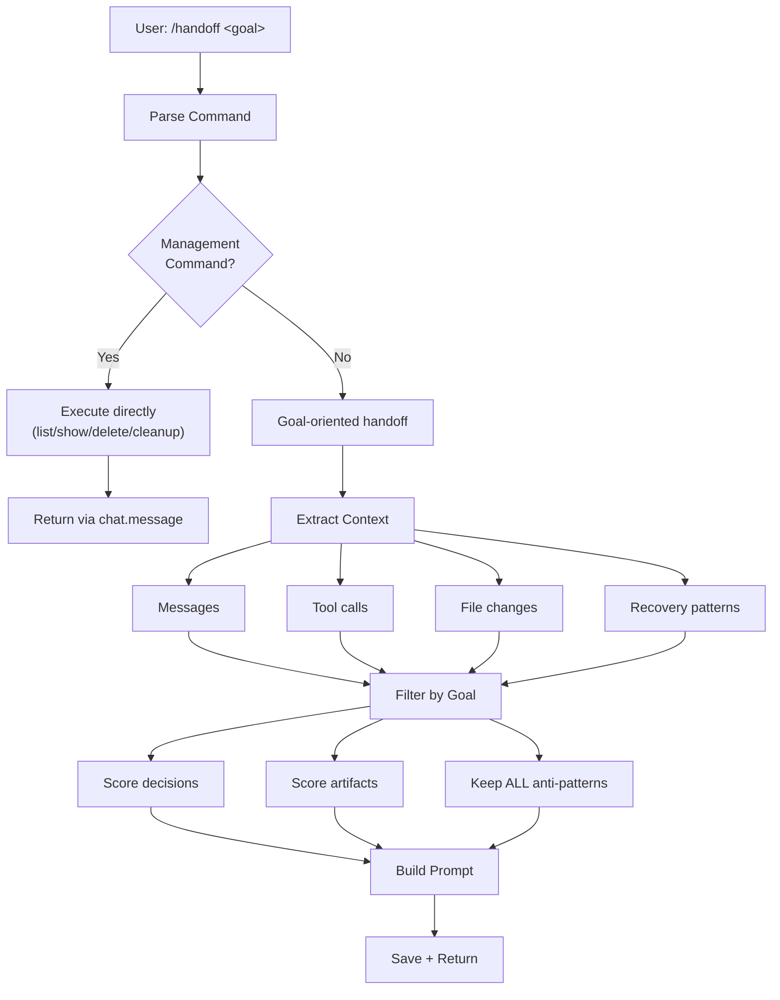
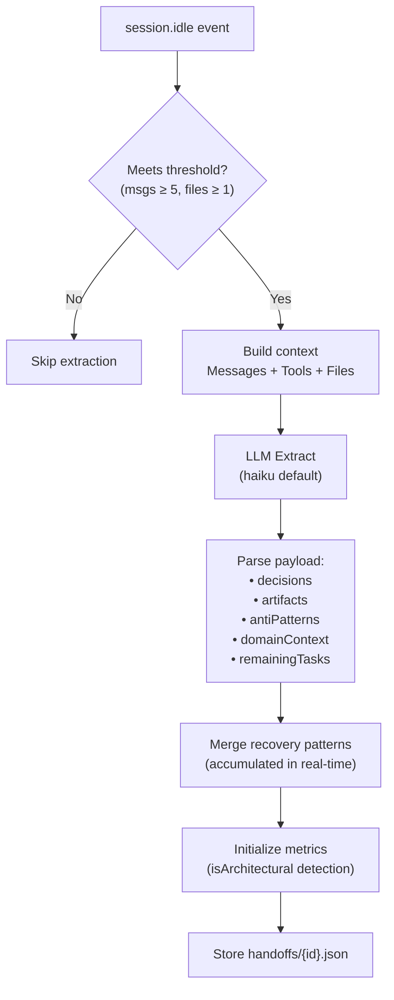
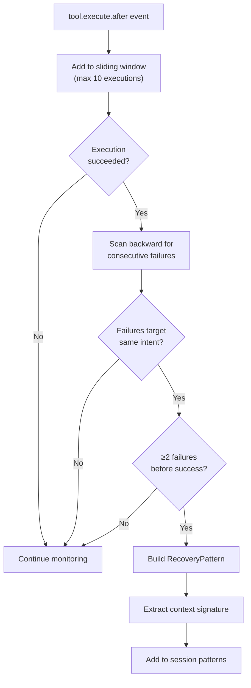
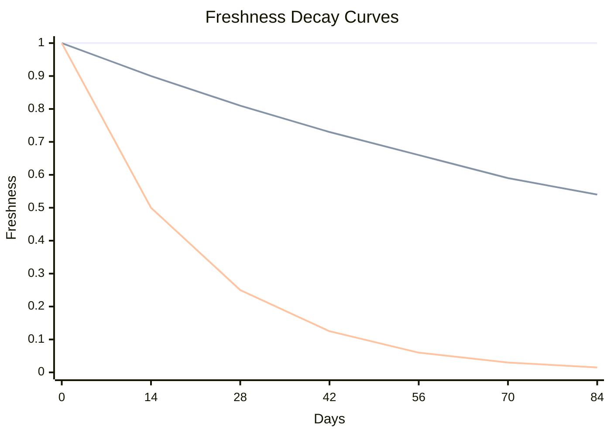
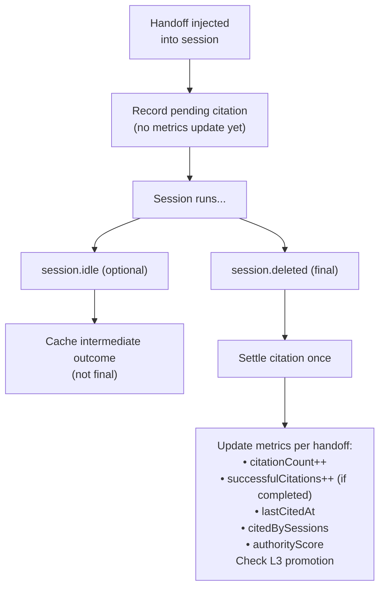

# Session Handoff Design

Session Handoff provides structured knowledge extraction and transfer between sessions, enabling continuous learning across coding sessions.

## Overview

A **Handoff Package** is a structured "graduation certificate" for a completed session, containing transferable knowledge for future sessions working on related tasks.



**Scoring Factors:**
- **R** (Relevance): Keyword matching (embedding-ready, falls back to lexical)
- **F** (Freshness): Temporal decay with half-life
- **A** (Authority): Citation success rate

### Motivation

**Problem**: Each new session starts with zero context about previous work. This leads to:

- Re-explaining architecture decisions already made
- Re-discovering failed approaches
- Inconsistent coding patterns across sessions
- Manual context rebuilding via copy-paste
- Repeating the same mistakes without knowing the fix

**Solution**: Structured knowledge transfer that preserves:

| Knowledge Type | What It Captures | Value |
|---------------|------------------|-------|
| **Decisions** | What was chosen and why | Prevents re-discussion |
| **Artifacts** | What was created or modified | Maps the changes |
| **Anti-patterns** | What failed and should be avoided | Warns against approaches |
| **Recovery Patterns** | Failure sequences that led to success | Shows the fix path |
| **Domain Knowledge** | Insights about the codebase | Transfers tacit knowledge |

### Design Philosophy

| Principle | Implementation |
|-----------|----------------|
| **Structured over free-form** | Handoff packages have defined schemas, not prose dumps |
| **Compaction-aligned** | Handoff extraction mirrors `compaction-context-injector` structure |
| **Embedding-ready** | All content indexable for semantic retrieval |
| **Lazy extraction** | Handoffs created on-demand or at session idle, not continuously |
| **Declarative reference** | `@session:id` syntax is explicit and parseable |
| **Goal-oriented transfer** | Active handoffs filter context by goal relevance |
| **Authority-weighted injection** | Proven-useful handoffs rank higher |
| **Recovery-aware** | Captures not just failures, but how they were fixed |

---

## Core Schemas

### HandoffPackage

```typescript
interface HandoffPackage {
  /** Unique identifier (format: "ho_{timestamp}_{hash}") */
  id: string

  /** Source session ID */
  sourceSessionId: string

  /** Creation timestamp */
  createdAt: number

  /** Expiration timestamp (default: 7 days, L3 promoted: never) */
  expiresAt: number

  /** Package metadata */
  metadata: HandoffMetadata

  /** Knowledge payload */
  payload: HandoffPayload

  /** Embedding index metadata for semantic search (lazy-computed, optional) */
  embeddingIndex?: EmbeddingIndexEntry[]

  /** Usage metrics for scoring and L3 promotion */
  metrics?: HandoffMetrics
}

// EmbeddingIndexEntry (optional, for semantic search)
interface EmbeddingIndexEntry {
  id: string                    // e.g., "ho_xxx:decision:0"
  content: string               // Normalized text for embedding
  category: "decision" | "artifact" | "antiPattern" | "domainContext"
  index: number                 // Index within category
  vectorIndex: number           // Index into binary vector file
}
```

**Embeddings (Optional)**:
- When `extractor.generate_embeddings: true` AND an `embed` function is provided, embedding vectors are generated and stored in `handoffs/embeddings/*.bin`
- When disabled or unavailable, the system falls back to keyword-based relevance scoring
- Embeddings enable `computeHandoffScoreWithEmbedding()` for true semantic similarity
- Storage path: `~/.config/opencode/oh-my-opencode/handoffs/embeddings/` (cross-platform via Node.js `homedir()`)

### HandoffMetadata

```typescript
interface HandoffMetadata {
  /** Original goal/request from the session */
  originalGoal: string

  /** Session duration in milliseconds */
  durationMs: number

  /** Project path where work occurred */
  projectPath: string

  /** Target intent description (optional, for guided handoffs) */
  targetIntent?: string

  /** Key files involved */
  keyFiles: string[]

  /** Session outcome */
  outcome: "completed" | "partial" | "blocked"
}

interface HandoffPayload {
  /** Key decisions made during the session */
  decisions: Decision[]

  /** Files created or modified */
  artifacts: Artifact[]

  /** Approaches that failed (to prevent re-exploration) */
  antiPatterns: AntiPattern[]

  /** Domain knowledge discovered */
  domainContext: string[]

  /** Remaining tasks (optional, for continuation) */
  remainingTasks?: string[]

  /** Recovery patterns: failure sequences that led to success */
  recoveryPatterns?: RecoveryPattern[]
}
```

### Decision

Decisions are the most valuable part of a handoff - they capture **why** choices were made.

```typescript
interface Decision {
  /** What decision was made */
  what: string

  /** The chosen approach */
  chosen: string

  /** Rationale for the choice */
  why: string

  /** Alternatives that were considered and rejected */
  rejected?: RejectedAlternative[]

  /** Files affected by this decision */
  relatedFiles?: string[]

  /** Decision category for filtering */
  category?: "architecture" | "implementation" | "tooling" | "convention"
}

interface RejectedAlternative {
  approach: string
  reason: string
}
```

**Example:**

```json
{
  "what": "State management approach for user preferences",
  "chosen": "Zustand with persist middleware",
  "why": "Simpler API than Redux, built-in persistence, good TypeScript support",
  "rejected": [
    { "approach": "Redux Toolkit", "reason": "Overkill for this use case" },
    { "approach": "React Context", "reason": "No built-in persistence" }
  ],
  "relatedFiles": ["src/stores/preferences.ts"],
  "category": "architecture"
}
```

### Artifact

```typescript
interface Artifact {
  /** File path (relative to project root) */
  path: string

  /** Change type */
  changeType: "created" | "modified" | "deleted"

  /** Brief summary of what changed */
  summary: string

  /** Key line ranges with descriptions (optional) */
  lineRanges?: LineRange[]

  /** Dependencies this file introduced or modified */
  dependencies?: string[]
}
```

### AntiPattern

Anti-patterns prevent future sessions from repeating failed experiments.

```typescript
interface AntiPattern {
  /** The approach that was tried */
  approach: string

  /** Why it failed */
  reason: string

  /** Error signature for matching (optional) */
  errorSignature?: string

  /** Context in which this failed */
  context?: string
}
```

**Limitation**: AntiPattern only captures "what failed", not "how it was fixed". For the complete recovery journey, see RecoveryPattern below.

### RecoveryPattern

Recovery patterns capture the complete "failure → fix" journey, providing actionable guidance.

```typescript
/**
 * A captured recovery sequence: failures followed by successful resolution.
 * More actionable than AntiPattern because it includes "what worked".
 */
interface RecoveryPattern {
  /** Unique identifier (format: "rp_{timestamp}_{hash}") */
  id: string

  /** Sequence of failed attempts leading to resolution */
  failureSequence: FailedAttempt[]

  /** The successful resolution */
  resolution: SuccessfulResolution

  /** LLM-generated lesson learned (populated async) */
  insight?: RecoveryInsight

  /** Context signature for matching similar scenarios */
  contextSignature: ContextSignature

  /** Statistics */
  stats: RecoveryPatternStats
}

interface FailedAttempt {
  tool: string
  args: Record<string, unknown>  // Sanitized - no secrets
  error: string
  timestamp: number
}

interface SuccessfulResolution {
  tool: string
  args: Record<string, unknown>
  result: string
  timestamp: number
}

interface RecoveryInsight {
  /** One-sentence summary of the lesson */
  summary: string

  /** What to verify BEFORE attempting similar operations */
  precheck: string

  /** The critical change that led to success */
  keyDifference: string

  /** Confidence in the insight (0-1) */
  confidence: number
}

interface ContextSignature {
  /** File patterns involved (e.g., ["*.tsx", "package.json"]) */
  filePatterns: string[]

  /** Error category for matching */
  errorCategory: ErrorCategory

  /** Tool chain that was used */
  toolChain: string[]
}

type ErrorCategory =
  | "type-error"
  | "module-not-found"
  | "syntax-error"
  | "runtime-error"
  | "permission-denied"
  | "network-error"
  | "validation-error"
  | "unknown"
```

**AntiPattern vs RecoveryPattern:**

| Aspect | AntiPattern | RecoveryPattern |
|--------|-------------|-----------------|
| **Captures** | Single failure | Failure sequence + resolution |
| **Value** | "Avoid this" | "Do this instead" |
| **Trigger** | LLM extraction (subjective) | Tool execution events (objective) |
| **Confidence** | Depends on LLM interpretation | High (observed success) |

### HandoffMetrics

Metrics track handoff usage and effectiveness for scoring.

```typescript
interface HandoffMetrics {
  /** Number of times this handoff was injected into a session */
  citationCount: number

  /** Number of sessions where injection led to successful outcome */
  successfulCitations: number

  /** Timestamp of most recent citation */
  lastCitedAt: number

  /** Whether this contains architectural decisions (longer half-life) */
  isArchitectural: boolean

  /** Whether user manually pinned this handoff */
  manualPinned: boolean

  /** Computed authority score (0-1), updated on citation */
  authorityScore: number

  /** IDs of sessions that cited this handoff (max 20, FIFO) */
  citedBySessions: string[]
}

// Default for new handoffs
const DEFAULT_HANDOFF_METRICS: HandoffMetrics = {
  citationCount: 0,
  successfulCitations: 0,
  lastCitedAt: 0,
  isArchitectural: false,
  manualPinned: false,
  authorityScore: 0.5,  // Neutral starting point
  citedBySessions: [],
}
```

---

## Active Handoff (Goal-Oriented)

Active Handoff transforms the handoff mechanism from "passive archive" to "active task launcher". Instead of waiting for session end, users can proactively transfer context with a specific goal.

### Usage

```
/handoff <goal>
```

**Examples:**
- `/handoff execute phase one of the plan`
- `/handoff check if this bug exists elsewhere`
- `/handoff build admin panel for this feature`

### When to Use

| Situation | Recommended Action |
|-----------|-------------------|
| Context limit reached, work ongoing | `/handoff <next-goal>` |
| Compact failed multiple times | `/handoff <continue-goal>` |
| Starting focused work on specific aspect | `/handoff <specific-task>` |
| Session naturally ending | Automatic extraction on idle |

### Active Handoff Flow



### Goal Filtering

The goal extractor filters payload items by relevance:

1. Extract keywords from goal text (excluding stop words)
2. Extract file-related keywords (extensions, directories)
3. Score each item by keyword overlap
4. Normalize scores and filter by threshold

**Important:** Anti-patterns and recovery patterns are **ALWAYS** preserved (not filtered out) by goal filtering.
They may still be *rendered* with per-mode caps to protect prompt budget.

### Rendered Template

Both Active Handoff and Auto-Injection use the same base template, with minor differences:

| Aspect | Active Handoff (`/handoff <goal>`) | Auto-Injection (session start) |
|--------|-----------------------------------|-------------------------------|
| **Header** | "Session Handoff" | "Previous Session Context" |
| **Goal section** | User-provided goal | Original session goal |
| **Staleness warning** | Not included | Included if files modified |
| **Filtering** | Filtered by goal relevance | All content included |
| **Rendering** | Full prompt template | Compact multi-handoff blocks (token-efficient) |

**Template Structure:**

```markdown
## [Header]

[Introduction text]

---

## Goal
<goal text>

## Key Decisions
1. **Decision topic**
   - Chose: chosen approach
   - Reason: rationale
   - Rejected: alternatives

## Recovery Patterns
When you encounter similar errors, use these proven solutions:

### RP-1: [ErrorCategory]
**Failures:**
1. `[Tool] [args]` → Error: [message]
2. `[Tool] [args]` → Error: [message]

**Resolution:**
`[Tool] [args]` → [result]

**Lesson:** [insight.summary]
**Precheck:** [insight.precheck]

## Approaches to AVOID
- ❌ [approach]: [reason]

## Domain Knowledge
- [context item 1]
- [context item 2]

## Remaining Tasks
- [ ] task 1
- [ ] task 2
```

**Token Budget**: Anti-patterns and recovery patterns are capped at 10 items each during extraction (`extractor.ts` + recovery merge).
Auto-injection may apply stricter per-section caps during rendering to keep startup context small.

---

## Passive Extraction Flow

Automatic extraction on session idle:



**Important**: Recovery patterns are detected **in real-time** via `tool.execute.after` hook (see below), then **merged** into the handoff package on idle. The LLM extraction handles decisions/artifacts/antiPatterns/domainContext/remainingTasks.

### Recovery Pattern Detection

Recovery patterns are detected in real-time by monitoring tool execution:



**Same-Intent Detection:**

| Tool | Same Intent Criteria |
|------|---------------------|
| `Edit` / `Write` / `Read` | Same `file_path` |
| `Bash` | Same command prefix (`npm`, `git`, etc.) |
| `Grep` / `Glob` | Same `pattern` |
| Other | Same tool name |

**Error Classification:**

```typescript
function classifyError(error: string): ErrorCategory {
  // type-error: "Type error", "cannot assign", "is not assignable"
  // module-not-found: "Cannot find module", "no such file", "ENOENT"
  // syntax-error: "SyntaxError", "unexpected token", "parsing error"
  // permission-denied: "EACCES", "permission denied"
  // network-error: "ECONNREFUSED", "fetch failed"
  // validation-error: "validation", "invalid", "required field"
  // runtime-error: "runtime", "uncaught", "exception"
  // unknown: fallback
}
```

---

## Injection Flow

When a new session starts, relevant handoffs are automatically injected using multi-factor scoring.

### Multi-Factor Scoring

```
Final Score = (Relevance × 0.5) + (Freshness × 0.25) + (Authority × 0.25)
```

| Factor | Description | Range |
|--------|-------------|-------|
| **Relevance** | Keyword overlap with query (embedding-ready) | 0-1 |
| **Freshness** | Temporal decay (newer = higher) | 0-1 |
| **Authority** | Citation success rate | 0-1 |

**1. Relevance Calculation (Keyword-Based, Embedding-Ready):**

Current implementation uses keyword matching. When embeddings are enabled, use `computeHandoffScoreWithEmbedding()` for true semantic similarity.

```typescript
function calculateKeywordRelevance(handoff: HandoffPackage, query: string): number {
  // Extract meaningful words from query (excluding stop words)
  // Count matches in handoff content (goal, decisions, files, domainContext)
  // Return match ratio (0 = no overlap, 1 = full overlap)
}
```

**2. Freshness Calculation (Half-Life Decay):**

```typescript
function calculateFreshness(metrics: HandoffMetrics, createdAt: number): number {
  // Pinned → always 1.0
  // Architectural → 90-day half-life
  // Default → 14-day half-life
  //
  // freshness = 0.5^(ageDays / halfLifeDays)
}
```



**3. Authority Calculation (Bayesian-smoothed):**

Authority is derived from citation success history, with Bayesian smoothing to avoid cold-start penalty.

```typescript
function calculateAuthorityScore(metrics: HandoffMetrics): number {
  const { citationCount, successfulCitations } = metrics

  // Beta(1, 1) prior expressed as pseudo-counts:
  // priorSuccesses = 1, priorTotal = 2 => neutral 0.5 at citationCount = 0
  const priorSuccesses = 1
  const priorTotal = 2

  const smoothedSuccessRate =
    (successfulCitations + priorSuccesses) / (citationCount + priorTotal)

  const citationBoost = Math.log10(citationCount + 1) / 2
  return Math.min(1.0, smoothedSuccessRate * (1 + citationBoost))
}
```

| Citations | Successful | Authority (examples) |
|-----------|------------|----------------------|
| 0 | 0 | 0.50 (neutral) |
| 1 | 0 | 0.33 (mild drop, not 0) |
| 1 | 1 | ~0.77 |
| 10 | 8 | 1.00 (capped) |

### Citation Tracking



**Two-phase model:**
- **Injection** records a *pending citation* (no `citationCount` / `authorityScore` update).
- **Idle** may cache an *intermediate outcome* (the session can continue).
- **Deletion** is the authoritative settlement point: metrics are updated exactly once.

### L3 Promotion (Long-Term Preservation)

High-value handoffs are promoted to L3 (exempt from expiration):

| Rule | Trigger |
|------|---------|
| `proven-valuable` | ≥3 successful citations |
| `architectural-decision` | Contains architecture/convention decisions |
| `user-pinned` | User manually pinned |
| `high-authority` | Authority score ≥0.8 |

L3 handoffs:
- Never expire (exempt from cleanup)
- Get extended half-life (architectural = 90 days)
- Are prioritized in injection

### Injection-Specific: Staleness Warning

When auto-injecting, if related files have been modified since the handoff was created, a staleness warning is prepended:

```markdown
⚠️ **Staleness Warning**: 60% of related files have been modified since this session.
Modified: src/stores/auth.ts, src/api/interceptors.ts
*Some decisions may be outdated. Verify before applying.*
```

This is **not** included in active handoff prompts (since they're created from the current session).

### Staleness Detection

When injecting, the system checks if related files have been modified:

- **>50% files modified** → Mark as stale
- **Handoff >3 days old AND any file modified** → Mark as stale

This helps the LLM understand that handoff content may be outdated.

---

## Storage Structure

```
~/.config/opencode/oh-my-opencode/
└── handoffs/
    ├── index.json                    # Metadata index (v1 or v2)
    ├── ho_1706500000_abc123.json     # Individual handoff packages
    ├── ho_1706400000_def456.json
    └── embeddings/
        ├── ho_1706500000_abc123.bin  # Embedding vectors (optional)
        └── ho_1706400000_def456.bin
```

### Index Schema

```typescript
type HandoffIndexVersion = 1 | 2

interface HandoffIndex {
  /** Schema version */
  version: HandoffIndexVersion

  /** Indexed handoffs */
  handoffs: HandoffIndexEntry[]

  /** Last cleanup timestamp */
  lastCleanup: number

  /** L3 promoted handoff IDs (exempt from expiration, v2+) */
  l3Promoted?: string[]
}

interface HandoffIndexEntry {
  id: string
  sourceSessionId: string
  projectPath: string
  originalGoal: string
  createdAt: number
  expiresAt: number
  outcome: "completed" | "partial" | "blocked"
  decisionCount: number
  artifactCount: number

  /** Metrics summary for quick filtering (v2+) */
  metricsSummary?: {
    authorityScore: number
    citationCount: number
    isArchitectural: boolean
    manualPinned: boolean
  }

  /** Count of recovery patterns (v2+) */
  recoveryPatternCount?: number
}
```

---

## Commands

### Goal-Oriented (Primary Usage)

| Command | Description |
|---------|-------------|
| `/handoff <goal>` | Create goal-oriented handoff with context transfer |

### Management Commands

| Command | Description |
|---------|-------------|
| `/handoff` or `/handoff list` | List handoffs for current project |
| `/handoff show <id>` | Display handoff details |
| `/handoff delete <id>` | Delete a handoff |
| `/handoff cleanup` | Remove expired handoffs |

---

## Configuration

```typescript
interface SessionHandoffConfig {
  /** Enable session handoff feature */
  enabled: boolean  // default: true

  /** Automatically extract handoff on session idle */
  auto_extract: boolean  // default: true

  /** Automatically inject relevant handoffs on session start */
  auto_inject: boolean  // default: true

  /** Minimum messages for auto-extraction */
  min_messages_for_extract: number  // default: 5

  /** Minimum file modifications for auto-extraction */
  min_file_changes_for_extract: number  // default: 1

  /** Maximum handoffs to inject */
  max_inject_count: number  // default: 3

  /** Handoff expiration in days */
  expiry_days: number  // default: 7

  /** Run extraction asynchronously (non-blocking) */
  async_extraction: boolean  // default: true

  /** Extractor configuration */
  extractor: {
    model: "haiku" | "sonnet" | "opus"  // default: "haiku"
    max_decisions: number  // default: 10
    max_artifacts: number  // default: 20
    generate_embeddings: boolean  // default: true
  }
}
```

**Scoring Configuration** (in code, via `InjectorScoringConfig`):

```typescript
interface ScoringConfig {
  weights: {
    relevance: number   // default: 0.5
    freshness: number   // default: 0.25
    authority: number   // default: 0.25
  }
  halfLife: {
    default: number       // default: 14 (days)
    architectural: number // default: 90 (days)
  }
  minScore: number  // default: 0.25
}
```

**Recovery Pattern Configuration** (in code, via `RecoveryDetectorConfig`):

```typescript
interface RecoveryDetectorConfig {
  minFailures: number  // default: 2
  maxFailures: number  // default: 5
  windowSize: number   // default: 10
}
```

**Configuration location:** `session_handoff` in oh-my-opencode.json

---

## Module Structure

```
src/features/session-handoff/
├── types.ts              # Core types, schemas, defaults
├── extractor.ts          # LLM-based knowledge extraction
├── injector.ts           # Handoff injection selection (scoring + ranking)
├── renderer.ts           # Unified formatting (prompt/injection/reference)
├── storage.ts            # Filesystem persistence
├── embeddings.ts         # Semantic search support
├── summarizer.ts         # Circuit-breaker wrapped summarizer
├── hook.ts               # Plugin lifecycle integration
├── goal-extractor.ts     # Goal-relevance filtering
├── prompt-builder.ts     # Handoff prompt construction
├── launcher.ts           # Active handoff execution
├── staleness.ts          # Git-based staleness detection
├── reference-resolver.ts # @session:id resolution
├── command-parser.ts     # /handoff command parsing
├── recovery-detector.ts  # Recovery pattern detection
├── citation-tracker.ts   # Citation tracking + outcome
├── scoring.ts            # Multi-factor scoring
└── index.ts              # Public exports
```

---

## Known Limitations

### Extraction & Detection

| Limitation | Impact | Mitigation |
|------------|--------|------------|
| LLM extraction cost | Each session may incur API cost | Use haiku model, skip short sessions |
| Extraction quality | Depends on LLM understanding | Structured prompt, fallback to metadata |
| Same-intent heuristics | May miss related failures | Conservative matching, manual review |
| Window size limit | Long failure sequences truncated | Configurable window size |

### Scoring & Metrics

| Limitation | Impact | Mitigation |
|------------|--------|------------|
| Cold start | New handoffs have no history | Neutral default score (0.5) |
| Outcome detection | Heuristic-based success detection | Conservative success criteria |
| Settlement latency | Authority and citation metrics update on `session.deleted` (final), not on every `idle` | Treat as eventual consistency; use manual pinning for immediately-important handoffs |
| Citation tracking overhead | Additional storage I/O | Batch updates, async writes |
| Architectural detection | Heuristic-based | User can manually pin |

### Storage & Lifecycle

| Limitation | Impact | Mitigation |
|------------|--------|------------|
| Storage growth | Handoffs accumulate | Auto-expiry (7 days default), cleanup command |
| L3 no demotion | Once promoted, stays promoted | Manual cleanup |
| Cross-project isolation | Filtered by project path | Could miss related work in different paths |
| Goal filtering accuracy | Keyword-based scoring | Anti-patterns always preserved |
