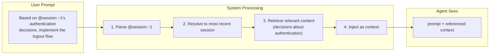
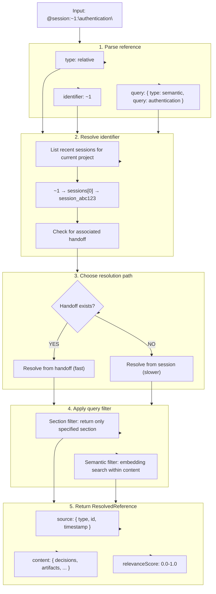

# Session Reference Design (@session:id)

Session Reference provides a **declarative syntax** for explicitly referencing content from previous sessions within prompts.

## Overview



---

## Syntax Specification

```
@session:<identifier>[:<query>]

Identifiers:
  @session:abc123          Full session ID
  @session:~1              Most recent session (relative)
  @session:~2              Second most recent session
  @session:latest          Alias for ~1
  @session:handoff:xyz     Direct handoff reference

Queries (optional):
  @session:abc123:decisions      Only decisions
  @session:abc123:artifacts      Only file changes
  @session:abc123:antiPatterns   Only failed approaches
  @session:abc123:context        Only domain knowledge
  @session:abc123:"auth"         Semantic search for "auth"
  @session:abc123:"JWT tokens"   Semantic search phrase
```

## Examples

| Reference | Meaning |
|-----------|---------|
| `@session:~1` | Everything from most recent session |
| `@session:~1:decisions` | Only decisions from most recent |
| `@session:~2:"database"` | Database-related content from 2nd most recent |
| `@session:abc123` | Everything from specific session |
| `@session:handoff:ho_123` | Direct handoff by ID |
| `@session:latest:antiPatterns` | What to avoid from latest session |

---

## Resolution Flow



---

## ResolvedReference Schema

```typescript
interface ResolvedReference {
  /** Source information */
  source: {
    type: "session" | "handoff"
    id: string
    timestamp: number
    projectPath: string
  }

  /** Resolved content */
  content: ResolvedContent

  /** Relevance score (0-1) for semantic queries */
  relevanceScore: number
}

interface ResolvedContent {
  /** Summary of the source */
  summary: string

  /** Decisions (filtered by query) */
  decisions?: Decision[]

  /** Artifacts (filtered by query) */
  artifacts?: Artifact[]

  /** Domain context (filtered by query) */
  domainContext?: string[]

  /** Anti-patterns (filtered by query) */
  antiPatterns?: AntiPattern[]

  /** Raw message excerpts (fallback when no handoff) */
  messageExcerpts?: MessageExcerpt[]
}

interface MessageExcerpt {
  role: "user" | "assistant"
  content: string
  timestamp: number
  score: number  // Relevance score for semantic search
}
```

---

## Resolution Strategies

**Strategy 1: Handoff Resolution (Preferred)**

When a handoff exists for the referenced session:
- Fast: Pre-extracted, structured data
- Complete: All payload sections available
- Searchable: Embedding index for semantic queries

**Strategy 2: Session Resolution (Fallback)**

When no handoff exists:
- Slower: Must process raw messages
- Less structured: Returns message excerpts
- On-demand extraction: Can trigger lazy handoff creation

```typescript
async function resolveSessionReference(
  ref: SessionReference,
  options: ResolveOptions
): Promise<ResolvedReference | null> {

  // 1. Resolve identifier to concrete target
  const target = await resolveIdentifier(ref)
  if (!target) return null

  // 2. Prefer handoff (structured, fast)
  if (target.handoff) {
    return resolveFromHandoff(target.handoff, ref.query, options)
  }

  // 3. Fallback to session messages
  if (options.allowSessionFallback !== false) {
    return resolveFromSession(target.sessionId, ref.query, options)
  }

  // 4. Optionally trigger lazy handoff creation
  if (options.createHandoffIfMissing) {
    const handoff = await extractHandoff(target.sessionId)
    await saveHandoff(handoff)
    return resolveFromHandoff(handoff, ref.query, options)
  }

  return null
}
```

---

## Semantic Search

When a query like `@session:~1:"authentication"` is used:

```typescript
async function semanticSearchHandoff(
  handoff: HandoffPackage,
  query: string,
  maxResults: number
): Promise<ResolvedContent> {

  // 1. Get or compute embedding index (metadata)
  const index = handoff.embeddingIndex ?? await generateEmbeddingIndex(handoff)

  // 2. Load vectors (or generate + persist if missing)
  const vectors = await loadOrGenerateVectors(handoff, index)

  // 3. Embed the query
  const queryEmbedding = await embed(query)

  // 4. Compute similarities
  const scored = index.map(entry => ({
    ...entry,
    score: cosineSimilarity(queryEmbedding, vectors[entry.vectorIndex])
  }))

  // 5. Filter and sort by relevance
  const relevant = scored
    .filter(e => e.score > 0.3)  // Minimum threshold
    .sort((a, b) => b.score - a.score)
    .slice(0, maxResults)

  // 6. Reconstruct content from relevant entries
  return reconstructContent(relevant, handoff)
}
```

**Implementation Note:** In the current implementation, vectors are persisted to
`~/.config/opencode/oh-my-opencode/handoffs/embeddings/{handoffId}.bin` when a handoff is created
(or lazily generated on first semantic query if missing). The handoff JSON stores only the
`embeddingIndex` metadata (`vectorIndex` mapping).

---

## Hook Integration

> **Implementation Note:** The @session reference parsing is integrated into the session-handoff hook
> rather than being a separate hook. See `src/features/session-handoff/hook.ts`.

```typescript
// Actual implementation in session-handoff/hook.ts user.prompt.submit handler:
"user.prompt.submit": async (input) => {
  const { sessionID, parts } = input
  const promptText = parts?.filter(p => p.type === "text")?.map(p => p.text).join("\n") || ""

  // ... session start and message tracking ...

  // Parse and resolve @session references in prompt
  if (promptText && /@session:/.test(promptText)) {
    const references = parseSessionReferences(promptText)
    if (references.length > 0 && collector) {
      const refContent = references.map(r =>
        `## Referenced Session Context\n\n*From: ${r.original}*\n\n${r.content}`
      ).join("\n\n---\n\n")

      collector.register(sessionID, {
        id: `session-ref-${Date.now()}`,
        source: "session-handoff",
        content: refContent,
        priority: "high",
      })
    }
  }
}
```

---

## Injection Format

```markdown
## Referenced Session Context

### From session ~1 (2 hours ago): "Implement user authentication"

**Decisions matching "authentication":**

1. **Token storage strategy**
   - Chosen: httpOnly cookies
   - Why: XSS protection, CSRF tokens for additional security
   - Related files: src/middleware/auth.ts, src/utils/cookies.ts

2. **Session management**
   - Chosen: Redis-backed sessions with 24h expiry
   - Why: Scalable across instances, configurable TTL
   - Rejected: In-memory sessions (not scalable)

**Relevant Anti-Patterns:**
- ❌ Storing JWT in localStorage: Vulnerable to XSS attacks

**Domain Knowledge:**
- Auth middleware in src/middleware/auth.ts must run before route handlers
- User model has passwordHash field, never expose in API responses

---
```

---

## Tool Interface (Future Work)

> **Status:** Not yet implemented. The @session reference syntax works via prompt injection,
> but a dedicated tool for programmatic session reference is planned for future.

Agents could also programmatically reference sessions:

```typescript
// PLANNED - Not yet implemented
const session_reference: ToolDefinition = tool({
  description: `Reference content from previous sessions.

Examples:
  @session:~1              - Most recent session
  @session:~1:decisions    - Only decisions
  @session:abc123:"API"    - Semantic search for "API"

Returns structured content from the referenced session.`,

  args: {
    reference: tool.schema.string()
      .describe('Session reference (e.g., "@session:~1:decisions")'),
    context: tool.schema.string().optional()
      .describe('Additional context for semantic search'),
  },

  execute: async (args) => {
    const ref = parseSessionReference(args.reference)
    if (!ref) {
      return "Invalid reference format. Use @session:<id>[:<query>]"
    }

    // Add context as semantic query if provided
    if (args.context && !ref.query) {
      ref.query = { type: "semantic", query: args.context }
    }

    const resolved = await resolveSessionReference(ref)
    if (!resolved) {
      return "Session not found or no relevant content"
    }

    return formatResolvedForTool(resolved)
  }
})
```

---

## Configuration

```typescript
interface SessionReferenceConfig {
  /** Enable @session reference syntax */
  enabled: boolean  // default: true

  /** Strip @session references from prompt after resolution */
  strip_from_prompt: boolean  // default: false (keep for context)

  /** Resolution options */
  resolve_options: {
    /** Prefer handoff over raw session */
    prefer_handoff: boolean  // default: true

    /** Fall back to session if handoff missing */
    allow_session_fallback: boolean  // default: true

    /** Create handoff on-demand if missing */
    create_handoff_if_missing: boolean  // default: false

    /** Maximum results for semantic search */
    max_results: number  // default: 5

    /** Minimum relevance score for semantic results */
    min_relevance: number  // default: 0.3
  }
}
```

**Configuration location:** prefer `session_handoff.reference` (recommended). Top-level `session_reference` is deprecated but still supported for backward compatibility.

> **Implementation Note:** The configuration is defined in `src/config/schema.ts` as
> `SessionReferenceConfigSchema`. Currently the @session parsing is part of the session-handoff
> hook. The hook honors the merged config (preferring `session_handoff.reference` over deprecated
> top-level `session_reference`) and uses `resolve_options.max_results` /
> `resolve_options.min_relevance` for embedding-based semantic search. `strip_from_prompt` and
> session fallback / `create_handoff_if_missing` are still future work.

---

## Known Limitations

| Limitation | Impact | Mitigation |
|------------|--------|------------|
| Missing handoff | Fallback to raw messages is slower | Option to create handoff on-demand |
| Semantic search accuracy | Depends on embedding quality | Hybrid search with BM25 |
| Reference in code blocks | May be incorrectly parsed | Context-aware parsing |
| Multiple references | Order may matter | Process in order, deduplicate |
