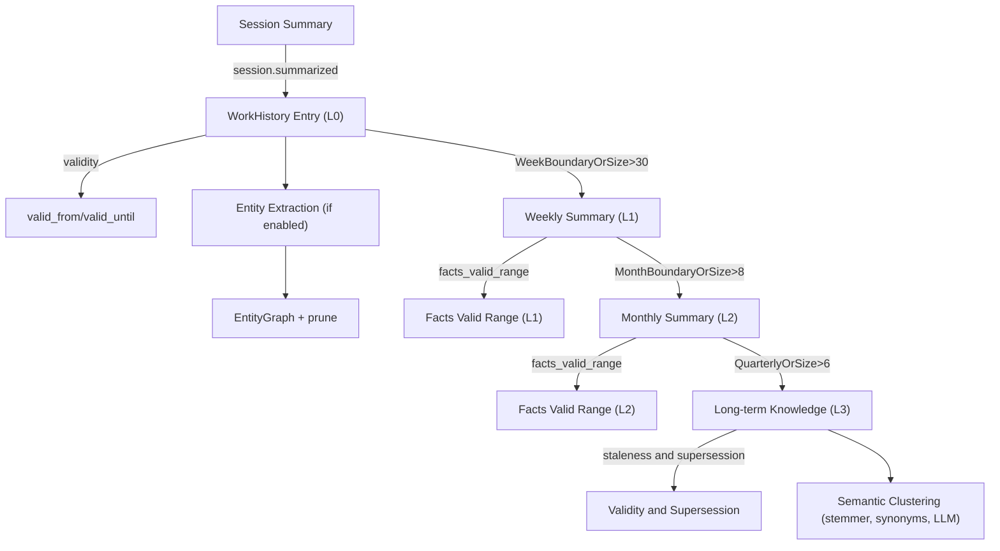

# User Memory: RAPTOR-style Hierarchical Memory

## Overview

User Memory implements a **RAPTOR-inspired** (Recursive Abstractive Processing for Tree-Organized Retrieval) hierarchical memory system with three enhancement layers:

1. **Temporal Validity** - Facts have valid_from/valid_until with staleness decay
2. **Entity Memory** - Person/project/technology relationship graph (opt-in)
3. **Semantic Clustering** - LLM-assisted knowledge deduplication

**LLM Summarizer (default)**:
- A built-in summarizer can call the OpenCode session API to generate weekly/monthly summaries.
- Sessions are **reused per (kind, model)** with an in-memory LRU cap of **6** to avoid session explosion.
- Model selection is driven by `aggregation_model` and category config overrides (see Model Selection).

```
┌───────────────────────────────────────────────────────────────────────────┐
│                      Enhanced Memory Architecture                         │
├───────────────────────────────────────────────────────────────────────────┤
│                                                                           │
│  RAPTOR Axis (Time)              Entity Axis (Relationships)              │
│  ─────────────────               ───────────────────────────              │
│                                                                           │
│  L3: LongTermKnowledge[]  ◄────► EntityGraph                              │
│      + valid_from/until          ├─ EntityNode[] (person/project)         │
│      + staleness_category        └─ EntityRelationship[]                  │
│      + effective_confidence                                               │
│                                                                           │
│  L2: MonthlySummary[]                                                     │
│      + facts_valid_range                                                  │
│                                                                           │
│  L1: WeeklySummary[]      ◄────── Entity extraction source                │
│      + facts_valid_range                                                  │
│                                                                           │
│  L0: WorkHistoryEntry[]   ◄────── Entity extraction source                │
│      + valid_from/until                                                   │
│      + staleness_category                                                 │
│                                                                           │
│  ──────────────────────────────────────────────────────────────────────   │
│  Semantic Clustering Layer                                                │
│  ─────────────────────────                                                │
│  Enhanced word overlap + LLM-assisted borderline decisions                │
│  (Stemming, synonyms, 0.6 high / 0.25 candidate thresholds)               │
│                                                                           │
└───────────────────────────────────────────────────────────────────────────┘
```

### Memory Hierarchy Limits

| Level | Name | Retention | Max Entries | Time Trigger | Size Trigger |
|-------|------|-----------|-------------|--------------|--------------|
| L3 | LongTermKnowledge | Permanent | 50 | Every 3 months | >6 monthly summaries |
| L2 | MonthlySummary | ~1 year | 12 | Month boundary crossed | >8 weekly summaries |
| L1 | WeeklySummary | ~3 months | 12 | Week boundary crossed (ISO Mon-Sun) | >30 work entries |
| L0 | WorkHistoryEntry | ~1 week | 50 | `session.summarized` event | N/A (trimmed to 50) |

---

## Part 1: Temporal Validity System

### Staleness Categories

Facts decay at different rates based on their nature:

```typescript
type StalenessCategory =
  | "ephemeral"    // 3 days: current task, active debugging
  | "short-term"   // 2 weeks: project state, current focus
  | "medium-term"  // 3 months: preferences, patterns
  | "long-term"    // 1 year: skills, fundamental preferences
  | "permanent"    // Never: explicit rules, core identity
```

### Staleness Calculation

```typescript
// Half-life based decay: staleness = 1 - exp(-ln(2) * t / halfLife)
function calculateStaleness(fact, queryTime): number {
  const halfLife = STALENESS_HALF_LIFE_MS[fact.staleness_category]
  const timeSinceActive = queryTime - (fact.lastReinforced ?? fact.valid_from)
  return 1 - Math.exp(-Math.LN2 * timeSinceActive / halfLife)
}

// Half-life values
const STALENESS_HALF_LIFE_MS = {
  ephemeral: 3 * DAY,
  "short-term": 14 * DAY,
  "medium-term": 90 * DAY,
  "long-term": 365 * DAY,
  permanent: Infinity
}
```

### Effective Confidence

Knowledge confidence decays with staleness:

```typescript
function calculateEffectiveConfidence(knowledge, queryTime): number {
  const staleness = calculateStaleness(knowledge, queryTime)
  const decayFactor = config.decay_factor  // default: 0.5
  return knowledge.confidence * (1 - staleness * decayFactor)
}
```

### Facts Valid Range

Aggregated summaries (L1/L2) track the validity range of their contained facts:

```typescript
interface FactsValidRange {
  earliest_valid_from: number    // Earliest valid_from among entries
  latest_valid_until?: number | null  // Latest valid_until (null = ongoing)
}
```

### Validity Semantics

`valid_from` is **inclusive** and `valid_until` is **exclusive** (half-open interval):

```text
valid at time t  <=>  t >= valid_from  &&  (valid_until is null/undefined || t < valid_until)
```

This avoids overlap during supersession (e.g., `old.valid_until = new.valid_from`).

### Configuration

```typescript
interface TemporalValidityConfig {
  enabled: boolean           // default: true
  staleness_threshold: number // default: 0.7 (max staleness to include)
  decay_factor: number       // default: 0.5
  include_expired: boolean   // default: false
}
```

Recommended ranges:
- `staleness_threshold`: 0.6–0.8 (lower = stricter injection)
- `decay_factor`: 0.3–0.7 (higher = stronger decay penalty)
- `include_expired`: keep `false` unless you explicitly want historical context

Configured via `user_memory.temporal_validity`.

---

## Part 2: Entity Memory Layer

### Entity Types

```typescript
type EntityType =
  | "person"       // Colleagues, reviewers
  | "project"      // Codebases, repos
  | "technology"   // Languages, frameworks
  | "organization" // Companies, teams
  | "concept"      // Patterns, methodologies
```

### Entity Graph Structure

```typescript
interface EntityGraph {
  nodes: Record<string, EntityNode>      // Keyed by ID
  relationships: EntityRelationship[]
  aliasIndex: Record<string, string>     // alias -> canonical ID
  lastExtraction: number
  graphVersion: number  // Currently: 1
}

interface EntityNode {
  id: string          // "person:john_smith"
  name: string        // "John Smith"
  type: EntityType
  aliases: string[]   // ["JS", "John"]
  aliasConfidence: Record<string, number>
  mentions: EntityMention[]  // Last 10
  mentionCount: number
  firstSeen: number
  lastSeen: number
  metadata: Record<string, string>
}

interface EntityRelationship {
  id: string
  subject: string     // Entity ID
  predicate: RelationshipPredicate  // works_on, uses, etc.
  object: string      // Entity ID
  confidence: number  // Based on co-occurrence
  observationCount: number
  firstObserved: number
  lastObserved: number
  contextSamples: string[]  // Last 3
}
```

### Alias Reconciliation

```typescript
function shouldMergeAsAlias(name1, name2, type): { shouldMerge, confidence } {
  // 1. Exact match after normalization -> confidence: 1.0
  // 2. Known aliases (js->javascript, ts->typescript) -> 0.95
  // 3. Abbreviation (JS -> John Smith) -> 0.85
  // 4. Edit distance > threshold -> similarity score
}

// Similarity thresholds by entity type
const SIMILARITY_THRESHOLDS = {
  person: 0.85,       // Strict for names
  project: 0.80,
  technology: 0.90,   // Very strict
  organization: 0.85,
  concept: 0.80
}
```

### Relationship Inference (Co-occurrence)

Relationships are inferred from a single `session.summarized` observation (i.e., one work entry) using type-aware co-occurrence rules:

| Entities | Predicate | Direction |
|----------|-----------|-----------|
| person + project | `works_on` | person → project |
| project + technology | `uses` | project → technology |
| person + person | `collaborates_with` | canonical ordering (undirected) |

Each observation increments `observationCount` and updates `confidence = min(1, observationCount / 5)`.

### Entity Configuration

```typescript
interface EntityMemoryConfig {
  enabled: boolean                    // default: false (opt-in)
  max_entities: number                // default: 200
  max_relationships: number           // default: 500
  min_mentions: number                // default: 2 (retention priority + injection gating)
  injection_confidence_threshold: number  // default: 0.4
  extract_types: EntityType[]         // default: all
}
```

Recommended ranges:
- `min_mentions`: 2–5 (higher = less noisy injection)
- `injection_confidence_threshold`: 0.3–0.7 (higher = fewer entities/relations injected)
- `max_entities`: 100–500 (depends on how many repos/projects you work on)
- `max_relationships`: 300–2000 (keep proportional to `max_entities`)

Configured via `user_memory.entity_memory`.

**Note**:
- Entity Memory is **disabled by default** (`enabled: false`). Must be explicitly enabled.
- Entity pruning happens at extraction time in `hook.ts`, not during RAPTOR aggregation.
- Entity extraction runs on every `session.summarized` event when enabled.

---

## Part 3: Semantic Clustering

### Two-Phase Clustering

**Phase 1: Candidate Selection (Word Overlap)**
```typescript
function calculateSimilarity(text1, text2): SimilarityResult {
  // 1. Preprocess: lowercase, normalize separators, remove stopwords
  // 2. Apply Porter stemmer (optional)
  // 3. Expand with domain synonyms (optional)
  // 4. Calculate weighted score:
  //    score = 0.5*baseOverlap + 0.3*synonymScore + 0.2*ngramScore
  return { score, confidence: "high" | "medium" | "low" }
}
```

**Phase 2: LLM-Assisted Merge (Borderline Cases)**
```typescript
// Only for medium confidence (0.25-0.6), limited to max_llm_calls
if (similarity.confidence === "medium" && llmCallsUsed < config.max_llm_calls) {
  const decision = await askLLMToMerge(cluster.content, lesson.content)
  // { same_insight: boolean, merged_content: string }
}
```

### Configuration

```typescript
interface SemanticClusteringConfig {
  enabled: boolean                   // default: true
  high_confidence_threshold: number  // default: 0.6 (auto-merge)
  candidate_threshold: number        // default: 0.25 (consider for merge)
  max_llm_calls: number              // default: 20
  use_synonyms: boolean              // default: true
  use_stemming: boolean              // default: true
}
```

Recommended ranges:
- `high_confidence_threshold`: 0.55–0.7 (lower = more aggressive auto-merge)
- `candidate_threshold`: 0.2–0.35 (lower = more LLM calls / merge attempts)
- `max_llm_calls`: 0–50 (set to 0 to disable LLM-assisted merges entirely)
- `use_synonyms` / `use_stemming`: keep `true` unless you see false positives

Configured via `user_memory.semantic_clustering`.

### Domain Synonyms

```typescript
const SYNONYM_GROUPS = [
  ["api", "endpoint", "route", "rest"],
  ["snake_case", "underscore", "snake-case"],
  ["camelCase", "camel_case", "camel"],
  ["test", "spec", "unittest"],
  ["config", "configuration", "settings"],
  // ... more groups
]
```

---

## Consolidation Triggers

Aggregation is triggered by **time boundaries** OR **size thresholds** (whichever comes first).

```typescript
interface ConsolidationConfig {
  enabled: boolean                    // default: true
  work_history_threshold: number      // default: 30 -> trigger L0->L1
  weekly_summaries_threshold: number  // default: 8 -> trigger L1->L2
  monthly_summaries_threshold: number // default: 6 -> trigger L2->L3
}
```

Recommended ranges:
- `work_history_threshold`: 20–80 (lower = more frequent weekly aggregation)
- `weekly_summaries_threshold`: 4–16
- `monthly_summaries_threshold`: 3–12

Configured via `user_memory.consolidation`.

### Trigger Logic

```typescript
const needsWeeklyAggregation =
  lastWeeklyAggregation !== undefined &&
  (crossedWeekBoundary(lastWeeklyAggregation, now) || workHistory.length > 30)

const needsMonthlyAggregation =
  lastMonthlyAggregation !== undefined &&
  (crossedMonthBoundary(lastMonthlyAggregation, now) || weeklySummaries.length > 8)
```

---

## Progressive Disclosure

Memory injection supports three levels to optimize token usage:

```typescript
type DisclosureLevel = "minimal" | "standard" | "full"
```

Configured via `user_memory.disclosure_level`.

| Level | ~Tokens | Includes |
|-------|---------|----------|
| minimal | ~50 | Rules + Top 3 Knowledge + Top 5 Explicit Memories |
| standard | ~150 | + Weekly/Monthly + Preferences + Environment + Top 10 Explicit Memories |
| full | ~300 | + Entity Graph + All Work History (max 5) + Frequent Patterns |

**Note**: The injection level is configurable via `user_memory.disclosure_level` (`minimal` / `standard` / `full`).

### Injection Order (Standard Level)

```
[User Memory - Hierarchical Context]

## User Rules                    <- Highest priority
- ...

## Remembered Context            <- Explicit "remember X"
- ...

## Long-term Learnings           <- L3: max 5, confidence >= 0.6
- [lesson] ...
- [pattern] ...

## Last Month (2025-01)          <- L2: most recent only
...
Projects: a, b, c (max 3)

## This Week                     <- L1: most recent only
...
Key: achievement1; achievement2

## User Preferences
- key: value

## Environment
OS: darwin, Shell: zsh, Editor: vscode

[End User Memory]
```

### Full Level Additions

```
## Recent Work                   <- L0: max 5, filtered by staleness threshold
- [date] summary (project)

## Known Entities                <- Entity Graph (if enabled and non-empty)
People: John Smith (aka JS), Alice (max 5)
Projects: oh-my-opencode (max 5)
Technologies: TypeScript, React (max 5)
Organizations: Acme Inc (max 3)
Relations: John works on oh-my-opencode (max 5, sorted by confidence)

## Frequent Operations           <- Tool patterns (max 10)
- Read: src/features/* (15 uses)
```

**Note**: L0 "Recent Work" only appears in `full` level, not in `standard`.

---

## Data Flow



---

## Trigger Points

| Event | Actions |
|-------|---------|
| `session.summarized` | Add L0 entry + Extract entities (if enabled) + Trigger aggregation |
| `session.deleted` | Trigger aggregation only |
| `session.compacted` | Trigger aggregation only |
| `tool.execute.after` | Inject memory (once per session, on first tool call) |
| `user.prompt.submit` | Detect "remember X" patterns → `addExplicitMemory()` |

### "Remember" Detection Patterns

The following patterns in user prompts trigger explicit memory storage:

```typescript
const REMEMBER_PATTERNS = [
  /\bremember\s+that\s+(.+)/i,           // "remember that X"
  /\bremember(?:\s+this)?\s*:\s*(.+)/i,  // "remember: X" or "remember this: X"
  /\b(?:please\s+)?(?:save|note)\s*:\s*(.+)/i,  // "please save: X" or "note: X"
  /\bnote\s+that\s+(.+)/i,               // "note that X"
  /\bkeep\s+in\s+mind\s+that\s+(.+)/i,   // "keep in mind that X"
  /\bi\s+(?:prefer|always|like|use|want)\s+(.+)/i,  // "I prefer X", "I always X"
]
```

**Note**: Patterns require declarative form (e.g., "remember that X") to avoid matching imperative commands like "remember to run tests".

---

## Multi-Period Gap Handling

When users skip multiple periods (e.g., vacation), **all intermediate periods are aggregated**:

```
User last active: Jan 6 (Week 1)
User returns: Jan 20 (Week 3)

Aggregation sequence:
  Week 1 → aggregate → WeeklySummary
  Week 2 → aggregate → WeeklySummary (empty if no entries)
  Week 3 → current week (not aggregated yet)
```

### Implementation

```typescript
while (iterWeekStart < currentWeekStart) {
  const weeklySummary = await aggregateToWeekly(...)

  // Only add non-empty summaries
  if (weeklySummary.entryCount > 0) {
    weeklySummaries.unshift(weeklySummary)
  }

  // DST-safe: use getWeekStart() instead of +7 days
  const nextWeekApprox = iterWeekStart + 7 * DAY_MS
  iterWeekStart = getWeekStart(nextWeekApprox)
}
```

---

## Knowledge Extraction (L2 → L3)

### Clustering Algorithm

```typescript
function clusterSimilarLessons(lessons): LessonCluster[] {
  for (const lesson of lessons) {
    const similarity = calculateSimilarity(lesson, cluster)

    if (similarity.confidence === "high") {
      // Auto-merge: >= 0.6 threshold
      mergeIntoCluster(cluster, lesson)
    } else if (similarity.confidence === "medium" && llmCallsUsed < 20) {
      // Ask LLM for borderline cases
      const decision = await askLLMToMerge(...)
      if (decision.same_insight) mergeIntoCluster(...)
    } else {
      // Create new cluster
      clusters.push(createCluster(lesson))
    }
  }
}
```

### Confidence Formula

Based on **unique source months**, not total occurrences:

```typescript
confidence = Math.min(sourceMonths.length / 5, 1.0)
```

| Unique Months | Confidence | Extracted? (≥2 months) | Injected? (≥0.6 confidence) |
|---------------|------------|------------------------|----------------------------|
| 1 | 0.2 | ❌ No | ❌ No |
| 2 | 0.4 | ✅ Yes | ❌ No |
| 3 | 0.6 | ✅ Yes | ✅ Yes |
| 4 | 0.8 | ✅ Yes | ✅ Yes |
| 5+ | 1.0 | ✅ Yes | ✅ Yes |

**Key insight**: Same-month repetitions do NOT increase confidence. A lesson appearing 10 times in January still has confidence 0.2.

### Optional LLM Knowledge Extraction

If a summarizer is available and `semantic_clustering.max_llm_calls > 0`, the system can **augment** L2→L3 extraction using a dedicated prompt:

- The prompt extracts candidate knowledge across monthly summaries.
- Results are merged into L3 via the same `mergeKnowledge()` logic and limits.
- This augmentation is **additive**, not a replacement for clustering.

### Supersession Detection

New knowledge can supersede old knowledge when patterns change:

```typescript
// Detected patterns: "I prefer X" vs "I prefer Y"
if (detectsPreferenceChange(oldKnowledge, newKnowledge)) {
  oldKnowledge.valid_until = newKnowledge.valid_from
  oldKnowledge.superseded_by = newKnowledge.id
}
```

---

## Storage

All memory stored in `~/.opencode/memory/`:

```
~/.opencode/memory/
├── user.json          # Main memory (UserMemory)
└── pattern-stats.json # Tool usage patterns
```

### Estimated Storage Size

| Component | Size per Entry | Max Entries | Total |
|-----------|---------------|-------------|-------|
| L0 WorkHistoryEntry | ~200 bytes | 50 | ~10 KB |
| L1 WeeklySummary | ~500 bytes | 12 | ~6 KB |
| L2 MonthlySummary | ~800 bytes | 12 | ~10 KB |
| L3 LongTermKnowledge | ~150 bytes | 50 | ~8 KB |
| EntityNode | ~200 bytes | 200 | ~40 KB |
| EntityRelationship | ~150 bytes | 500 | ~75 KB |
| **Total (typical)** | | | **~150 KB** |

### Atomic Write

```typescript
function atomicWriteFileSync(filePath: string, content: string): void {
  const tempPath = filePath + ".tmp"
  writeFileSync(tempPath, content, "utf-8")
  renameSync(tempPath, filePath)  // atomic on POSIX
}
```

**Behavior**:
- Prevents partial writes on crash/interrupt
- File is always valid JSON (never corrupted mid-write)
- Does NOT provide file locking (multiple processes may still overwrite each other, but always with valid JSON)

---

## Schema Migration

Current schema version: **3**

| Version | Changes |
|---------|---------|
| 1 | Original: preferences, workHistory, customRules |
| 2 | RAPTOR: weeklySummaries, monthlySummaries, longTermKnowledge, timestamps |
| 3 | Enhanced: temporal validity fields, entityGraph, semantic clustering config |

Migration is automatic and non-destructive.

---

## Configuration Summary

### HierarchicalMemoryConfig

```typescript
{
  enabled: true,
  weekly_summaries_limit: 12,
  monthly_summaries_limit: 12,
  long_term_knowledge_limit: 50,
  aggregation_model: "haiku",
  auto_aggregate: true
}
```

### ConsolidationConfig

```typescript
{
  enabled: true,
  work_history_threshold: 30,
  weekly_summaries_threshold: 8,
  monthly_summaries_threshold: 6
}
```

### TemporalValidityConfig

```typescript
{
  enabled: true,
  staleness_threshold: 0.7,
  decay_factor: 0.5,
  include_expired: false
}
```

### EntityMemoryConfig

```typescript
{
  enabled: false,  // opt-in
  max_entities: 200,
  max_relationships: 500,
  min_mentions: 2,
  injection_confidence_threshold: 0.4,
  extract_types: ["person", "project", "technology", "organization", "concept"]
}
```

### SemanticClusteringConfig

```typescript
{
  enabled: true,
  high_confidence_threshold: 0.6,
  candidate_threshold: 0.25,
  max_llm_calls: 20,
  use_synonyms: true,
  use_stemming: true
}
```

### Model Selection (Aggregation)

`aggregation_model` maps to built-in category defaults, then user overrides:

| aggregation_model | Category | Default Model |
|-------------------|----------|---------------|
| haiku | quick | anthropic/claude-haiku-4-5 |
| sonnet | unspecified-low | anthropic/claude-sonnet-4-5 |
| opus | unspecified-high | anthropic/claude-opus-4-5 |

If a user config exists under `categories.<category>.model`, it overrides the default.

---

## File Structure

```
src/features/user-memory/
├── types.ts              # All type definitions, defaults, schema version
├── storage.ts            # Load/save, migration, injection, progressive disclosure
├── aggregation.ts        # RAPTOR algorithms, consolidation triggers
├── temporal-validity.ts  # Staleness calculation, filtering
├── entity-extraction.ts  # Pattern-based entity extraction
├── entity-reconciliation.ts  # Alias detection, graph operations
├── similarity.ts         # Semantic similarity calculation
├── text-processing.ts    # Stemmer, synonyms, preprocessing
├── schemas.ts            # Zod schemas for LLM response validation
├── prompts.ts            # LLM prompt templates
├── summarizer.ts         # LLM summarizer with circuit breaker
├── hook.ts               # Event handlers, trigger orchestration
├── index.ts              # Public exports
├── aggregation.test.ts   # Core test suite
├── storage.test.ts       # Storage tests
├── hook.test.ts          # Hook tests
├── schemas.test.ts       # Schema validation tests
├── entity-extraction.test.ts
└── summarizer.test.ts
```

```
src/shared/
└── user-memory-model.ts  # Aggregation model → provider/model resolution
```

---

## Known Limitations

### Concurrency

| Issue | Impact | Mitigation |
|-------|--------|------------|
| `aggregationInProgress` flag is per-process | Multiple terminal windows can run concurrent aggregations | Atomic write prevents file corruption, but last-write-wins for data |
| No file locking | Multi-process writes may overwrite each other | Use single OpenCode instance per user |

### Summarizer Sessions

| Issue | Impact | Mitigation |
|-------|--------|------------|
| LLM summarizer sessions are not deleted | Long-lived session list may grow in the UI | In-memory LRU cap (max 6) + session reuse |
| LRU is in-memory only | Restart loses reuse cache | Acceptable; sessions are re-created on demand |
| Circuit breaker opens after 3 failures | Summarization falls back to metadata-only for 30 seconds | Prevents cascading failures; auto-recovers |

### Configuration

The following settings are configurable under `user_memory`:

- `user_memory.temporal_validity`
- `user_memory.consolidation`
- `user_memory.semantic_clustering`
- `user_memory.disclosure_level`

### Entity Extraction

| Limitation | Details |
|------------|---------|
| Pattern-based only | Regex patterns may produce false positives/negatives |
| English-only | Patterns designed for English text |
| No context awareness | Cannot infer entities from implicit mentions |
| Limited technology list | Hardcoded list of ~50 technologies |
| Stopword filtering | May incorrectly filter valid names (e.g., "March" as month vs person) |

### Semantic Clustering

| Limitation | Details |
|------------|---------|
| Simplified Porter stemmer | Not linguistically perfect, English-only |
| Hardcoded synonyms | ~20 domain-specific groups, not extensible |
| LLM call budget | Max 20 calls per aggregation, borderline cases may be missed |
| LLM failures | Falls back to word overlap only if LLM unavailable |

### Temporal Validity

| Limitation | Details |
|------------|---------|
| Manual `valid_from` | Only L0 entries auto-set `valid_from = timestamp` |
| Manual `staleness_category` | Inferred heuristically, may be incorrect |
| No explicit expiration | `valid_until` rarely set automatically |

### Cold Start

| Issue | Delay |
|-------|-------|
| L3 injection requires 3 unique months | Knowledge won't appear until ~3 months of use |
| L2→L3 extraction is quarterly | New patterns take 3+ months to become L3 |
| Confidence threshold 0.6 | Needs 3 source months minimum |

### Storage

| Limitation | Details |
|------------|---------|
| Single JSON file | All data in `~/.opencode/memory/user.json` |
| No compression | Large history may grow to several MB |
| No backup | Corruption risk on disk failure |
| Local timezone | Week/month boundaries use local time; cross-timezone migration may cause issues |

### Memory Injection

| Limitation | Details |
|------------|---------|
| Once per session | Memory injected on first tool call only |
| Appended to tool output | May be truncated if output is long |
| No dynamic refresh | Changes during session not reflected |

---

## Edge Cases

### Cross-Month Week

When a week spans two months (e.g., Jan 27 - Feb 2):

```typescript
// Week is assigned to the month of its START date
const monthWeeks = weeklySummaries.filter(w => formatMonth(w.weekStart) === month)
```

This week would be assigned to **January**, not February.

### Week Entry Filtering

Entries use **inclusive** bounds:

```typescript
// In aggregateToWeekly
const weekEntries = entries.filter(
  (e) => e.timestamp >= weekStart && e.timestamp <= weekEnd  // Note: <=
)
```

`weekEnd` is Sunday 23:59:59.999. Using `<=` ensures entries at exactly that millisecond are included.

### Empty Weeks/Months

Empty periods (no work entries) are **NOT** added to summaries:

```typescript
if (weeklySummary.entryCount > 0) {
  weeklySummaries.unshift(weeklySummary)
}
```

### First-Time User

New users skip aggregation until timestamps are initialized:

```typescript
if (!memory.lastWeeklyAggregation && memory.workHistory.length > 0) {
  memory.lastWeeklyAggregation = now
  memory.lastMonthlyAggregation = now
  memory.lastKnowledgeExtraction = now
  return  // Skip aggregation this time
}
```

### DST Transitions

Week iteration uses `getWeekStart()` recalculation instead of `+7 days` to handle Daylight Saving Time:

```typescript
// Wrong: +7 days can land on 23:00 or 01:00 during DST transition
// Correct: recalculate Monday 00:00:00
const nextWeekApprox = iterWeekStart + 7 * DAY_MS
iterWeekStart = getWeekStart(nextWeekApprox)
```

---

## Testing

```bash
bun test src/features/user-memory/
```

### Test Coverage

| File | Tests | Coverage |
|------|-------|----------|
| `aggregation.test.ts` | 40+ | Core RAPTOR algorithms |
| `storage.test.ts` | 10+ | Load/save, pattern normalization |
| `hook.test.ts` | 5+ | Event handling |
| `entity-extraction.ts` | ❌ | No dedicated tests |
| `entity-reconciliation.ts` | ❌ | No dedicated tests |
| `similarity.ts` | ❌ | No dedicated tests |
| `temporal-validity.ts` | ❌ | No dedicated tests |

### Key Test Scenarios

1. Multi-week/month gap aggregation
2. Empty summarizer fallback
3. Staleness calculation at various time points
4. Entity extraction patterns (manual verification)
5. Alias reconciliation (manual verification)
6. Semantic similarity thresholds (manual verification)
7. Schema migration v2→v3
